## Effect of COVID-19 on Financial Market Analysis of listed Companies.

**Prepared By : Jay Patel**

1. Reliance India GoldBees MF
2. LIC Housing Finance Limited (LICHSGFIN.NS)
3. LIC Housing Finance Limited (LICHSGFIN.BO)
4. Reliance Industries Limited (RELIANCE.NS)
5. Reliance Industries Limited (RELIANCE.BO)

**Notice** : In this data project I'll only focus on exploratory data analysis of stock prices. Keep in mind, this project is just meant to practice visualization and python pandas skills, it is not meant to be a robust financial analysis or be taken as financial advice.


```python
from pandas_datareader import data, wb
from pandas.util.testing import assert_frame_equal
import pandas as pd
import numpy as np
import datetime
import seaborn as sns
%matplotlib inline
```


```python
start = datetime.datetime(2020,2,15)
end = datetime.datetime(2020,4,15)
```


```python
# LIC India GoldBees MF
NIP_GoldBees = data.DataReader("GOLDBEES.NS", 'yahoo', start, end)

# LIC Housing Finance Limited (LICHSGFIN.NS)
LIC_Housing = data.DataReader("LICHSGFIN.NS", 'yahoo', start, end)

# LIC Housing Finance Limited (LICHSGFIN.BO)
LIC_Housing_BM = data.DataReader("LICHSGFIN.BO", 'yahoo', start, end)

# Reliance Industries Limited (RELIANCE.NS)
REL_IN = data.DataReader("RELIANCE.NS", 'yahoo', start, end)

# Reliance Industries Limited (RELIANCE.BO)
REL_BM = data.DataReader("RELIANCE.BO", 'yahoo', start, end)
```


```python
NIP_GoldBees.head()
```


<div>
<style scoped>
    .dataframe tbody tr th:only-of-type {
        vertical-align: middle;
    }

    .dataframe tbody tr th {
        vertical-align: top;
    }

    .dataframe thead th {
        text-align: right;
    }
</style>
<table border="1" class="dataframe">
  <thead>
    <tr style="text-align: right;">
      <th></th>
      <th>High</th>
      <th>Low</th>
      <th>Open</th>
      <th>Close</th>
      <th>Volume</th>
      <th>Adj Close</th>
    </tr>
    <tr>
      <th>Date</th>
      <th></th>
      <th></th>
      <th></th>
      <th></th>
      <th></th>
      <th></th>
    </tr>
  </thead>
  <tbody>
    <tr>
      <th>2020-02-17</th>
      <td>37.299999</td>
      <td>35.869999</td>
      <td>36.250000</td>
      <td>35.930000</td>
      <td>1117666.0</td>
      <td>35.930000</td>
    </tr>
    <tr>
      <th>2020-02-18</th>
      <td>36.180000</td>
      <td>36.049999</td>
      <td>36.139999</td>
      <td>36.139999</td>
      <td>864267.0</td>
      <td>36.139999</td>
    </tr>
    <tr>
      <th>2020-02-19</th>
      <td>36.900002</td>
      <td>36.200001</td>
      <td>36.900002</td>
      <td>36.709999</td>
      <td>1416101.0</td>
      <td>36.709999</td>
    </tr>
    <tr>
      <th>2020-02-20</th>
      <td>37.000000</td>
      <td>36.650002</td>
      <td>36.750000</td>
      <td>36.820000</td>
      <td>1950317.0</td>
      <td>36.820000</td>
    </tr>
    <tr>
      <th>2020-02-24</th>
      <td>39.000000</td>
      <td>37.799999</td>
      <td>37.810001</td>
      <td>38.580002</td>
      <td>11623173.0</td>
      <td>38.580002</td>
    </tr>
  </tbody>
</table>
</div>


```python
LIC_Housing.head()
```


<div>
<style scoped>
    .dataframe tbody tr th:only-of-type {
        vertical-align: middle;
    }

    .dataframe tbody tr th {
        vertical-align: top;
    }

    .dataframe thead th {
        text-align: right;
    }
</style>
<table border="1" class="dataframe">
  <thead>
    <tr style="text-align: right;">
      <th></th>
      <th>High</th>
      <th>Low</th>
      <th>Open</th>
      <th>Close</th>
      <th>Volume</th>
      <th>Adj Close</th>
    </tr>
    <tr>
      <th>Date</th>
      <th></th>
      <th></th>
      <th></th>
      <th></th>
      <th></th>
      <th></th>
    </tr>
  </thead>
  <tbody>
    <tr>
      <th>2020-02-17</th>
      <td>399.000000</td>
      <td>351.100006</td>
      <td>399.000000</td>
      <td>379.850006</td>
      <td>36528007</td>
      <td>379.850006</td>
    </tr>
    <tr>
      <th>2020-02-18</th>
      <td>382.000000</td>
      <td>354.299988</td>
      <td>380.000000</td>
      <td>363.950012</td>
      <td>18284085</td>
      <td>363.950012</td>
    </tr>
    <tr>
      <th>2020-02-19</th>
      <td>374.399994</td>
      <td>361.250000</td>
      <td>366.950012</td>
      <td>366.200012</td>
      <td>6880554</td>
      <td>366.200012</td>
    </tr>
    <tr>
      <th>2020-02-20</th>
      <td>375.649994</td>
      <td>362.250000</td>
      <td>362.250000</td>
      <td>364.600006</td>
      <td>6059345</td>
      <td>364.600006</td>
    </tr>
    <tr>
      <th>2020-02-24</th>
      <td>361.700012</td>
      <td>346.399994</td>
      <td>357.950012</td>
      <td>348.299988</td>
      <td>6748965</td>
      <td>348.299988</td>
    </tr>
  </tbody>
</table>
</div>


```python
LIC_Housing_BM.head()
```


<div>
<style scoped>
    .dataframe tbody tr th:only-of-type {
        vertical-align: middle;
    }

    .dataframe tbody tr th {
        vertical-align: top;
    }

    .dataframe thead th {
        text-align: right;
    }
</style>
<table border="1" class="dataframe">
  <thead>
    <tr style="text-align: right;">
      <th></th>
      <th>High</th>
      <th>Low</th>
      <th>Open</th>
      <th>Close</th>
      <th>Volume</th>
      <th>Adj Close</th>
    </tr>
    <tr>
      <th>Date</th>
      <th></th>
      <th></th>
      <th></th>
      <th></th>
      <th></th>
      <th></th>
    </tr>
  </thead>
  <tbody>
    <tr>
      <th>2020-02-17</th>
      <td>401.000000</td>
      <td>361.299988</td>
      <td>401.000000</td>
      <td>379.850006</td>
      <td>1583548</td>
      <td>379.850006</td>
    </tr>
    <tr>
      <th>2020-02-18</th>
      <td>382.450012</td>
      <td>354.500000</td>
      <td>382.000000</td>
      <td>363.649994</td>
      <td>752613</td>
      <td>363.649994</td>
    </tr>
    <tr>
      <th>2020-02-19</th>
      <td>373.000000</td>
      <td>361.500000</td>
      <td>365.600006</td>
      <td>366.049988</td>
      <td>245465</td>
      <td>366.049988</td>
    </tr>
    <tr>
      <th>2020-02-20</th>
      <td>375.500000</td>
      <td>362.350006</td>
      <td>364.700012</td>
      <td>364.549988</td>
      <td>269927</td>
      <td>364.549988</td>
    </tr>
    <tr>
      <th>2020-02-24</th>
      <td>362.000000</td>
      <td>346.899994</td>
      <td>362.000000</td>
      <td>348.549988</td>
      <td>225241</td>
      <td>348.549988</td>
    </tr>
  </tbody>
</table>
</div>


```python
REL_IN.head()
```


<div>
<style scoped>
    .dataframe tbody tr th:only-of-type {
        vertical-align: middle;
    }

    .dataframe tbody tr th {
        vertical-align: top;
    }

    .dataframe thead th {
        text-align: right;
    }
</style>
<table border="1" class="dataframe">
  <thead>
    <tr style="text-align: right;">
      <th></th>
      <th>High</th>
      <th>Low</th>
      <th>Open</th>
      <th>Close</th>
      <th>Volume</th>
      <th>Adj Close</th>
    </tr>
    <tr>
      <th>Date</th>
      <th></th>
      <th></th>
      <th></th>
      <th></th>
      <th></th>
      <th></th>
    </tr>
  </thead>
  <tbody>
    <tr>
      <th>2020-02-17</th>
      <td>1506.150024</td>
      <td>1474.300049</td>
      <td>1489.000000</td>
      <td>1478.250000</td>
      <td>6011340</td>
      <td>1478.250000</td>
    </tr>
    <tr>
      <th>2020-02-18</th>
      <td>1475.900024</td>
      <td>1457.400024</td>
      <td>1475.900024</td>
      <td>1467.400024</td>
      <td>5086964</td>
      <td>1467.400024</td>
    </tr>
    <tr>
      <th>2020-02-19</th>
      <td>1506.449951</td>
      <td>1475.099976</td>
      <td>1479.349976</td>
      <td>1503.800049</td>
      <td>6438918</td>
      <td>1503.800049</td>
    </tr>
    <tr>
      <th>2020-02-20</th>
      <td>1508.000000</td>
      <td>1483.800049</td>
      <td>1497.000000</td>
      <td>1485.949951</td>
      <td>7722577</td>
      <td>1485.949951</td>
    </tr>
    <tr>
      <th>2020-02-24</th>
      <td>1477.000000</td>
      <td>1439.550049</td>
      <td>1469.750000</td>
      <td>1444.949951</td>
      <td>9769743</td>
      <td>1444.949951</td>
    </tr>
  </tbody>
</table>
</div>


```python
REL_BM.head()
```


<div>
<style scoped>
    .dataframe tbody tr th:only-of-type {
        vertical-align: middle;
    }

    .dataframe tbody tr th {
        vertical-align: top;
    }

    .dataframe thead th {
        text-align: right;
    }
</style>
<table border="1" class="dataframe">
  <thead>
    <tr style="text-align: right;">
      <th></th>
      <th>High</th>
      <th>Low</th>
      <th>Open</th>
      <th>Close</th>
      <th>Volume</th>
      <th>Adj Close</th>
    </tr>
    <tr>
      <th>Date</th>
      <th></th>
      <th></th>
      <th></th>
      <th></th>
      <th></th>
      <th></th>
    </tr>
  </thead>
  <tbody>
    <tr>
      <th>2020-02-17</th>
      <td>1506.000000</td>
      <td>1474.650024</td>
      <td>1490.000000</td>
      <td>1478.400024</td>
      <td>517807</td>
      <td>1478.400024</td>
    </tr>
    <tr>
      <th>2020-02-18</th>
      <td>1479.000000</td>
      <td>1458.000000</td>
      <td>1479.000000</td>
      <td>1466.099976</td>
      <td>370782</td>
      <td>1466.099976</td>
    </tr>
    <tr>
      <th>2020-02-19</th>
      <td>1506.500000</td>
      <td>1475.550049</td>
      <td>1475.550049</td>
      <td>1504.199951</td>
      <td>291146</td>
      <td>1504.199951</td>
    </tr>
    <tr>
      <th>2020-02-20</th>
      <td>1507.949951</td>
      <td>1483.449951</td>
      <td>1498.699951</td>
      <td>1485.500000</td>
      <td>1511993</td>
      <td>1485.500000</td>
    </tr>
    <tr>
      <th>2020-02-24</th>
      <td>1477.000000</td>
      <td>1439.599976</td>
      <td>1477.000000</td>
      <td>1444.849976</td>
      <td>400408</td>
      <td>1444.849976</td>
    </tr>
  </tbody>
</table>
</div>


# Effect of COVID-19 on Financial Market Analysis of listed Companies 

1. Reliance India GoldBees MF
2. LIC Housing Finance Limited (LICHSGFIN.NS)
3. LIC Housing Finance Limited (LICHSGFIN.BO)
4. Reliance Industries Limited (RELIANCE.NS)
5. Reliance Industries Limited (RELIANCE.BO)


```python
tickers = ['NIP_GoldBees','LIC_Housing','LIC_Housing_BM','REL_IN','REL_BM']
```


```python
bank_stocks = pd.concat([NIP_GoldBees,LIC_Housing,LIC_Housing_BM,REL_IN,REL_BM],axis=1,keys=tickers)
```


```python
bank_stocks.head()
```


<div>
<style scoped>
    .dataframe tbody tr th:only-of-type {
        vertical-align: middle;
    }

    .dataframe tbody tr th {
        vertical-align: top;
    }

    .dataframe thead tr th {
        text-align: left;
    }

    .dataframe thead tr:last-of-type th {
        text-align: right;
    }
</style>
<table border="1" class="dataframe">
  <thead>
    <tr>
      <th></th>
      <th colspan="6" halign="left">NIP_GoldBees</th>
      <th colspan="4" halign="left">LIC_Housing</th>
      <th>...</th>
      <th colspan="4" halign="left">REL_IN</th>
      <th colspan="6" halign="left">REL_BM</th>
    </tr>
    <tr>
      <th></th>
      <th>High</th>
      <th>Low</th>
      <th>Open</th>
      <th>Close</th>
      <th>Volume</th>
      <th>Adj Close</th>
      <th>High</th>
      <th>Low</th>
      <th>Open</th>
      <th>Close</th>
      <th>...</th>
      <th>Open</th>
      <th>Close</th>
      <th>Volume</th>
      <th>Adj Close</th>
      <th>High</th>
      <th>Low</th>
      <th>Open</th>
      <th>Close</th>
      <th>Volume</th>
      <th>Adj Close</th>
    </tr>
    <tr>
      <th>Date</th>
      <th></th>
      <th></th>
      <th></th>
      <th></th>
      <th></th>
      <th></th>
      <th></th>
      <th></th>
      <th></th>
      <th></th>
      <th></th>
      <th></th>
      <th></th>
      <th></th>
      <th></th>
      <th></th>
      <th></th>
      <th></th>
      <th></th>
      <th></th>
      <th></th>
    </tr>
  </thead>
  <tbody>
    <tr>
      <th>2020-02-17</th>
      <td>37.299999</td>
      <td>35.869999</td>
      <td>36.250000</td>
      <td>35.930000</td>
      <td>1117666.0</td>
      <td>35.930000</td>
      <td>399.000000</td>
      <td>351.100006</td>
      <td>399.000000</td>
      <td>379.850006</td>
      <td>...</td>
      <td>1489.000000</td>
      <td>1478.250000</td>
      <td>6011340</td>
      <td>1478.250000</td>
      <td>1506.000000</td>
      <td>1474.650024</td>
      <td>1490.000000</td>
      <td>1478.400024</td>
      <td>517807</td>
      <td>1478.400024</td>
    </tr>
    <tr>
      <th>2020-02-18</th>
      <td>36.180000</td>
      <td>36.049999</td>
      <td>36.139999</td>
      <td>36.139999</td>
      <td>864267.0</td>
      <td>36.139999</td>
      <td>382.000000</td>
      <td>354.299988</td>
      <td>380.000000</td>
      <td>363.950012</td>
      <td>...</td>
      <td>1475.900024</td>
      <td>1467.400024</td>
      <td>5086964</td>
      <td>1467.400024</td>
      <td>1479.000000</td>
      <td>1458.000000</td>
      <td>1479.000000</td>
      <td>1466.099976</td>
      <td>370782</td>
      <td>1466.099976</td>
    </tr>
    <tr>
      <th>2020-02-19</th>
      <td>36.900002</td>
      <td>36.200001</td>
      <td>36.900002</td>
      <td>36.709999</td>
      <td>1416101.0</td>
      <td>36.709999</td>
      <td>374.399994</td>
      <td>361.250000</td>
      <td>366.950012</td>
      <td>366.200012</td>
      <td>...</td>
      <td>1479.349976</td>
      <td>1503.800049</td>
      <td>6438918</td>
      <td>1503.800049</td>
      <td>1506.500000</td>
      <td>1475.550049</td>
      <td>1475.550049</td>
      <td>1504.199951</td>
      <td>291146</td>
      <td>1504.199951</td>
    </tr>
    <tr>
      <th>2020-02-20</th>
      <td>37.000000</td>
      <td>36.650002</td>
      <td>36.750000</td>
      <td>36.820000</td>
      <td>1950317.0</td>
      <td>36.820000</td>
      <td>375.649994</td>
      <td>362.250000</td>
      <td>362.250000</td>
      <td>364.600006</td>
      <td>...</td>
      <td>1497.000000</td>
      <td>1485.949951</td>
      <td>7722577</td>
      <td>1485.949951</td>
      <td>1507.949951</td>
      <td>1483.449951</td>
      <td>1498.699951</td>
      <td>1485.500000</td>
      <td>1511993</td>
      <td>1485.500000</td>
    </tr>
    <tr>
      <th>2020-02-24</th>
      <td>39.000000</td>
      <td>37.799999</td>
      <td>37.810001</td>
      <td>38.580002</td>
      <td>11623173.0</td>
      <td>38.580002</td>
      <td>361.700012</td>
      <td>346.399994</td>
      <td>357.950012</td>
      <td>348.299988</td>
      <td>...</td>
      <td>1469.750000</td>
      <td>1444.949951</td>
      <td>9769743</td>
      <td>1444.949951</td>
      <td>1477.000000</td>
      <td>1439.599976</td>
      <td>1477.000000</td>
      <td>1444.849976</td>
      <td>400408</td>
      <td>1444.849976</td>
    </tr>
  </tbody>
</table>
<p>5 rows × 30 columns</p>
</div>


```python
bank_stocks.columns.names = ['Bank Ticker','Stock Info']
```


```python
bank_stocks.head()
```


<div>
<style scoped>
    .dataframe tbody tr th:only-of-type {
        vertical-align: middle;
    }

    .dataframe tbody tr th {
        vertical-align: top;
    }

    .dataframe thead tr th {
        text-align: left;
    }

    .dataframe thead tr:last-of-type th {
        text-align: right;
    }
</style>
<table border="1" class="dataframe">
  <thead>
    <tr>
      <th>Bank Ticker</th>
      <th colspan="6" halign="left">NIP_GoldBees</th>
      <th colspan="4" halign="left">LIC_Housing</th>
      <th>...</th>
      <th colspan="4" halign="left">REL_IN</th>
      <th colspan="6" halign="left">REL_BM</th>
    </tr>
    <tr>
      <th>Stock Info</th>
      <th>High</th>
      <th>Low</th>
      <th>Open</th>
      <th>Close</th>
      <th>Volume</th>
      <th>Adj Close</th>
      <th>High</th>
      <th>Low</th>
      <th>Open</th>
      <th>Close</th>
      <th>...</th>
      <th>Open</th>
      <th>Close</th>
      <th>Volume</th>
      <th>Adj Close</th>
      <th>High</th>
      <th>Low</th>
      <th>Open</th>
      <th>Close</th>
      <th>Volume</th>
      <th>Adj Close</th>
    </tr>
    <tr>
      <th>Date</th>
      <th></th>
      <th></th>
      <th></th>
      <th></th>
      <th></th>
      <th></th>
      <th></th>
      <th></th>
      <th></th>
      <th></th>
      <th></th>
      <th></th>
      <th></th>
      <th></th>
      <th></th>
      <th></th>
      <th></th>
      <th></th>
      <th></th>
      <th></th>
      <th></th>
    </tr>
  </thead>
  <tbody>
    <tr>
      <th>2020-02-17</th>
      <td>37.299999</td>
      <td>35.869999</td>
      <td>36.250000</td>
      <td>35.930000</td>
      <td>1117666.0</td>
      <td>35.930000</td>
      <td>399.000000</td>
      <td>351.100006</td>
      <td>399.000000</td>
      <td>379.850006</td>
      <td>...</td>
      <td>1489.000000</td>
      <td>1478.250000</td>
      <td>6011340</td>
      <td>1478.250000</td>
      <td>1506.000000</td>
      <td>1474.650024</td>
      <td>1490.000000</td>
      <td>1478.400024</td>
      <td>517807</td>
      <td>1478.400024</td>
    </tr>
    <tr>
      <th>2020-02-18</th>
      <td>36.180000</td>
      <td>36.049999</td>
      <td>36.139999</td>
      <td>36.139999</td>
      <td>864267.0</td>
      <td>36.139999</td>
      <td>382.000000</td>
      <td>354.299988</td>
      <td>380.000000</td>
      <td>363.950012</td>
      <td>...</td>
      <td>1475.900024</td>
      <td>1467.400024</td>
      <td>5086964</td>
      <td>1467.400024</td>
      <td>1479.000000</td>
      <td>1458.000000</td>
      <td>1479.000000</td>
      <td>1466.099976</td>
      <td>370782</td>
      <td>1466.099976</td>
    </tr>
    <tr>
      <th>2020-02-19</th>
      <td>36.900002</td>
      <td>36.200001</td>
      <td>36.900002</td>
      <td>36.709999</td>
      <td>1416101.0</td>
      <td>36.709999</td>
      <td>374.399994</td>
      <td>361.250000</td>
      <td>366.950012</td>
      <td>366.200012</td>
      <td>...</td>
      <td>1479.349976</td>
      <td>1503.800049</td>
      <td>6438918</td>
      <td>1503.800049</td>
      <td>1506.500000</td>
      <td>1475.550049</td>
      <td>1475.550049</td>
      <td>1504.199951</td>
      <td>291146</td>
      <td>1504.199951</td>
    </tr>
    <tr>
      <th>2020-02-20</th>
      <td>37.000000</td>
      <td>36.650002</td>
      <td>36.750000</td>
      <td>36.820000</td>
      <td>1950317.0</td>
      <td>36.820000</td>
      <td>375.649994</td>
      <td>362.250000</td>
      <td>362.250000</td>
      <td>364.600006</td>
      <td>...</td>
      <td>1497.000000</td>
      <td>1485.949951</td>
      <td>7722577</td>
      <td>1485.949951</td>
      <td>1507.949951</td>
      <td>1483.449951</td>
      <td>1498.699951</td>
      <td>1485.500000</td>
      <td>1511993</td>
      <td>1485.500000</td>
    </tr>
    <tr>
      <th>2020-02-24</th>
      <td>39.000000</td>
      <td>37.799999</td>
      <td>37.810001</td>
      <td>38.580002</td>
      <td>11623173.0</td>
      <td>38.580002</td>
      <td>361.700012</td>
      <td>346.399994</td>
      <td>357.950012</td>
      <td>348.299988</td>
      <td>...</td>
      <td>1469.750000</td>
      <td>1444.949951</td>
      <td>9769743</td>
      <td>1444.949951</td>
      <td>1477.000000</td>
      <td>1439.599976</td>
      <td>1477.000000</td>
      <td>1444.849976</td>
      <td>400408</td>
      <td>1444.849976</td>
    </tr>
  </tbody>
</table>
<p>5 rows × 30 columns</p>
</div>


# EDA

Let's explore the data a bit! 

## What is the max Close price for each bank's stock throughout the time period?


```python
for tick in tickers:
    print(tick, bank_stocks[tick]['Close'].max())
```

    NIP_GoldBees 43.2599983215332
    LIC_Housing 379.8500061035156
    LIC_Housing_BM 379.8500061035156
    REL_IN 1503.800048828125
    REL_BM 1504.199951171875
    


```python
bank_stocks.xs(key='Close',axis=1,level='Stock Info')
```


<div>
<style scoped>
    .dataframe tbody tr th:only-of-type {
        vertical-align: middle;
    }

    .dataframe tbody tr th {
        vertical-align: top;
    }

    .dataframe thead th {
        text-align: right;
    }
</style>
<table border="1" class="dataframe">
  <thead>
    <tr style="text-align: right;">
      <th>Bank Ticker</th>
      <th>NIP_GoldBees</th>
      <th>LIC_Housing</th>
      <th>LIC_Housing_BM</th>
      <th>REL_IN</th>
      <th>REL_BM</th>
    </tr>
    <tr>
      <th>Date</th>
      <th></th>
      <th></th>
      <th></th>
      <th></th>
      <th></th>
    </tr>
  </thead>
  <tbody>
    <tr>
      <th>2020-02-17</th>
      <td>35.930000</td>
      <td>379.850006</td>
      <td>379.850006</td>
      <td>1478.250000</td>
      <td>1478.400024</td>
    </tr>
    <tr>
      <th>2020-02-18</th>
      <td>36.139999</td>
      <td>363.950012</td>
      <td>363.649994</td>
      <td>1467.400024</td>
      <td>1466.099976</td>
    </tr>
    <tr>
      <th>2020-02-19</th>
      <td>36.709999</td>
      <td>366.200012</td>
      <td>366.049988</td>
      <td>1503.800049</td>
      <td>1504.199951</td>
    </tr>
    <tr>
      <th>2020-02-20</th>
      <td>36.820000</td>
      <td>364.600006</td>
      <td>364.549988</td>
      <td>1485.949951</td>
      <td>1485.500000</td>
    </tr>
    <tr>
      <th>2020-02-24</th>
      <td>38.580002</td>
      <td>348.299988</td>
      <td>348.549988</td>
      <td>1444.949951</td>
      <td>1444.849976</td>
    </tr>
    <tr>
      <th>2020-02-25</th>
      <td>37.439999</td>
      <td>350.700012</td>
      <td>350.850006</td>
      <td>1416.400024</td>
      <td>1416.300049</td>
    </tr>
    <tr>
      <th>2020-02-26</th>
      <td>37.520000</td>
      <td>348.149994</td>
      <td>347.899994</td>
      <td>1392.000000</td>
      <td>1391.400024</td>
    </tr>
    <tr>
      <th>2020-02-27</th>
      <td>37.380001</td>
      <td>336.350006</td>
      <td>336.399994</td>
      <td>1386.250000</td>
      <td>1385.800049</td>
    </tr>
    <tr>
      <th>2020-02-28</th>
      <td>37.369999</td>
      <td>320.250000</td>
      <td>320.549988</td>
      <td>1328.650024</td>
      <td>1328.650024</td>
    </tr>
    <tr>
      <th>2020-03-02</th>
      <td>37.029999</td>
      <td>322.450012</td>
      <td>321.299988</td>
      <td>1316.150024</td>
      <td>1314.849976</td>
    </tr>
    <tr>
      <th>2020-03-03</th>
      <td>37.119999</td>
      <td>330.000000</td>
      <td>330.299988</td>
      <td>1342.849976</td>
      <td>1343.650024</td>
    </tr>
    <tr>
      <th>2020-03-04</th>
      <td>38.099998</td>
      <td>320.899994</td>
      <td>320.799988</td>
      <td>1339.699951</td>
      <td>1339.150024</td>
    </tr>
    <tr>
      <th>2020-03-05</th>
      <td>38.040001</td>
      <td>320.399994</td>
      <td>320.399994</td>
      <td>1311.150024</td>
      <td>1311.500000</td>
    </tr>
    <tr>
      <th>2020-03-06</th>
      <td>39.049999</td>
      <td>302.299988</td>
      <td>302.299988</td>
      <td>1271.000000</td>
      <td>1270.050049</td>
    </tr>
    <tr>
      <th>2020-03-09</th>
      <td>38.459999</td>
      <td>284.399994</td>
      <td>302.299988</td>
      <td>1114.150024</td>
      <td>1270.050049</td>
    </tr>
    <tr>
      <th>2020-03-11</th>
      <td>38.180000</td>
      <td>288.549988</td>
      <td>288.200012</td>
      <td>1153.550049</td>
      <td>1153.250000</td>
    </tr>
    <tr>
      <th>2020-03-12</th>
      <td>37.959999</td>
      <td>255.350006</td>
      <td>255.600006</td>
      <td>1063.000000</td>
      <td>1061.599976</td>
    </tr>
    <tr>
      <th>2020-03-13</th>
      <td>36.619999</td>
      <td>280.250000</td>
      <td>280.250000</td>
      <td>1105.300049</td>
      <td>1106.900024</td>
    </tr>
    <tr>
      <th>2020-03-16</th>
      <td>35.669998</td>
      <td>255.449997</td>
      <td>255.550003</td>
      <td>1015.700012</td>
      <td>1015.250000</td>
    </tr>
    <tr>
      <th>2020-03-17</th>
      <td>34.830002</td>
      <td>251.199997</td>
      <td>250.750000</td>
      <td>1008.000000</td>
      <td>1008.900024</td>
    </tr>
    <tr>
      <th>2020-03-18</th>
      <td>35.439999</td>
      <td>226.800003</td>
      <td>226.899994</td>
      <td>968.500000</td>
      <td>968.849976</td>
    </tr>
    <tr>
      <th>2020-03-19</th>
      <td>35.209999</td>
      <td>223.550003</td>
      <td>223.699997</td>
      <td>917.700012</td>
      <td>917.099976</td>
    </tr>
    <tr>
      <th>2020-03-20</th>
      <td>36.110001</td>
      <td>225.050003</td>
      <td>223.699997</td>
      <td>1017.950012</td>
      <td>1020.200012</td>
    </tr>
    <tr>
      <th>2020-03-23</th>
      <td>35.020000</td>
      <td>192.449997</td>
      <td>191.600006</td>
      <td>884.049988</td>
      <td>883.849976</td>
    </tr>
    <tr>
      <th>2020-03-24</th>
      <td>36.389999</td>
      <td>192.300003</td>
      <td>192.500000</td>
      <td>943.400024</td>
      <td>943.099976</td>
    </tr>
    <tr>
      <th>2020-03-25</th>
      <td>36.990002</td>
      <td>210.250000</td>
      <td>210.100006</td>
      <td>1082.250000</td>
      <td>1081.250000</td>
    </tr>
    <tr>
      <th>2020-03-26</th>
      <td>36.720001</td>
      <td>228.600006</td>
      <td>228.600006</td>
      <td>1066.199951</td>
      <td>1074.750000</td>
    </tr>
    <tr>
      <th>2020-03-27</th>
      <td>38.169998</td>
      <td>237.250000</td>
      <td>237.550003</td>
      <td>1065.599976</td>
      <td>1065.500000</td>
    </tr>
    <tr>
      <th>2020-03-30</th>
      <td>39.740002</td>
      <td>228.899994</td>
      <td>228.550003</td>
      <td>1030.449951</td>
      <td>1032.349976</td>
    </tr>
    <tr>
      <th>2020-03-31</th>
      <td>38.209999</td>
      <td>235.300003</td>
      <td>235.199997</td>
      <td>1113.750000</td>
      <td>1112.449951</td>
    </tr>
    <tr>
      <th>2020-04-01</th>
      <td>38.240002</td>
      <td>233.000000</td>
      <td>232.899994</td>
      <td>1080.449951</td>
      <td>1080.650024</td>
    </tr>
    <tr>
      <th>2020-04-03</th>
      <td>38.790001</td>
      <td>218.649994</td>
      <td>218.850006</td>
      <td>1077.449951</td>
      <td>1078.199951</td>
    </tr>
    <tr>
      <th>2020-04-07</th>
      <td>NaN</td>
      <td>216.000000</td>
      <td>215.899994</td>
      <td>1206.099976</td>
      <td>1206.400024</td>
    </tr>
    <tr>
      <th>2020-04-08</th>
      <td>NaN</td>
      <td>223.750000</td>
      <td>223.699997</td>
      <td>1192.150024</td>
      <td>1192.150024</td>
    </tr>
    <tr>
      <th>2020-04-09</th>
      <td>NaN</td>
      <td>255.350006</td>
      <td>255.600006</td>
      <td>1219.949951</td>
      <td>1219.199951</td>
    </tr>
    <tr>
      <th>2020-04-13</th>
      <td>NaN</td>
      <td>244.000000</td>
      <td>243.899994</td>
      <td>1189.150024</td>
      <td>1189.250000</td>
    </tr>
    <tr>
      <th>2020-04-15</th>
      <td>NaN</td>
      <td>248.149994</td>
      <td>248.350006</td>
      <td>1149.849976</td>
      <td>1150.050049</td>
    </tr>
    <tr>
      <th>2020-04-16</th>
      <td>43.259998</td>
      <td>257.299988</td>
      <td>257.299988</td>
      <td>1168.050049</td>
      <td>1168.699951</td>
    </tr>
  </tbody>
</table>
</div>


```python
bank_stocks.xs(key='Close',axis=1,level='Stock Info').max()
```


    Bank Ticker
    NIP_GoldBees        43.259998
    LIC_Housing        379.850006
    LIC_Housing_BM     379.850006
    REL_IN            1503.800049
    REL_BM            1504.199951
    dtype: float64


## Create a new empty DataFrame called returns. This dataframe will contain the returns for each bank's stock. returns are typically defined by:**

$$r_t = \frac{p_t - p_{t-1}}{p_{t-1}} = \frac{p_t}{p_{t-1}} - 1$$


```python
returns = pd.DataFrame()
```


```python
for tick in tickers:
    returns[tick+ ' Return'] = bank_stocks[tick]['Close'].pct_change()
```

## Return of the each Bank


```python
returns.head()
```


<div>
<style scoped>
    .dataframe tbody tr th:only-of-type {
        vertical-align: middle;
    }

    .dataframe tbody tr th {
        vertical-align: top;
    }

    .dataframe thead th {
        text-align: right;
    }
</style>
<table border="1" class="dataframe">
  <thead>
    <tr style="text-align: right;">
      <th></th>
      <th>NIP_GoldBees Return</th>
      <th>LIC_Housing Return</th>
      <th>LIC_Housing_BM Return</th>
      <th>REL_IN Return</th>
      <th>REL_BM Return</th>
    </tr>
    <tr>
      <th>Date</th>
      <th></th>
      <th></th>
      <th></th>
      <th></th>
      <th></th>
    </tr>
  </thead>
  <tbody>
    <tr>
      <th>2020-02-17</th>
      <td>NaN</td>
      <td>NaN</td>
      <td>NaN</td>
      <td>NaN</td>
      <td>NaN</td>
    </tr>
    <tr>
      <th>2020-02-18</th>
      <td>0.005845</td>
      <td>-0.041859</td>
      <td>-0.042648</td>
      <td>-0.007340</td>
      <td>-0.008320</td>
    </tr>
    <tr>
      <th>2020-02-19</th>
      <td>0.015772</td>
      <td>0.006182</td>
      <td>0.006600</td>
      <td>0.024806</td>
      <td>0.025987</td>
    </tr>
    <tr>
      <th>2020-02-20</th>
      <td>0.002996</td>
      <td>-0.004369</td>
      <td>-0.004098</td>
      <td>-0.011870</td>
      <td>-0.012432</td>
    </tr>
    <tr>
      <th>2020-02-24</th>
      <td>0.047800</td>
      <td>-0.044707</td>
      <td>-0.043890</td>
      <td>-0.027592</td>
      <td>-0.027365</td>
    </tr>
  </tbody>
</table>
</div>


```python
import seaborn as sns
```

## Let's find out all correlated data.


```python
sns.pairplot(returns[1:])
```


    <seaborn.axisgrid.PairGrid at 0x24f3ec1e388>


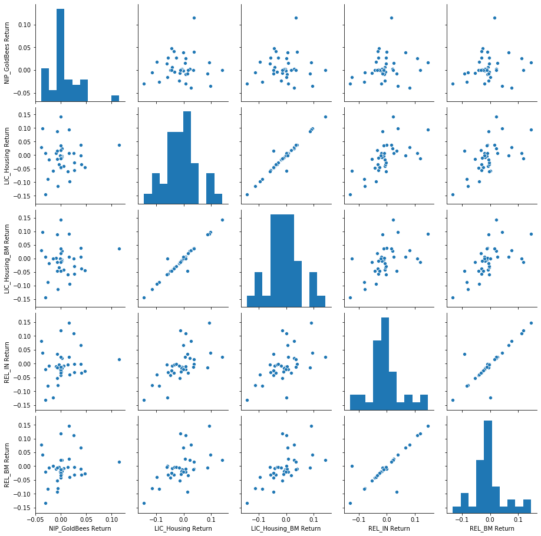


## Let's find out on what dates each bank stock had the best and worst single day returns. You should notice that 4 of the banks share the same day for the worst drop, did anything significant happen that day?


```python
returns.min() # This are % values
```


    NIP_GoldBees Return     -0.038500
    LIC_Housing Return      -0.144857
    LIC_Housing_BM Return   -0.143496
    REL_IN Return           -0.131539
    REL_BM Return           -0.133650
    dtype: float64


```python
returns.idxmin() # This is the date on which all 4 banks has low data values
```


    NIP_GoldBees Return     2020-03-31
    LIC_Housing Return      2020-03-23
    LIC_Housing_BM Return   2020-03-23
    REL_IN Return           2020-03-23
    REL_BM Return           2020-03-23
    dtype: datetime64[ns]


## Quick Update : Here is what happened on March 23, 2020.

**ANS. U.S. stock futures tumbled in early Monday trading as the death toll from the Coronavirus continued to rise globally.**

Read more at: https://www.bloombergquint.com/markets/all-you-need-to-know-going-into-trade-on-march-23


## Take a look at the standard deviation of the returns, which stock would you classify as the riskiest over the entire time period? Which would you classify as the riskiest for the year 2020?


```python
returns['2020-02-15':'2020-04-15'].std()
```


    NIP_GoldBees Return      0.021554
    LIC_Housing Return       0.058751
    LIC_Housing_BM Return    0.058198
    REL_IN Return            0.058760
    REL_BM Return            0.057025
    dtype: float64


```python
# 'NIP_GoldBees','LIC_Housing','LIC_Housing_BM','REL_IN','REL_BM'
sns.distplot(returns['2020-02-15':'2020-04-15']['NIP_GoldBees Return'],color='blue')
```


    <matplotlib.axes._subplots.AxesSubplot at 0x24f46efb748>


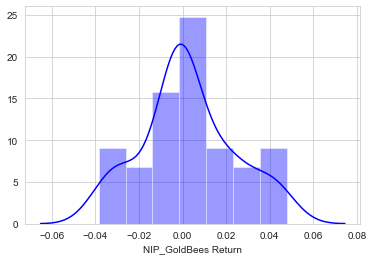


```python
sns.distplot(returns['2020-02-15':'2020-04-15']['LIC_Housing Return'],color='red')
```


    <matplotlib.axes._subplots.AxesSubplot at 0x24f46eb9fc8>


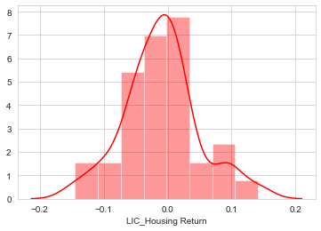


```python
sns.distplot(returns['2020-02-15':'2020-04-15']['LIC_Housing_BM Return'],color='green')
```


    <matplotlib.axes._subplots.AxesSubplot at 0x24f45c30608>


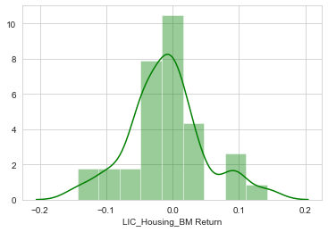


```python
sns.distplot(returns['2020-02-15':'2020-04-15']['REL_IN Return'],color='m')
```


    <matplotlib.axes._subplots.AxesSubplot at 0x24f46da08c8>


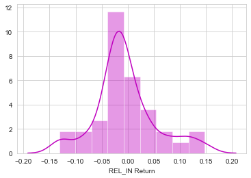


```python
sns.distplot(returns['2020-02-15':'2020-04-15']['REL_BM Return'],color='orange')
```


    <matplotlib.axes._subplots.AxesSubplot at 0x24f46e2a208>


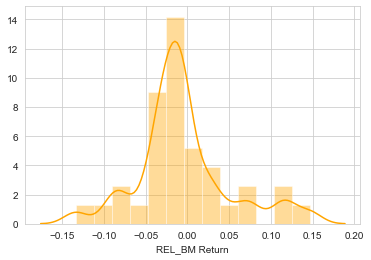


```python
import matplotlib.pyplot as plt
import seaborn as sns
sns.set_style('whitegrid')
%matplotlib inline

# Optional Plotly Method Imports
import plotly
import cufflinks as cf
cf.go_offline()
```


<script type="text/javascript">
window.PlotlyConfig = {MathJaxConfig: 'local'};
if (window.MathJax) {MathJax.Hub.Config({SVG: {font: "STIX-Web"}});}
if (typeof require !== 'undefined') {
require.undef("plotly");
requirejs.config({
    paths: {
        'plotly': ['https://cdn.plot.ly/plotly-latest.min']
    }
});
require(['plotly'], function(Plotly) {
    window._Plotly = Plotly;
});
}
</script>


## Create a line plot showing Close price for each bank for the entire index of time.


```python
for tick in tickers:
    bank_stocks[tick]['Close'].plot(label=tick,figsize=(15,4),lw=3)
plt.legend()
```


    <matplotlib.legend.Legend at 0x24f449c6b88>


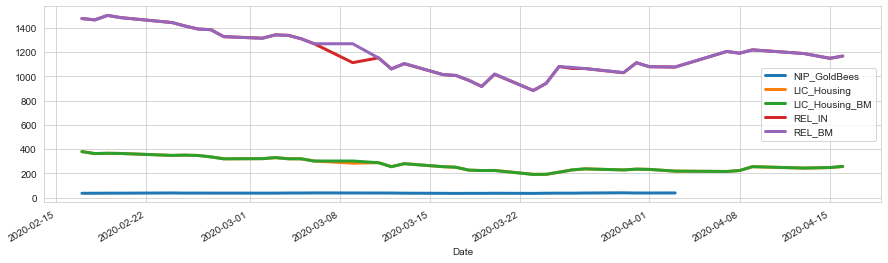


```python
bank_stocks.xs('Close',axis=1,level='Stock Info').plot()
```


    <matplotlib.axes._subplots.AxesSubplot at 0x24f44a1b708>


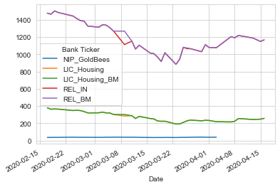


```python
bank_stocks.xs('Close',axis=1,level='Stock Info').iplot()
```


<div>


            <div id="11b77ab4-8ecb-4cf5-a485-f64431479875" class="plotly-graph-div" style="height:525px; width:100%;"></div>
            <script type="text/javascript">
                require(["plotly"], function(Plotly) {
                    window.PLOTLYENV=window.PLOTLYENV || {};
                    window.PLOTLYENV.BASE_URL='https://plot.ly';

                if (document.getElementById("11b77ab4-8ecb-4cf5-a485-f64431479875")) {
                    Plotly.newPlot(
                        '11b77ab4-8ecb-4cf5-a485-f64431479875',
                        [{"line": {"color": "rgba(255, 153, 51, 1.0)", "dash": "solid", "shape": "linear", "width": 1.3}, "mode": "lines", "name": "NIP_GoldBees", "text": "", "type": "scatter", "x": ["2020-02-17", "2020-02-18", "2020-02-19", "2020-02-20", "2020-02-24", "2020-02-25", "2020-02-26", "2020-02-27", "2020-02-28", "2020-03-02", "2020-03-03", "2020-03-04", "2020-03-05", "2020-03-06", "2020-03-09", "2020-03-11", "2020-03-12", "2020-03-13", "2020-03-16", "2020-03-17", "2020-03-18", "2020-03-19", "2020-03-20", "2020-03-23", "2020-03-24", "2020-03-25", "2020-03-26", "2020-03-27", "2020-03-30", "2020-03-31", "2020-04-01", "2020-04-03", "2020-04-07", "2020-04-08", "2020-04-09", "2020-04-13", "2020-04-15", "2020-04-16"], "y": [35.93000030517578, 36.13999938964844, 36.709999084472656, 36.81999969482422, 38.58000183105469, 37.439998626708984, 37.52000045776367, 37.380001068115234, 37.369998931884766, 37.029998779296875, 37.119998931884766, 38.099998474121094, 38.040000915527344, 39.04999923706055, 38.459999084472656, 38.18000030517578, 37.959999084472656, 36.619998931884766, 35.66999816894531, 34.83000183105469, 35.439998626708984, 35.209999084472656, 36.11000061035156, 35.02000045776367, 36.38999938964844, 36.9900016784668, 36.720001220703125, 38.16999816894531, 39.7400016784668, 38.209999084472656, 38.2400016784668, 38.790000915527344, "", "", "", "", "", 43.2599983215332]}, {"line": {"color": "rgba(55, 128, 191, 1.0)", "dash": "solid", "shape": "linear", "width": 1.3}, "mode": "lines", "name": "LIC_Housing", "text": "", "type": "scatter", "x": ["2020-02-17", "2020-02-18", "2020-02-19", "2020-02-20", "2020-02-24", "2020-02-25", "2020-02-26", "2020-02-27", "2020-02-28", "2020-03-02", "2020-03-03", "2020-03-04", "2020-03-05", "2020-03-06", "2020-03-09", "2020-03-11", "2020-03-12", "2020-03-13", "2020-03-16", "2020-03-17", "2020-03-18", "2020-03-19", "2020-03-20", "2020-03-23", "2020-03-24", "2020-03-25", "2020-03-26", "2020-03-27", "2020-03-30", "2020-03-31", "2020-04-01", "2020-04-03", "2020-04-07", "2020-04-08", "2020-04-09", "2020-04-13", "2020-04-15", "2020-04-16"], "y": [379.8500061035156, 363.95001220703125, 366.20001220703125, 364.6000061035156, 348.29998779296875, 350.70001220703125, 348.1499938964844, 336.3500061035156, 320.25, 322.45001220703125, 330.0, 320.8999938964844, 320.3999938964844, 302.29998779296875, 284.3999938964844, 288.54998779296875, 255.35000610351562, 280.25, 255.4499969482422, 251.1999969482422, 226.8000030517578, 223.5500030517578, 225.0500030517578, 192.4499969482422, 192.3000030517578, 210.25, 228.60000610351562, 237.25, 228.89999389648438, 235.3000030517578, 233.0, 218.64999389648438, 216.0, 223.75, 255.35000610351562, 244.0, 248.14999389648438, 257.29998779296875]}, {"line": {"color": "rgba(50, 171, 96, 1.0)", "dash": "solid", "shape": "linear", "width": 1.3}, "mode": "lines", "name": "LIC_Housing_BM", "text": "", "type": "scatter", "x": ["2020-02-17", "2020-02-18", "2020-02-19", "2020-02-20", "2020-02-24", "2020-02-25", "2020-02-26", "2020-02-27", "2020-02-28", "2020-03-02", "2020-03-03", "2020-03-04", "2020-03-05", "2020-03-06", "2020-03-09", "2020-03-11", "2020-03-12", "2020-03-13", "2020-03-16", "2020-03-17", "2020-03-18", "2020-03-19", "2020-03-20", "2020-03-23", "2020-03-24", "2020-03-25", "2020-03-26", "2020-03-27", "2020-03-30", "2020-03-31", "2020-04-01", "2020-04-03", "2020-04-07", "2020-04-08", "2020-04-09", "2020-04-13", "2020-04-15", "2020-04-16"], "y": [379.8500061035156, 363.6499938964844, 366.04998779296875, 364.54998779296875, 348.54998779296875, 350.8500061035156, 347.8999938964844, 336.3999938964844, 320.54998779296875, 321.29998779296875, 330.29998779296875, 320.79998779296875, 320.3999938964844, 302.29998779296875, 302.29998779296875, 288.20001220703125, 255.60000610351562, 280.25, 255.5500030517578, 250.75, 226.89999389648438, 223.6999969482422, 223.6999969482422, 191.60000610351562, 192.5, 210.10000610351562, 228.60000610351562, 237.5500030517578, 228.5500030517578, 235.1999969482422, 232.89999389648438, 218.85000610351562, 215.89999389648438, 223.6999969482422, 255.60000610351562, 243.89999389648438, 248.35000610351562, 257.29998779296875]}, {"line": {"color": "rgba(128, 0, 128, 1.0)", "dash": "solid", "shape": "linear", "width": 1.3}, "mode": "lines", "name": "REL_IN", "text": "", "type": "scatter", "x": ["2020-02-17", "2020-02-18", "2020-02-19", "2020-02-20", "2020-02-24", "2020-02-25", "2020-02-26", "2020-02-27", "2020-02-28", "2020-03-02", "2020-03-03", "2020-03-04", "2020-03-05", "2020-03-06", "2020-03-09", "2020-03-11", "2020-03-12", "2020-03-13", "2020-03-16", "2020-03-17", "2020-03-18", "2020-03-19", "2020-03-20", "2020-03-23", "2020-03-24", "2020-03-25", "2020-03-26", "2020-03-27", "2020-03-30", "2020-03-31", "2020-04-01", "2020-04-03", "2020-04-07", "2020-04-08", "2020-04-09", "2020-04-13", "2020-04-15", "2020-04-16"], "y": [1478.25, 1467.4000244140625, 1503.800048828125, 1485.949951171875, 1444.949951171875, 1416.4000244140625, 1392.0, 1386.25, 1328.6500244140625, 1316.1500244140625, 1342.8499755859375, 1339.699951171875, 1311.1500244140625, 1271.0, 1114.1500244140625, 1153.550048828125, 1063.0, 1105.300048828125, 1015.7000122070312, 1008.0, 968.5, 917.7000122070312, 1017.9500122070312, 884.0499877929688, 943.4000244140625, 1082.25, 1066.199951171875, 1065.5999755859375, 1030.449951171875, 1113.75, 1080.449951171875, 1077.449951171875, 1206.0999755859375, 1192.1500244140625, 1219.949951171875, 1189.1500244140625, 1149.8499755859375, 1168.050048828125]}, {"line": {"color": "rgba(219, 64, 82, 1.0)", "dash": "solid", "shape": "linear", "width": 1.3}, "mode": "lines", "name": "REL_BM", "text": "", "type": "scatter", "x": ["2020-02-17", "2020-02-18", "2020-02-19", "2020-02-20", "2020-02-24", "2020-02-25", "2020-02-26", "2020-02-27", "2020-02-28", "2020-03-02", "2020-03-03", "2020-03-04", "2020-03-05", "2020-03-06", "2020-03-09", "2020-03-11", "2020-03-12", "2020-03-13", "2020-03-16", "2020-03-17", "2020-03-18", "2020-03-19", "2020-03-20", "2020-03-23", "2020-03-24", "2020-03-25", "2020-03-26", "2020-03-27", "2020-03-30", "2020-03-31", "2020-04-01", "2020-04-03", "2020-04-07", "2020-04-08", "2020-04-09", "2020-04-13", "2020-04-15", "2020-04-16"], "y": [1478.4000244140625, 1466.0999755859375, 1504.199951171875, 1485.5, 1444.8499755859375, 1416.300048828125, 1391.4000244140625, 1385.800048828125, 1328.6500244140625, 1314.8499755859375, 1343.6500244140625, 1339.1500244140625, 1311.5, 1270.050048828125, 1270.050048828125, 1153.25, 1061.5999755859375, 1106.9000244140625, 1015.25, 1008.9000244140625, 968.8499755859375, 917.0999755859375, 1020.2000122070312, 883.8499755859375, 943.0999755859375, 1081.25, 1074.75, 1065.5, 1032.3499755859375, 1112.449951171875, 1080.6500244140625, 1078.199951171875, 1206.4000244140625, 1192.1500244140625, 1219.199951171875, 1189.25, 1150.050048828125, 1168.699951171875]}],
                        {"legend": {"bgcolor": "#F5F6F9", "font": {"color": "#4D5663"}}, "paper_bgcolor": "#F5F6F9", "plot_bgcolor": "#F5F6F9", "template": {"data": {"bar": [{"error_x": {"color": "#2a3f5f"}, "error_y": {"color": "#2a3f5f"}, "marker": {"line": {"color": "#E5ECF6", "width": 0.5}}, "type": "bar"}], "barpolar": [{"marker": {"line": {"color": "#E5ECF6", "width": 0.5}}, "type": "barpolar"}], "carpet": [{"aaxis": {"endlinecolor": "#2a3f5f", "gridcolor": "white", "linecolor": "white", "minorgridcolor": "white", "startlinecolor": "#2a3f5f"}, "baxis": {"endlinecolor": "#2a3f5f", "gridcolor": "white", "linecolor": "white", "minorgridcolor": "white", "startlinecolor": "#2a3f5f"}, "type": "carpet"}], "choropleth": [{"colorbar": {"outlinewidth": 0, "ticks": ""}, "type": "choropleth"}], "contour": [{"colorbar": {"outlinewidth": 0, "ticks": ""}, "colorscale": [[0.0, "#0d0887"], [0.1111111111111111, "#46039f"], [0.2222222222222222, "#7201a8"], [0.3333333333333333, "#9c179e"], [0.4444444444444444, "#bd3786"], [0.5555555555555556, "#d8576b"], [0.6666666666666666, "#ed7953"], [0.7777777777777778, "#fb9f3a"], [0.8888888888888888, "#fdca26"], [1.0, "#f0f921"]], "type": "contour"}], "contourcarpet": [{"colorbar": {"outlinewidth": 0, "ticks": ""}, "type": "contourcarpet"}], "heatmap": [{"colorbar": {"outlinewidth": 0, "ticks": ""}, "colorscale": [[0.0, "#0d0887"], [0.1111111111111111, "#46039f"], [0.2222222222222222, "#7201a8"], [0.3333333333333333, "#9c179e"], [0.4444444444444444, "#bd3786"], [0.5555555555555556, "#d8576b"], [0.6666666666666666, "#ed7953"], [0.7777777777777778, "#fb9f3a"], [0.8888888888888888, "#fdca26"], [1.0, "#f0f921"]], "type": "heatmap"}], "heatmapgl": [{"colorbar": {"outlinewidth": 0, "ticks": ""}, "colorscale": [[0.0, "#0d0887"], [0.1111111111111111, "#46039f"], [0.2222222222222222, "#7201a8"], [0.3333333333333333, "#9c179e"], [0.4444444444444444, "#bd3786"], [0.5555555555555556, "#d8576b"], [0.6666666666666666, "#ed7953"], [0.7777777777777778, "#fb9f3a"], [0.8888888888888888, "#fdca26"], [1.0, "#f0f921"]], "type": "heatmapgl"}], "histogram": [{"marker": {"colorbar": {"outlinewidth": 0, "ticks": ""}}, "type": "histogram"}], "histogram2d": [{"colorbar": {"outlinewidth": 0, "ticks": ""}, "colorscale": [[0.0, "#0d0887"], [0.1111111111111111, "#46039f"], [0.2222222222222222, "#7201a8"], [0.3333333333333333, "#9c179e"], [0.4444444444444444, "#bd3786"], [0.5555555555555556, "#d8576b"], [0.6666666666666666, "#ed7953"], [0.7777777777777778, "#fb9f3a"], [0.8888888888888888, "#fdca26"], [1.0, "#f0f921"]], "type": "histogram2d"}], "histogram2dcontour": [{"colorbar": {"outlinewidth": 0, "ticks": ""}, "colorscale": [[0.0, "#0d0887"], [0.1111111111111111, "#46039f"], [0.2222222222222222, "#7201a8"], [0.3333333333333333, "#9c179e"], [0.4444444444444444, "#bd3786"], [0.5555555555555556, "#d8576b"], [0.6666666666666666, "#ed7953"], [0.7777777777777778, "#fb9f3a"], [0.8888888888888888, "#fdca26"], [1.0, "#f0f921"]], "type": "histogram2dcontour"}], "mesh3d": [{"colorbar": {"outlinewidth": 0, "ticks": ""}, "type": "mesh3d"}], "parcoords": [{"line": {"colorbar": {"outlinewidth": 0, "ticks": ""}}, "type": "parcoords"}], "pie": [{"automargin": true, "type": "pie"}], "scatter": [{"marker": {"colorbar": {"outlinewidth": 0, "ticks": ""}}, "type": "scatter"}], "scatter3d": [{"line": {"colorbar": {"outlinewidth": 0, "ticks": ""}}, "marker": {"colorbar": {"outlinewidth": 0, "ticks": ""}}, "type": "scatter3d"}], "scattercarpet": [{"marker": {"colorbar": {"outlinewidth": 0, "ticks": ""}}, "type": "scattercarpet"}], "scattergeo": [{"marker": {"colorbar": {"outlinewidth": 0, "ticks": ""}}, "type": "scattergeo"}], "scattergl": [{"marker": {"colorbar": {"outlinewidth": 0, "ticks": ""}}, "type": "scattergl"}], "scattermapbox": [{"marker": {"colorbar": {"outlinewidth": 0, "ticks": ""}}, "type": "scattermapbox"}], "scatterpolar": [{"marker": {"colorbar": {"outlinewidth": 0, "ticks": ""}}, "type": "scatterpolar"}], "scatterpolargl": [{"marker": {"colorbar": {"outlinewidth": 0, "ticks": ""}}, "type": "scatterpolargl"}], "scatterternary": [{"marker": {"colorbar": {"outlinewidth": 0, "ticks": ""}}, "type": "scatterternary"}], "surface": [{"colorbar": {"outlinewidth": 0, "ticks": ""}, "colorscale": [[0.0, "#0d0887"], [0.1111111111111111, "#46039f"], [0.2222222222222222, "#7201a8"], [0.3333333333333333, "#9c179e"], [0.4444444444444444, "#bd3786"], [0.5555555555555556, "#d8576b"], [0.6666666666666666, "#ed7953"], [0.7777777777777778, "#fb9f3a"], [0.8888888888888888, "#fdca26"], [1.0, "#f0f921"]], "type": "surface"}], "table": [{"cells": {"fill": {"color": "#EBF0F8"}, "line": {"color": "white"}}, "header": {"fill": {"color": "#C8D4E3"}, "line": {"color": "white"}}, "type": "table"}]}, "layout": {"annotationdefaults": {"arrowcolor": "#2a3f5f", "arrowhead": 0, "arrowwidth": 1}, "coloraxis": {"colorbar": {"outlinewidth": 0, "ticks": ""}}, "colorscale": {"diverging": [[0, "#8e0152"], [0.1, "#c51b7d"], [0.2, "#de77ae"], [0.3, "#f1b6da"], [0.4, "#fde0ef"], [0.5, "#f7f7f7"], [0.6, "#e6f5d0"], [0.7, "#b8e186"], [0.8, "#7fbc41"], [0.9, "#4d9221"], [1, "#276419"]], "sequential": [[0.0, "#0d0887"], [0.1111111111111111, "#46039f"], [0.2222222222222222, "#7201a8"], [0.3333333333333333, "#9c179e"], [0.4444444444444444, "#bd3786"], [0.5555555555555556, "#d8576b"], [0.6666666666666666, "#ed7953"], [0.7777777777777778, "#fb9f3a"], [0.8888888888888888, "#fdca26"], [1.0, "#f0f921"]], "sequentialminus": [[0.0, "#0d0887"], [0.1111111111111111, "#46039f"], [0.2222222222222222, "#7201a8"], [0.3333333333333333, "#9c179e"], [0.4444444444444444, "#bd3786"], [0.5555555555555556, "#d8576b"], [0.6666666666666666, "#ed7953"], [0.7777777777777778, "#fb9f3a"], [0.8888888888888888, "#fdca26"], [1.0, "#f0f921"]]}, "colorway": ["#636efa", "#EF553B", "#00cc96", "#ab63fa", "#FFA15A", "#19d3f3", "#FF6692", "#B6E880", "#FF97FF", "#FECB52"], "font": {"color": "#2a3f5f"}, "geo": {"bgcolor": "white", "lakecolor": "white", "landcolor": "#E5ECF6", "showlakes": true, "showland": true, "subunitcolor": "white"}, "hoverlabel": {"align": "left"}, "hovermode": "closest", "mapbox": {"style": "light"}, "paper_bgcolor": "white", "plot_bgcolor": "#E5ECF6", "polar": {"angularaxis": {"gridcolor": "white", "linecolor": "white", "ticks": ""}, "bgcolor": "#E5ECF6", "radialaxis": {"gridcolor": "white", "linecolor": "white", "ticks": ""}}, "scene": {"xaxis": {"backgroundcolor": "#E5ECF6", "gridcolor": "white", "gridwidth": 2, "linecolor": "white", "showbackground": true, "ticks": "", "zerolinecolor": "white"}, "yaxis": {"backgroundcolor": "#E5ECF6", "gridcolor": "white", "gridwidth": 2, "linecolor": "white", "showbackground": true, "ticks": "", "zerolinecolor": "white"}, "zaxis": {"backgroundcolor": "#E5ECF6", "gridcolor": "white", "gridwidth": 2, "linecolor": "white", "showbackground": true, "ticks": "", "zerolinecolor": "white"}}, "shapedefaults": {"line": {"color": "#2a3f5f"}}, "ternary": {"aaxis": {"gridcolor": "white", "linecolor": "white", "ticks": ""}, "baxis": {"gridcolor": "white", "linecolor": "white", "ticks": ""}, "bgcolor": "#E5ECF6", "caxis": {"gridcolor": "white", "linecolor": "white", "ticks": ""}}, "title": {"x": 0.05}, "xaxis": {"automargin": true, "gridcolor": "white", "linecolor": "white", "ticks": "", "title": {"standoff": 15}, "zerolinecolor": "white", "zerolinewidth": 2}, "yaxis": {"automargin": true, "gridcolor": "white", "linecolor": "white", "ticks": "", "title": {"standoff": 15}, "zerolinecolor": "white", "zerolinewidth": 2}}}, "title": {"font": {"color": "#4D5663"}}, "xaxis": {"gridcolor": "#E1E5ED", "showgrid": true, "tickfont": {"color": "#4D5663"}, "title": {"font": {"color": "#4D5663"}, "text": ""}, "zerolinecolor": "#E1E5ED"}, "yaxis": {"gridcolor": "#E1E5ED", "showgrid": true, "tickfont": {"color": "#4D5663"}, "title": {"font": {"color": "#4D5663"}, "text": ""}, "zerolinecolor": "#E1E5ED"}},
                        {"showLink": true, "linkText": "Export to plot.ly", "plotlyServerURL": "https://plot.ly", "responsive": true}
                    ).then(function(){

var gd = document.getElementById('11b77ab4-8ecb-4cf5-a485-f64431479875');
var x = new MutationObserver(function (mutations, observer) {{
        var display = window.getComputedStyle(gd).display;
        if (!display || display === 'none') {{
            console.log([gd, 'removed!']);
            Plotly.purge(gd);
            observer.disconnect();
        }}
}});

// Listen for the removal of the full notebook cells
var notebookContainer = gd.closest('#notebook-container');
if (notebookContainer) {{
    x.observe(notebookContainer, {childList: true});
}}

// Listen for the clearing of the current output cell
var outputEl = gd.closest('.output');
if (outputEl) {{
    x.observe(outputEl, {childList: true});
}}

                        })
                };
                });
            </script>
        </div>


## Moving Averages

Let's analyze the moving averages for these stocks in the year 2020. 

**Plot the rolling 60 day average against the Close Price for LIC's stock for the year 2020**


```python
# 'NIP_GoldBees','LIC_Housing','LIC_Housing_BM','REL_IN','REL_BM'
plt.figure(figsize=(15,4))
LIC_Housing['Close']['2020-02-15':'2020-04-15'].rolling(window=5).mean().plot(label = '60 days avg')
LIC_Housing['Close']['2020-02-15':'2020-04-15'].plot(label = 'LIC_Housing Close')
plt.legend()
```


    <matplotlib.legend.Legend at 0x24f4869e908>


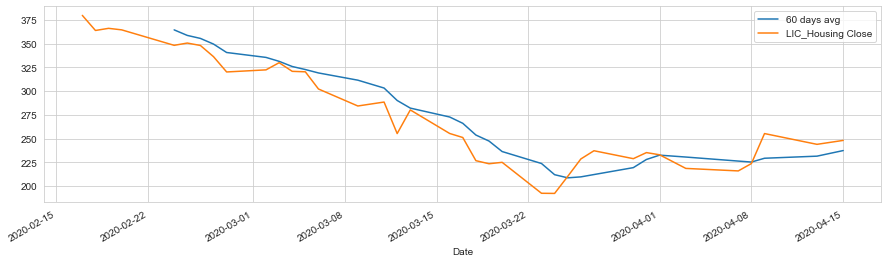


## Let's create Heat maps.


```python
sns.heatmap(bank_stocks.xs(key='Close',axis=1,level='Stock Info').corr(),annot=True)
```


    <matplotlib.axes._subplots.AxesSubplot at 0x24f487f36c8>


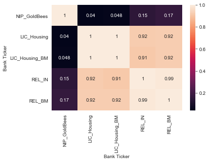


## Let's create Cluster Map.


```python
sns.clustermap(bank_stocks.xs(key='Close',axis=1,level='Stock Info').corr(),annot=True)
```


    <seaborn.matrix.ClusterGrid at 0x24f4887a448>


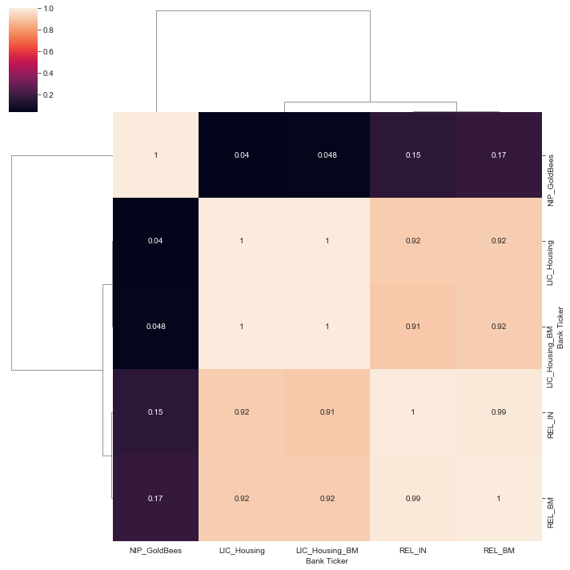


```python
close_corr = bank_stocks.xs(key='Close',axis=1,level='Stock Info').corr()
close_corr.iplot(kind='heatmap',colorscale='rdylbu')
```


<div>


            <div id="d87cda04-b79e-4ae4-8d39-72368f5735eb" class="plotly-graph-div" style="height:525px; width:100%;"></div>
            <script type="text/javascript">
                require(["plotly"], function(Plotly) {
                    window.PLOTLYENV=window.PLOTLYENV || {};
                    window.PLOTLYENV.BASE_URL='https://plot.ly';

                if (document.getElementById("d87cda04-b79e-4ae4-8d39-72368f5735eb")) {
                    Plotly.newPlot(
                        'd87cda04-b79e-4ae4-8d39-72368f5735eb',
                        [{"colorscale": [[0.0, "rgb(165,0,38)"], [0.1, "rgb(215,48,39)"], [0.2, "rgb(244,109,67)"], [0.3, "rgb(253,174,97)"], [0.4, "rgb(254,224,144)"], [0.5, "rgb(255,255,191)"], [0.6, "rgb(224,243,248)"], [0.7, "rgb(171,217,233)"], [0.8, "rgb(116,173,209)"], [0.9, "rgb(69,117,180)"], [1.0, "rgb(49,54,149)"]], "type": "heatmap", "x": ["NIP_GoldBees", "LIC_Housing", "LIC_Housing_BM", "REL_IN", "REL_BM"], "y": ["NIP_GoldBees", "LIC_Housing", "LIC_Housing_BM", "REL_IN", "REL_BM"], "z": [[1.0, 0.039787316390809374, 0.047715745528296674, 0.15355745593716993, 0.17110339784304077], [0.039787316390809374, 1.0, 0.9986228102031798, 0.9184345442161916, 0.9221695341493104], [0.047715745528296674, 0.9986228102031798, 1.0, 0.912441405211469, 0.923645975876998], [0.15355745593716993, 0.9184345442161916, 0.912441405211469, 1.0, 0.9896399061716888], [0.17110339784304077, 0.9221695341493104, 0.923645975876998, 0.9896399061716888, 1.0]], "zmax": 1.0, "zmin": 0.039787316390809374}],
                        {"legend": {"bgcolor": "#F5F6F9", "font": {"color": "#4D5663"}}, "paper_bgcolor": "#F5F6F9", "plot_bgcolor": "#F5F6F9", "template": {"data": {"bar": [{"error_x": {"color": "#2a3f5f"}, "error_y": {"color": "#2a3f5f"}, "marker": {"line": {"color": "#E5ECF6", "width": 0.5}}, "type": "bar"}], "barpolar": [{"marker": {"line": {"color": "#E5ECF6", "width": 0.5}}, "type": "barpolar"}], "carpet": [{"aaxis": {"endlinecolor": "#2a3f5f", "gridcolor": "white", "linecolor": "white", "minorgridcolor": "white", "startlinecolor": "#2a3f5f"}, "baxis": {"endlinecolor": "#2a3f5f", "gridcolor": "white", "linecolor": "white", "minorgridcolor": "white", "startlinecolor": "#2a3f5f"}, "type": "carpet"}], "choropleth": [{"colorbar": {"outlinewidth": 0, "ticks": ""}, "type": "choropleth"}], "contour": [{"colorbar": {"outlinewidth": 0, "ticks": ""}, "colorscale": [[0.0, "#0d0887"], [0.1111111111111111, "#46039f"], [0.2222222222222222, "#7201a8"], [0.3333333333333333, "#9c179e"], [0.4444444444444444, "#bd3786"], [0.5555555555555556, "#d8576b"], [0.6666666666666666, "#ed7953"], [0.7777777777777778, "#fb9f3a"], [0.8888888888888888, "#fdca26"], [1.0, "#f0f921"]], "type": "contour"}], "contourcarpet": [{"colorbar": {"outlinewidth": 0, "ticks": ""}, "type": "contourcarpet"}], "heatmap": [{"colorbar": {"outlinewidth": 0, "ticks": ""}, "colorscale": [[0.0, "#0d0887"], [0.1111111111111111, "#46039f"], [0.2222222222222222, "#7201a8"], [0.3333333333333333, "#9c179e"], [0.4444444444444444, "#bd3786"], [0.5555555555555556, "#d8576b"], [0.6666666666666666, "#ed7953"], [0.7777777777777778, "#fb9f3a"], [0.8888888888888888, "#fdca26"], [1.0, "#f0f921"]], "type": "heatmap"}], "heatmapgl": [{"colorbar": {"outlinewidth": 0, "ticks": ""}, "colorscale": [[0.0, "#0d0887"], [0.1111111111111111, "#46039f"], [0.2222222222222222, "#7201a8"], [0.3333333333333333, "#9c179e"], [0.4444444444444444, "#bd3786"], [0.5555555555555556, "#d8576b"], [0.6666666666666666, "#ed7953"], [0.7777777777777778, "#fb9f3a"], [0.8888888888888888, "#fdca26"], [1.0, "#f0f921"]], "type": "heatmapgl"}], "histogram": [{"marker": {"colorbar": {"outlinewidth": 0, "ticks": ""}}, "type": "histogram"}], "histogram2d": [{"colorbar": {"outlinewidth": 0, "ticks": ""}, "colorscale": [[0.0, "#0d0887"], [0.1111111111111111, "#46039f"], [0.2222222222222222, "#7201a8"], [0.3333333333333333, "#9c179e"], [0.4444444444444444, "#bd3786"], [0.5555555555555556, "#d8576b"], [0.6666666666666666, "#ed7953"], [0.7777777777777778, "#fb9f3a"], [0.8888888888888888, "#fdca26"], [1.0, "#f0f921"]], "type": "histogram2d"}], "histogram2dcontour": [{"colorbar": {"outlinewidth": 0, "ticks": ""}, "colorscale": [[0.0, "#0d0887"], [0.1111111111111111, "#46039f"], [0.2222222222222222, "#7201a8"], [0.3333333333333333, "#9c179e"], [0.4444444444444444, "#bd3786"], [0.5555555555555556, "#d8576b"], [0.6666666666666666, "#ed7953"], [0.7777777777777778, "#fb9f3a"], [0.8888888888888888, "#fdca26"], [1.0, "#f0f921"]], "type": "histogram2dcontour"}], "mesh3d": [{"colorbar": {"outlinewidth": 0, "ticks": ""}, "type": "mesh3d"}], "parcoords": [{"line": {"colorbar": {"outlinewidth": 0, "ticks": ""}}, "type": "parcoords"}], "pie": [{"automargin": true, "type": "pie"}], "scatter": [{"marker": {"colorbar": {"outlinewidth": 0, "ticks": ""}}, "type": "scatter"}], "scatter3d": [{"line": {"colorbar": {"outlinewidth": 0, "ticks": ""}}, "marker": {"colorbar": {"outlinewidth": 0, "ticks": ""}}, "type": "scatter3d"}], "scattercarpet": [{"marker": {"colorbar": {"outlinewidth": 0, "ticks": ""}}, "type": "scattercarpet"}], "scattergeo": [{"marker": {"colorbar": {"outlinewidth": 0, "ticks": ""}}, "type": "scattergeo"}], "scattergl": [{"marker": {"colorbar": {"outlinewidth": 0, "ticks": ""}}, "type": "scattergl"}], "scattermapbox": [{"marker": {"colorbar": {"outlinewidth": 0, "ticks": ""}}, "type": "scattermapbox"}], "scatterpolar": [{"marker": {"colorbar": {"outlinewidth": 0, "ticks": ""}}, "type": "scatterpolar"}], "scatterpolargl": [{"marker": {"colorbar": {"outlinewidth": 0, "ticks": ""}}, "type": "scatterpolargl"}], "scatterternary": [{"marker": {"colorbar": {"outlinewidth": 0, "ticks": ""}}, "type": "scatterternary"}], "surface": [{"colorbar": {"outlinewidth": 0, "ticks": ""}, "colorscale": [[0.0, "#0d0887"], [0.1111111111111111, "#46039f"], [0.2222222222222222, "#7201a8"], [0.3333333333333333, "#9c179e"], [0.4444444444444444, "#bd3786"], [0.5555555555555556, "#d8576b"], [0.6666666666666666, "#ed7953"], [0.7777777777777778, "#fb9f3a"], [0.8888888888888888, "#fdca26"], [1.0, "#f0f921"]], "type": "surface"}], "table": [{"cells": {"fill": {"color": "#EBF0F8"}, "line": {"color": "white"}}, "header": {"fill": {"color": "#C8D4E3"}, "line": {"color": "white"}}, "type": "table"}]}, "layout": {"annotationdefaults": {"arrowcolor": "#2a3f5f", "arrowhead": 0, "arrowwidth": 1}, "coloraxis": {"colorbar": {"outlinewidth": 0, "ticks": ""}}, "colorscale": {"diverging": [[0, "#8e0152"], [0.1, "#c51b7d"], [0.2, "#de77ae"], [0.3, "#f1b6da"], [0.4, "#fde0ef"], [0.5, "#f7f7f7"], [0.6, "#e6f5d0"], [0.7, "#b8e186"], [0.8, "#7fbc41"], [0.9, "#4d9221"], [1, "#276419"]], "sequential": [[0.0, "#0d0887"], [0.1111111111111111, "#46039f"], [0.2222222222222222, "#7201a8"], [0.3333333333333333, "#9c179e"], [0.4444444444444444, "#bd3786"], [0.5555555555555556, "#d8576b"], [0.6666666666666666, "#ed7953"], [0.7777777777777778, "#fb9f3a"], [0.8888888888888888, "#fdca26"], [1.0, "#f0f921"]], "sequentialminus": [[0.0, "#0d0887"], [0.1111111111111111, "#46039f"], [0.2222222222222222, "#7201a8"], [0.3333333333333333, "#9c179e"], [0.4444444444444444, "#bd3786"], [0.5555555555555556, "#d8576b"], [0.6666666666666666, "#ed7953"], [0.7777777777777778, "#fb9f3a"], [0.8888888888888888, "#fdca26"], [1.0, "#f0f921"]]}, "colorway": ["#636efa", "#EF553B", "#00cc96", "#ab63fa", "#FFA15A", "#19d3f3", "#FF6692", "#B6E880", "#FF97FF", "#FECB52"], "font": {"color": "#2a3f5f"}, "geo": {"bgcolor": "white", "lakecolor": "white", "landcolor": "#E5ECF6", "showlakes": true, "showland": true, "subunitcolor": "white"}, "hoverlabel": {"align": "left"}, "hovermode": "closest", "mapbox": {"style": "light"}, "paper_bgcolor": "white", "plot_bgcolor": "#E5ECF6", "polar": {"angularaxis": {"gridcolor": "white", "linecolor": "white", "ticks": ""}, "bgcolor": "#E5ECF6", "radialaxis": {"gridcolor": "white", "linecolor": "white", "ticks": ""}}, "scene": {"xaxis": {"backgroundcolor": "#E5ECF6", "gridcolor": "white", "gridwidth": 2, "linecolor": "white", "showbackground": true, "ticks": "", "zerolinecolor": "white"}, "yaxis": {"backgroundcolor": "#E5ECF6", "gridcolor": "white", "gridwidth": 2, "linecolor": "white", "showbackground": true, "ticks": "", "zerolinecolor": "white"}, "zaxis": {"backgroundcolor": "#E5ECF6", "gridcolor": "white", "gridwidth": 2, "linecolor": "white", "showbackground": true, "ticks": "", "zerolinecolor": "white"}}, "shapedefaults": {"line": {"color": "#2a3f5f"}}, "ternary": {"aaxis": {"gridcolor": "white", "linecolor": "white", "ticks": ""}, "baxis": {"gridcolor": "white", "linecolor": "white", "ticks": ""}, "bgcolor": "#E5ECF6", "caxis": {"gridcolor": "white", "linecolor": "white", "ticks": ""}}, "title": {"x": 0.05}, "xaxis": {"automargin": true, "gridcolor": "white", "linecolor": "white", "ticks": "", "title": {"standoff": 15}, "zerolinecolor": "white", "zerolinewidth": 2}, "yaxis": {"automargin": true, "gridcolor": "white", "linecolor": "white", "ticks": "", "title": {"standoff": 15}, "zerolinecolor": "white", "zerolinewidth": 2}}}, "title": {"font": {"color": "#4D5663"}}, "xaxis": {"gridcolor": "#E1E5ED", "showgrid": true, "tickfont": {"color": "#4D5663"}, "title": {"font": {"color": "#4D5663"}, "text": ""}, "zerolinecolor": "#E1E5ED"}, "yaxis": {"gridcolor": "#E1E5ED", "showgrid": true, "tickfont": {"color": "#4D5663"}, "title": {"font": {"color": "#4D5663"}, "text": ""}, "zerolinecolor": "#E1E5ED"}},
                        {"showLink": true, "linkText": "Export to plot.ly", "plotlyServerURL": "https://plot.ly", "responsive": true}
                    ).then(function(){

var gd = document.getElementById('d87cda04-b79e-4ae4-8d39-72368f5735eb');
var x = new MutationObserver(function (mutations, observer) {{
        var display = window.getComputedStyle(gd).display;
        if (!display || display === 'none') {{
            console.log([gd, 'removed!']);
            Plotly.purge(gd);
            observer.disconnect();
        }}
}});

// Listen for the removal of the full notebook cells
var notebookContainer = gd.closest('#notebook-container');
if (notebookContainer) {{
    x.observe(notebookContainer, {childList: true});
}}

// Listen for the clearing of the current output cell
var outputEl = gd.closest('.output');
if (outputEl) {{
    x.observe(outputEl, {childList: true});
}}

                        })
                };
                });
            </script>
        </div>


## Let's do something interesting with Candle plot.


```python
# 'NIP_GoldBees','LIC_Housing','LIC_Housing_BM','REL_IN','REL_BM'
NIP_GoldBees[['Open', 'High', 'Low', 'Close']]['2020-02-15':'2020-04-15'].iplot(kind='candle',title='Reliance Nippon Candle Graph')
```


<div>


            <div id="8ebd5fd3-b905-4a9c-83d8-88cf213ccc01" class="plotly-graph-div" style="height:525px; width:100%;"></div>
            <script type="text/javascript">
                require(["plotly"], function(Plotly) {
                    window.PLOTLYENV=window.PLOTLYENV || {};
                    window.PLOTLYENV.BASE_URL='https://plot.ly';

                if (document.getElementById("8ebd5fd3-b905-4a9c-83d8-88cf213ccc01")) {
                    Plotly.newPlot(
                        '8ebd5fd3-b905-4a9c-83d8-88cf213ccc01',
                        [{"close": [35.93000030517578, 36.13999938964844, 36.709999084472656, 36.81999969482422, 38.58000183105469, 37.439998626708984, 37.52000045776367, 37.380001068115234, 37.369998931884766, 37.029998779296875, 37.119998931884766, 38.099998474121094, 38.040000915527344, 39.04999923706055, 38.459999084472656, 38.18000030517578, 37.959999084472656, 36.619998931884766, 35.66999816894531, 34.83000183105469, 35.439998626708984, 35.209999084472656, 36.11000061035156, 35.02000045776367, 36.38999938964844, 36.9900016784668, 36.720001220703125, 38.16999816894531, 39.7400016784668, 38.209999084472656, 38.2400016784668, 38.790000915527344], "high": [37.29999923706055, 36.18000030517578, 36.900001525878906, 37.0, 39.0, 38.599998474121094, 37.650001525878906, 37.9900016784668, 37.88999938964844, 37.11000061035156, 37.45000076293945, 38.599998474121094, 38.290000915527344, 39.2400016784668, 43.70000076293945, 38.79999923706055, 38.09000015258789, 37.29999923706055, 37.349998474121094, 35.189998626708984, 36.380001068115234, 35.70000076293945, 36.349998474121094, 40.900001525878906, 37.20000076293945, 37.63999938964844, 37.38999938964844, 38.29999923706055, 40.0, 40.5, 38.4900016784668, 39.400001525878906], "low": [35.869998931884766, 36.04999923706055, 36.20000076293945, 36.650001525878906, 37.79999923706055, 37.220001220703125, 37.20000076293945, 37.209999084472656, 37.119998931884766, 36.310001373291016, 36.849998474121094, 37.90999984741211, 37.93000030517578, 38.41999816894531, 38.369998931884766, 38.0099983215332, 37.560001373291016, 34.5, 35.54999923706055, 34.63999938964844, 35.130001068115234, 34.459999084472656, 35.11000061035156, 34.79999923706055, 35.95000076293945, 36.11000061035156, 36.31999969482422, 36.11000061035156, 38.0, 38.0, 37.31999969482422, 38.349998474121094], "open": [36.25, 36.13999938964844, 36.900001525878906, 36.75, 37.810001373291016, 38.599998474121094, 37.4900016784668, 37.400001525878906, 37.810001373291016, 36.939998626708984, 37.45000076293945, 38.0, 38.099998474121094, 38.75, 41.79999923706055, 38.0099983215332, 38.09000015258789, 37.29999923706055, 37.349998474121094, 35.189998626708984, 36.04999923706055, 35.400001525878906, 35.209999084472656, 36.209999084472656, 36.02000045776367, 36.939998626708984, 36.900001525878906, 36.310001373291016, 38.400001525878906, 39.7400016784668, 38.209999084472656, 38.349998474121094], "showlegend": false, "type": "candlestick", "x": ["2020-02-17", "2020-02-18", "2020-02-19", "2020-02-20", "2020-02-24", "2020-02-25", "2020-02-26", "2020-02-27", "2020-02-28", "2020-03-02", "2020-03-03", "2020-03-04", "2020-03-05", "2020-03-06", "2020-03-09", "2020-03-11", "2020-03-12", "2020-03-13", "2020-03-16", "2020-03-17", "2020-03-18", "2020-03-19", "2020-03-20", "2020-03-23", "2020-03-24", "2020-03-25", "2020-03-26", "2020-03-27", "2020-03-30", "2020-03-31", "2020-04-01", "2020-04-03"], "yaxis": "y2"}],
                        {"legend": {"bgcolor": "#F5F6F9", "font": {"color": "#4D5663"}}, "paper_bgcolor": "#F5F6F9", "plot_bgcolor": "#F5F6F9", "template": {"data": {"bar": [{"error_x": {"color": "#2a3f5f"}, "error_y": {"color": "#2a3f5f"}, "marker": {"line": {"color": "#E5ECF6", "width": 0.5}}, "type": "bar"}], "barpolar": [{"marker": {"line": {"color": "#E5ECF6", "width": 0.5}}, "type": "barpolar"}], "carpet": [{"aaxis": {"endlinecolor": "#2a3f5f", "gridcolor": "white", "linecolor": "white", "minorgridcolor": "white", "startlinecolor": "#2a3f5f"}, "baxis": {"endlinecolor": "#2a3f5f", "gridcolor": "white", "linecolor": "white", "minorgridcolor": "white", "startlinecolor": "#2a3f5f"}, "type": "carpet"}], "choropleth": [{"colorbar": {"outlinewidth": 0, "ticks": ""}, "type": "choropleth"}], "contour": [{"colorbar": {"outlinewidth": 0, "ticks": ""}, "colorscale": [[0.0, "#0d0887"], [0.1111111111111111, "#46039f"], [0.2222222222222222, "#7201a8"], [0.3333333333333333, "#9c179e"], [0.4444444444444444, "#bd3786"], [0.5555555555555556, "#d8576b"], [0.6666666666666666, "#ed7953"], [0.7777777777777778, "#fb9f3a"], [0.8888888888888888, "#fdca26"], [1.0, "#f0f921"]], "type": "contour"}], "contourcarpet": [{"colorbar": {"outlinewidth": 0, "ticks": ""}, "type": "contourcarpet"}], "heatmap": [{"colorbar": {"outlinewidth": 0, "ticks": ""}, "colorscale": [[0.0, "#0d0887"], [0.1111111111111111, "#46039f"], [0.2222222222222222, "#7201a8"], [0.3333333333333333, "#9c179e"], [0.4444444444444444, "#bd3786"], [0.5555555555555556, "#d8576b"], [0.6666666666666666, "#ed7953"], [0.7777777777777778, "#fb9f3a"], [0.8888888888888888, "#fdca26"], [1.0, "#f0f921"]], "type": "heatmap"}], "heatmapgl": [{"colorbar": {"outlinewidth": 0, "ticks": ""}, "colorscale": [[0.0, "#0d0887"], [0.1111111111111111, "#46039f"], [0.2222222222222222, "#7201a8"], [0.3333333333333333, "#9c179e"], [0.4444444444444444, "#bd3786"], [0.5555555555555556, "#d8576b"], [0.6666666666666666, "#ed7953"], [0.7777777777777778, "#fb9f3a"], [0.8888888888888888, "#fdca26"], [1.0, "#f0f921"]], "type": "heatmapgl"}], "histogram": [{"marker": {"colorbar": {"outlinewidth": 0, "ticks": ""}}, "type": "histogram"}], "histogram2d": [{"colorbar": {"outlinewidth": 0, "ticks": ""}, "colorscale": [[0.0, "#0d0887"], [0.1111111111111111, "#46039f"], [0.2222222222222222, "#7201a8"], [0.3333333333333333, "#9c179e"], [0.4444444444444444, "#bd3786"], [0.5555555555555556, "#d8576b"], [0.6666666666666666, "#ed7953"], [0.7777777777777778, "#fb9f3a"], [0.8888888888888888, "#fdca26"], [1.0, "#f0f921"]], "type": "histogram2d"}], "histogram2dcontour": [{"colorbar": {"outlinewidth": 0, "ticks": ""}, "colorscale": [[0.0, "#0d0887"], [0.1111111111111111, "#46039f"], [0.2222222222222222, "#7201a8"], [0.3333333333333333, "#9c179e"], [0.4444444444444444, "#bd3786"], [0.5555555555555556, "#d8576b"], [0.6666666666666666, "#ed7953"], [0.7777777777777778, "#fb9f3a"], [0.8888888888888888, "#fdca26"], [1.0, "#f0f921"]], "type": "histogram2dcontour"}], "mesh3d": [{"colorbar": {"outlinewidth": 0, "ticks": ""}, "type": "mesh3d"}], "parcoords": [{"line": {"colorbar": {"outlinewidth": 0, "ticks": ""}}, "type": "parcoords"}], "pie": [{"automargin": true, "type": "pie"}], "scatter": [{"marker": {"colorbar": {"outlinewidth": 0, "ticks": ""}}, "type": "scatter"}], "scatter3d": [{"line": {"colorbar": {"outlinewidth": 0, "ticks": ""}}, "marker": {"colorbar": {"outlinewidth": 0, "ticks": ""}}, "type": "scatter3d"}], "scattercarpet": [{"marker": {"colorbar": {"outlinewidth": 0, "ticks": ""}}, "type": "scattercarpet"}], "scattergeo": [{"marker": {"colorbar": {"outlinewidth": 0, "ticks": ""}}, "type": "scattergeo"}], "scattergl": [{"marker": {"colorbar": {"outlinewidth": 0, "ticks": ""}}, "type": "scattergl"}], "scattermapbox": [{"marker": {"colorbar": {"outlinewidth": 0, "ticks": ""}}, "type": "scattermapbox"}], "scatterpolar": [{"marker": {"colorbar": {"outlinewidth": 0, "ticks": ""}}, "type": "scatterpolar"}], "scatterpolargl": [{"marker": {"colorbar": {"outlinewidth": 0, "ticks": ""}}, "type": "scatterpolargl"}], "scatterternary": [{"marker": {"colorbar": {"outlinewidth": 0, "ticks": ""}}, "type": "scatterternary"}], "surface": [{"colorbar": {"outlinewidth": 0, "ticks": ""}, "colorscale": [[0.0, "#0d0887"], [0.1111111111111111, "#46039f"], [0.2222222222222222, "#7201a8"], [0.3333333333333333, "#9c179e"], [0.4444444444444444, "#bd3786"], [0.5555555555555556, "#d8576b"], [0.6666666666666666, "#ed7953"], [0.7777777777777778, "#fb9f3a"], [0.8888888888888888, "#fdca26"], [1.0, "#f0f921"]], "type": "surface"}], "table": [{"cells": {"fill": {"color": "#EBF0F8"}, "line": {"color": "white"}}, "header": {"fill": {"color": "#C8D4E3"}, "line": {"color": "white"}}, "type": "table"}]}, "layout": {"annotationdefaults": {"arrowcolor": "#2a3f5f", "arrowhead": 0, "arrowwidth": 1}, "coloraxis": {"colorbar": {"outlinewidth": 0, "ticks": ""}}, "colorscale": {"diverging": [[0, "#8e0152"], [0.1, "#c51b7d"], [0.2, "#de77ae"], [0.3, "#f1b6da"], [0.4, "#fde0ef"], [0.5, "#f7f7f7"], [0.6, "#e6f5d0"], [0.7, "#b8e186"], [0.8, "#7fbc41"], [0.9, "#4d9221"], [1, "#276419"]], "sequential": [[0.0, "#0d0887"], [0.1111111111111111, "#46039f"], [0.2222222222222222, "#7201a8"], [0.3333333333333333, "#9c179e"], [0.4444444444444444, "#bd3786"], [0.5555555555555556, "#d8576b"], [0.6666666666666666, "#ed7953"], [0.7777777777777778, "#fb9f3a"], [0.8888888888888888, "#fdca26"], [1.0, "#f0f921"]], "sequentialminus": [[0.0, "#0d0887"], [0.1111111111111111, "#46039f"], [0.2222222222222222, "#7201a8"], [0.3333333333333333, "#9c179e"], [0.4444444444444444, "#bd3786"], [0.5555555555555556, "#d8576b"], [0.6666666666666666, "#ed7953"], [0.7777777777777778, "#fb9f3a"], [0.8888888888888888, "#fdca26"], [1.0, "#f0f921"]]}, "colorway": ["#636efa", "#EF553B", "#00cc96", "#ab63fa", "#FFA15A", "#19d3f3", "#FF6692", "#B6E880", "#FF97FF", "#FECB52"], "font": {"color": "#2a3f5f"}, "geo": {"bgcolor": "white", "lakecolor": "white", "landcolor": "#E5ECF6", "showlakes": true, "showland": true, "subunitcolor": "white"}, "hoverlabel": {"align": "left"}, "hovermode": "closest", "mapbox": {"style": "light"}, "paper_bgcolor": "white", "plot_bgcolor": "#E5ECF6", "polar": {"angularaxis": {"gridcolor": "white", "linecolor": "white", "ticks": ""}, "bgcolor": "#E5ECF6", "radialaxis": {"gridcolor": "white", "linecolor": "white", "ticks": ""}}, "scene": {"xaxis": {"backgroundcolor": "#E5ECF6", "gridcolor": "white", "gridwidth": 2, "linecolor": "white", "showbackground": true, "ticks": "", "zerolinecolor": "white"}, "yaxis": {"backgroundcolor": "#E5ECF6", "gridcolor": "white", "gridwidth": 2, "linecolor": "white", "showbackground": true, "ticks": "", "zerolinecolor": "white"}, "zaxis": {"backgroundcolor": "#E5ECF6", "gridcolor": "white", "gridwidth": 2, "linecolor": "white", "showbackground": true, "ticks": "", "zerolinecolor": "white"}}, "shapedefaults": {"line": {"color": "#2a3f5f"}}, "ternary": {"aaxis": {"gridcolor": "white", "linecolor": "white", "ticks": ""}, "baxis": {"gridcolor": "white", "linecolor": "white", "ticks": ""}, "bgcolor": "#E5ECF6", "caxis": {"gridcolor": "white", "linecolor": "white", "ticks": ""}}, "title": {"x": 0.05}, "xaxis": {"automargin": true, "gridcolor": "white", "linecolor": "white", "ticks": "", "title": {"standoff": 15}, "zerolinecolor": "white", "zerolinewidth": 2}, "yaxis": {"automargin": true, "gridcolor": "white", "linecolor": "white", "ticks": "", "title": {"standoff": 15}, "zerolinecolor": "white", "zerolinewidth": 2}}}, "title": {"font": {"color": "#4D5663"}, "text": "Reliance Nippon Candle Graph"}, "xaxis": {"gridcolor": "#E1E5ED", "rangeslider": {"visible": false}, "showgrid": true, "tickfont": {"color": "#4D5663"}, "title": {"font": {"color": "#4D5663"}, "text": ""}, "zerolinecolor": "#E1E5ED"}, "yaxis": {"gridcolor": "#E1E5ED", "showgrid": true, "showticklabels": false, "tickfont": {"color": "#4D5663"}, "title": {"font": {"color": "#4D5663"}, "text": ""}, "zerolinecolor": "#E1E5ED"}, "yaxis2": {"gridcolor": "#E1E5ED", "showgrid": true, "tickfont": {"color": "#4D5663"}, "title": {"font": {"color": "#4D5663"}, "text": ""}, "zerolinecolor": "#E1E5ED"}},
                        {"showLink": true, "linkText": "Export to plot.ly", "plotlyServerURL": "https://plot.ly", "responsive": true}
                    ).then(function(){

var gd = document.getElementById('8ebd5fd3-b905-4a9c-83d8-88cf213ccc01');
var x = new MutationObserver(function (mutations, observer) {{
        var display = window.getComputedStyle(gd).display;
        if (!display || display === 'none') {{
            console.log([gd, 'removed!']);
            Plotly.purge(gd);
            observer.disconnect();
        }}
}});

// Listen for the removal of the full notebook cells
var notebookContainer = gd.closest('#notebook-container');
if (notebookContainer) {{
    x.observe(notebookContainer, {childList: true});
}}

// Listen for the clearing of the current output cell
var outputEl = gd.closest('.output');
if (outputEl) {{
    x.observe(outputEl, {childList: true});
}}

                        })
                };
                });
            </script>
        </div>


```python
LIC_Housing[['Open', 'High', 'Low', 'Close']]['2020-02-15':'2020-04-15'].iplot(kind='candle',title='LIC_Housing India Candle Graph')
```


<div>


            <div id="6a5594ae-e78e-431d-ad3d-b54cb68be45f" class="plotly-graph-div" style="height:525px; width:100%;"></div>
            <script type="text/javascript">
                require(["plotly"], function(Plotly) {
                    window.PLOTLYENV=window.PLOTLYENV || {};
                    window.PLOTLYENV.BASE_URL='https://plot.ly';

                if (document.getElementById("6a5594ae-e78e-431d-ad3d-b54cb68be45f")) {
                    Plotly.newPlot(
                        '6a5594ae-e78e-431d-ad3d-b54cb68be45f',
                        [{"close": [379.8500061035156, 363.95001220703125, 366.20001220703125, 364.6000061035156, 348.29998779296875, 350.70001220703125, 348.1499938964844, 336.3500061035156, 320.25, 322.45001220703125, 330.0, 320.8999938964844, 320.3999938964844, 302.29998779296875, 284.3999938964844, 288.54998779296875, 255.35000610351562, 280.25, 255.4499969482422, 251.1999969482422, 226.8000030517578, 223.5500030517578, 225.0500030517578, 192.4499969482422, 192.3000030517578, 210.25, 228.60000610351562, 237.25, 228.89999389648438, 235.3000030517578, 233.0, 218.64999389648438, 216.0, 223.75, 255.35000610351562, 244.0, 248.14999389648438], "high": [399.0, 382.0, 374.3999938964844, 375.6499938964844, 361.70001220703125, 354.79998779296875, 354.0, 349.5, 330.0, 335.5, 334.0, 331.3500061035156, 327.75, 305.79998779296875, 293.70001220703125, 295.75, 282.0, 283.6499938964844, 269.5, 273.79998779296875, 261.1000061035156, 237.8000030517578, 234.10000610351562, 213.5, 211.64999389648438, 220.89999389648438, 252.3000030517578, 254.0, 233.8000030517578, 240.8000030517578, 249.25, 234.6999969482422, 228.85000610351562, 233.5, 257.29998779296875, 260.0, 264.79998779296875], "low": [351.1000061035156, 354.29998779296875, 361.25, 362.25, 346.3999938964844, 345.20001220703125, 344.6499938964844, 333.54998779296875, 317.25, 318.0, 322.5, 315.0, 318.0, 292.6499938964844, 281.5, 280.0, 252.5, 227.75, 253.39999389648438, 247.10000610351562, 224.0500030517578, 209.1999969482422, 218.0500030517578, 189.64999389648438, 186.89999389648438, 185.25, 206.25, 227.5, 221.10000610351562, 230.5, 228.10000610351562, 216.0, 214.14999389648438, 209.35000610351562, 228.25, 239.5, 246.89999389648438], "open": [399.0, 380.0, 366.95001220703125, 362.25, 357.95001220703125, 351.0, 349.6499938964844, 349.5, 328.0, 327.25, 325.0, 330.0, 325.0, 305.0, 288.0, 281.0, 272.20001220703125, 232.0, 269.04998779296875, 259.0, 259.3999938964844, 215.39999389648438, 230.0, 208.8000030517578, 195.3000030517578, 189.8000030517578, 210.3000030517578, 240.0, 232.25, 236.0, 233.8000030517578, 232.0500030517578, 226.10000610351562, 213.8000030517578, 229.0, 255.35000610351562, 247.60000610351562], "showlegend": false, "type": "candlestick", "x": ["2020-02-17", "2020-02-18", "2020-02-19", "2020-02-20", "2020-02-24", "2020-02-25", "2020-02-26", "2020-02-27", "2020-02-28", "2020-03-02", "2020-03-03", "2020-03-04", "2020-03-05", "2020-03-06", "2020-03-09", "2020-03-11", "2020-03-12", "2020-03-13", "2020-03-16", "2020-03-17", "2020-03-18", "2020-03-19", "2020-03-20", "2020-03-23", "2020-03-24", "2020-03-25", "2020-03-26", "2020-03-27", "2020-03-30", "2020-03-31", "2020-04-01", "2020-04-03", "2020-04-07", "2020-04-08", "2020-04-09", "2020-04-13", "2020-04-15"], "yaxis": "y2"}],
                        {"legend": {"bgcolor": "#F5F6F9", "font": {"color": "#4D5663"}}, "paper_bgcolor": "#F5F6F9", "plot_bgcolor": "#F5F6F9", "template": {"data": {"bar": [{"error_x": {"color": "#2a3f5f"}, "error_y": {"color": "#2a3f5f"}, "marker": {"line": {"color": "#E5ECF6", "width": 0.5}}, "type": "bar"}], "barpolar": [{"marker": {"line": {"color": "#E5ECF6", "width": 0.5}}, "type": "barpolar"}], "carpet": [{"aaxis": {"endlinecolor": "#2a3f5f", "gridcolor": "white", "linecolor": "white", "minorgridcolor": "white", "startlinecolor": "#2a3f5f"}, "baxis": {"endlinecolor": "#2a3f5f", "gridcolor": "white", "linecolor": "white", "minorgridcolor": "white", "startlinecolor": "#2a3f5f"}, "type": "carpet"}], "choropleth": [{"colorbar": {"outlinewidth": 0, "ticks": ""}, "type": "choropleth"}], "contour": [{"colorbar": {"outlinewidth": 0, "ticks": ""}, "colorscale": [[0.0, "#0d0887"], [0.1111111111111111, "#46039f"], [0.2222222222222222, "#7201a8"], [0.3333333333333333, "#9c179e"], [0.4444444444444444, "#bd3786"], [0.5555555555555556, "#d8576b"], [0.6666666666666666, "#ed7953"], [0.7777777777777778, "#fb9f3a"], [0.8888888888888888, "#fdca26"], [1.0, "#f0f921"]], "type": "contour"}], "contourcarpet": [{"colorbar": {"outlinewidth": 0, "ticks": ""}, "type": "contourcarpet"}], "heatmap": [{"colorbar": {"outlinewidth": 0, "ticks": ""}, "colorscale": [[0.0, "#0d0887"], [0.1111111111111111, "#46039f"], [0.2222222222222222, "#7201a8"], [0.3333333333333333, "#9c179e"], [0.4444444444444444, "#bd3786"], [0.5555555555555556, "#d8576b"], [0.6666666666666666, "#ed7953"], [0.7777777777777778, "#fb9f3a"], [0.8888888888888888, "#fdca26"], [1.0, "#f0f921"]], "type": "heatmap"}], "heatmapgl": [{"colorbar": {"outlinewidth": 0, "ticks": ""}, "colorscale": [[0.0, "#0d0887"], [0.1111111111111111, "#46039f"], [0.2222222222222222, "#7201a8"], [0.3333333333333333, "#9c179e"], [0.4444444444444444, "#bd3786"], [0.5555555555555556, "#d8576b"], [0.6666666666666666, "#ed7953"], [0.7777777777777778, "#fb9f3a"], [0.8888888888888888, "#fdca26"], [1.0, "#f0f921"]], "type": "heatmapgl"}], "histogram": [{"marker": {"colorbar": {"outlinewidth": 0, "ticks": ""}}, "type": "histogram"}], "histogram2d": [{"colorbar": {"outlinewidth": 0, "ticks": ""}, "colorscale": [[0.0, "#0d0887"], [0.1111111111111111, "#46039f"], [0.2222222222222222, "#7201a8"], [0.3333333333333333, "#9c179e"], [0.4444444444444444, "#bd3786"], [0.5555555555555556, "#d8576b"], [0.6666666666666666, "#ed7953"], [0.7777777777777778, "#fb9f3a"], [0.8888888888888888, "#fdca26"], [1.0, "#f0f921"]], "type": "histogram2d"}], "histogram2dcontour": [{"colorbar": {"outlinewidth": 0, "ticks": ""}, "colorscale": [[0.0, "#0d0887"], [0.1111111111111111, "#46039f"], [0.2222222222222222, "#7201a8"], [0.3333333333333333, "#9c179e"], [0.4444444444444444, "#bd3786"], [0.5555555555555556, "#d8576b"], [0.6666666666666666, "#ed7953"], [0.7777777777777778, "#fb9f3a"], [0.8888888888888888, "#fdca26"], [1.0, "#f0f921"]], "type": "histogram2dcontour"}], "mesh3d": [{"colorbar": {"outlinewidth": 0, "ticks": ""}, "type": "mesh3d"}], "parcoords": [{"line": {"colorbar": {"outlinewidth": 0, "ticks": ""}}, "type": "parcoords"}], "pie": [{"automargin": true, "type": "pie"}], "scatter": [{"marker": {"colorbar": {"outlinewidth": 0, "ticks": ""}}, "type": "scatter"}], "scatter3d": [{"line": {"colorbar": {"outlinewidth": 0, "ticks": ""}}, "marker": {"colorbar": {"outlinewidth": 0, "ticks": ""}}, "type": "scatter3d"}], "scattercarpet": [{"marker": {"colorbar": {"outlinewidth": 0, "ticks": ""}}, "type": "scattercarpet"}], "scattergeo": [{"marker": {"colorbar": {"outlinewidth": 0, "ticks": ""}}, "type": "scattergeo"}], "scattergl": [{"marker": {"colorbar": {"outlinewidth": 0, "ticks": ""}}, "type": "scattergl"}], "scattermapbox": [{"marker": {"colorbar": {"outlinewidth": 0, "ticks": ""}}, "type": "scattermapbox"}], "scatterpolar": [{"marker": {"colorbar": {"outlinewidth": 0, "ticks": ""}}, "type": "scatterpolar"}], "scatterpolargl": [{"marker": {"colorbar": {"outlinewidth": 0, "ticks": ""}}, "type": "scatterpolargl"}], "scatterternary": [{"marker": {"colorbar": {"outlinewidth": 0, "ticks": ""}}, "type": "scatterternary"}], "surface": [{"colorbar": {"outlinewidth": 0, "ticks": ""}, "colorscale": [[0.0, "#0d0887"], [0.1111111111111111, "#46039f"], [0.2222222222222222, "#7201a8"], [0.3333333333333333, "#9c179e"], [0.4444444444444444, "#bd3786"], [0.5555555555555556, "#d8576b"], [0.6666666666666666, "#ed7953"], [0.7777777777777778, "#fb9f3a"], [0.8888888888888888, "#fdca26"], [1.0, "#f0f921"]], "type": "surface"}], "table": [{"cells": {"fill": {"color": "#EBF0F8"}, "line": {"color": "white"}}, "header": {"fill": {"color": "#C8D4E3"}, "line": {"color": "white"}}, "type": "table"}]}, "layout": {"annotationdefaults": {"arrowcolor": "#2a3f5f", "arrowhead": 0, "arrowwidth": 1}, "coloraxis": {"colorbar": {"outlinewidth": 0, "ticks": ""}}, "colorscale": {"diverging": [[0, "#8e0152"], [0.1, "#c51b7d"], [0.2, "#de77ae"], [0.3, "#f1b6da"], [0.4, "#fde0ef"], [0.5, "#f7f7f7"], [0.6, "#e6f5d0"], [0.7, "#b8e186"], [0.8, "#7fbc41"], [0.9, "#4d9221"], [1, "#276419"]], "sequential": [[0.0, "#0d0887"], [0.1111111111111111, "#46039f"], [0.2222222222222222, "#7201a8"], [0.3333333333333333, "#9c179e"], [0.4444444444444444, "#bd3786"], [0.5555555555555556, "#d8576b"], [0.6666666666666666, "#ed7953"], [0.7777777777777778, "#fb9f3a"], [0.8888888888888888, "#fdca26"], [1.0, "#f0f921"]], "sequentialminus": [[0.0, "#0d0887"], [0.1111111111111111, "#46039f"], [0.2222222222222222, "#7201a8"], [0.3333333333333333, "#9c179e"], [0.4444444444444444, "#bd3786"], [0.5555555555555556, "#d8576b"], [0.6666666666666666, "#ed7953"], [0.7777777777777778, "#fb9f3a"], [0.8888888888888888, "#fdca26"], [1.0, "#f0f921"]]}, "colorway": ["#636efa", "#EF553B", "#00cc96", "#ab63fa", "#FFA15A", "#19d3f3", "#FF6692", "#B6E880", "#FF97FF", "#FECB52"], "font": {"color": "#2a3f5f"}, "geo": {"bgcolor": "white", "lakecolor": "white", "landcolor": "#E5ECF6", "showlakes": true, "showland": true, "subunitcolor": "white"}, "hoverlabel": {"align": "left"}, "hovermode": "closest", "mapbox": {"style": "light"}, "paper_bgcolor": "white", "plot_bgcolor": "#E5ECF6", "polar": {"angularaxis": {"gridcolor": "white", "linecolor": "white", "ticks": ""}, "bgcolor": "#E5ECF6", "radialaxis": {"gridcolor": "white", "linecolor": "white", "ticks": ""}}, "scene": {"xaxis": {"backgroundcolor": "#E5ECF6", "gridcolor": "white", "gridwidth": 2, "linecolor": "white", "showbackground": true, "ticks": "", "zerolinecolor": "white"}, "yaxis": {"backgroundcolor": "#E5ECF6", "gridcolor": "white", "gridwidth": 2, "linecolor": "white", "showbackground": true, "ticks": "", "zerolinecolor": "white"}, "zaxis": {"backgroundcolor": "#E5ECF6", "gridcolor": "white", "gridwidth": 2, "linecolor": "white", "showbackground": true, "ticks": "", "zerolinecolor": "white"}}, "shapedefaults": {"line": {"color": "#2a3f5f"}}, "ternary": {"aaxis": {"gridcolor": "white", "linecolor": "white", "ticks": ""}, "baxis": {"gridcolor": "white", "linecolor": "white", "ticks": ""}, "bgcolor": "#E5ECF6", "caxis": {"gridcolor": "white", "linecolor": "white", "ticks": ""}}, "title": {"x": 0.05}, "xaxis": {"automargin": true, "gridcolor": "white", "linecolor": "white", "ticks": "", "title": {"standoff": 15}, "zerolinecolor": "white", "zerolinewidth": 2}, "yaxis": {"automargin": true, "gridcolor": "white", "linecolor": "white", "ticks": "", "title": {"standoff": 15}, "zerolinecolor": "white", "zerolinewidth": 2}}}, "title": {"font": {"color": "#4D5663"}, "text": "LIC_Housing India Candle Graph"}, "xaxis": {"gridcolor": "#E1E5ED", "rangeslider": {"visible": false}, "showgrid": true, "tickfont": {"color": "#4D5663"}, "title": {"font": {"color": "#4D5663"}, "text": ""}, "zerolinecolor": "#E1E5ED"}, "yaxis": {"gridcolor": "#E1E5ED", "showgrid": true, "showticklabels": false, "tickfont": {"color": "#4D5663"}, "title": {"font": {"color": "#4D5663"}, "text": ""}, "zerolinecolor": "#E1E5ED"}, "yaxis2": {"gridcolor": "#E1E5ED", "showgrid": true, "tickfont": {"color": "#4D5663"}, "title": {"font": {"color": "#4D5663"}, "text": ""}, "zerolinecolor": "#E1E5ED"}},
                        {"showLink": true, "linkText": "Export to plot.ly", "plotlyServerURL": "https://plot.ly", "responsive": true}
                    ).then(function(){

var gd = document.getElementById('6a5594ae-e78e-431d-ad3d-b54cb68be45f');
var x = new MutationObserver(function (mutations, observer) {{
        var display = window.getComputedStyle(gd).display;
        if (!display || display === 'none') {{
            console.log([gd, 'removed!']);
            Plotly.purge(gd);
            observer.disconnect();
        }}
}});

// Listen for the removal of the full notebook cells
var notebookContainer = gd.closest('#notebook-container');
if (notebookContainer) {{
    x.observe(notebookContainer, {childList: true});
}}

// Listen for the clearing of the current output cell
var outputEl = gd.closest('.output');
if (outputEl) {{
    x.observe(outputEl, {childList: true});
}}

                        })
                };
                });
            </script>
        </div>


```python
LIC_Housing_BM[['Open', 'High', 'Low', 'Close']]['2020-02-15':'2020-04-15'].iplot(kind='candle',title='LIC_Housing Bombay Candle Graph')
```


<div>


            <div id="6090dfac-962c-4db6-9fa7-64be9b5c6a01" class="plotly-graph-div" style="height:525px; width:100%;"></div>
            <script type="text/javascript">
                require(["plotly"], function(Plotly) {
                    window.PLOTLYENV=window.PLOTLYENV || {};
                    window.PLOTLYENV.BASE_URL='https://plot.ly';

                if (document.getElementById("6090dfac-962c-4db6-9fa7-64be9b5c6a01")) {
                    Plotly.newPlot(
                        '6090dfac-962c-4db6-9fa7-64be9b5c6a01',
                        [{"close": [379.8500061035156, 363.6499938964844, 366.04998779296875, 364.54998779296875, 348.54998779296875, 350.8500061035156, 347.8999938964844, 336.3999938964844, 320.54998779296875, 321.29998779296875, 330.29998779296875, 320.79998779296875, 320.3999938964844, 302.29998779296875, 302.29998779296875, 288.20001220703125, 255.60000610351562, 280.25, 255.5500030517578, 250.75, 226.89999389648438, 223.6999969482422, 223.6999969482422, 191.60000610351562, 192.5, 210.10000610351562, 228.60000610351562, 237.5500030517578, 228.5500030517578, 235.1999969482422, 232.89999389648438, 218.85000610351562, 215.89999389648438, 223.6999969482422, 255.60000610351562, 243.89999389648438, 248.35000610351562], "high": [401.0, 382.45001220703125, 373.0, 375.5, 362.0, 354.75, 354.0, 349.6499938964844, 330.0, 335.6000061035156, 333.25, 334.0, 327.70001220703125, 308.0, 302.29998779296875, 295.70001220703125, 282.1000061035156, 283.6499938964844, 270.0, 273.3500061035156, 259.3500061035156, 237.60000610351562, 234.0, 222.89999389648438, 208.8000030517578, 220.8000030517578, 252.10000610351562, 253.4499969482422, 234.9499969482422, 240.5, 249.0, 234.35000610351562, 228.75, 233.5, 257.0, 259.79998779296875, 264.75], "low": [361.29998779296875, 354.5, 361.5, 362.3500061035156, 346.8999938964844, 345.20001220703125, 344.8500061035156, 333.70001220703125, 317.3999938964844, 318.0, 324.5, 315.04998779296875, 318.1499938964844, 292.79998779296875, 302.29998779296875, 280.70001220703125, 252.14999389648438, 217.3000030517578, 253.5, 247.5, 224.35000610351562, 209.1999969482422, 218.0, 190.0, 187.3000030517578, 186.0, 207.4499969482422, 227.9499969482422, 221.5500030517578, 230.89999389648438, 229.35000610351562, 216.10000610351562, 214.25, 209.5, 228.6999969482422, 239.60000610351562, 246.0], "open": [401.0, 382.0, 365.6000061035156, 364.70001220703125, 362.0, 352.79998779296875, 348.79998779296875, 349.29998779296875, 328.8999938964844, 324.3999938964844, 328.0, 334.0, 324.54998779296875, 308.0, 302.29998779296875, 283.0, 275.0, 242.6999969482422, 270.0, 260.0, 258.04998779296875, 219.6999969482422, 227.0, 222.89999389648438, 191.60000610351562, 188.0, 212.0, 245.9499969482422, 234.9499969482422, 235.0, 236.0, 233.0, 223.0, 214.0, 229.0, 256.5, 246.0], "showlegend": false, "type": "candlestick", "x": ["2020-02-17", "2020-02-18", "2020-02-19", "2020-02-20", "2020-02-24", "2020-02-25", "2020-02-26", "2020-02-27", "2020-02-28", "2020-03-02", "2020-03-03", "2020-03-04", "2020-03-05", "2020-03-06", "2020-03-09", "2020-03-11", "2020-03-12", "2020-03-13", "2020-03-16", "2020-03-17", "2020-03-18", "2020-03-19", "2020-03-20", "2020-03-23", "2020-03-24", "2020-03-25", "2020-03-26", "2020-03-27", "2020-03-30", "2020-03-31", "2020-04-01", "2020-04-03", "2020-04-07", "2020-04-08", "2020-04-09", "2020-04-13", "2020-04-15"], "yaxis": "y2"}],
                        {"legend": {"bgcolor": "#F5F6F9", "font": {"color": "#4D5663"}}, "paper_bgcolor": "#F5F6F9", "plot_bgcolor": "#F5F6F9", "template": {"data": {"bar": [{"error_x": {"color": "#2a3f5f"}, "error_y": {"color": "#2a3f5f"}, "marker": {"line": {"color": "#E5ECF6", "width": 0.5}}, "type": "bar"}], "barpolar": [{"marker": {"line": {"color": "#E5ECF6", "width": 0.5}}, "type": "barpolar"}], "carpet": [{"aaxis": {"endlinecolor": "#2a3f5f", "gridcolor": "white", "linecolor": "white", "minorgridcolor": "white", "startlinecolor": "#2a3f5f"}, "baxis": {"endlinecolor": "#2a3f5f", "gridcolor": "white", "linecolor": "white", "minorgridcolor": "white", "startlinecolor": "#2a3f5f"}, "type": "carpet"}], "choropleth": [{"colorbar": {"outlinewidth": 0, "ticks": ""}, "type": "choropleth"}], "contour": [{"colorbar": {"outlinewidth": 0, "ticks": ""}, "colorscale": [[0.0, "#0d0887"], [0.1111111111111111, "#46039f"], [0.2222222222222222, "#7201a8"], [0.3333333333333333, "#9c179e"], [0.4444444444444444, "#bd3786"], [0.5555555555555556, "#d8576b"], [0.6666666666666666, "#ed7953"], [0.7777777777777778, "#fb9f3a"], [0.8888888888888888, "#fdca26"], [1.0, "#f0f921"]], "type": "contour"}], "contourcarpet": [{"colorbar": {"outlinewidth": 0, "ticks": ""}, "type": "contourcarpet"}], "heatmap": [{"colorbar": {"outlinewidth": 0, "ticks": ""}, "colorscale": [[0.0, "#0d0887"], [0.1111111111111111, "#46039f"], [0.2222222222222222, "#7201a8"], [0.3333333333333333, "#9c179e"], [0.4444444444444444, "#bd3786"], [0.5555555555555556, "#d8576b"], [0.6666666666666666, "#ed7953"], [0.7777777777777778, "#fb9f3a"], [0.8888888888888888, "#fdca26"], [1.0, "#f0f921"]], "type": "heatmap"}], "heatmapgl": [{"colorbar": {"outlinewidth": 0, "ticks": ""}, "colorscale": [[0.0, "#0d0887"], [0.1111111111111111, "#46039f"], [0.2222222222222222, "#7201a8"], [0.3333333333333333, "#9c179e"], [0.4444444444444444, "#bd3786"], [0.5555555555555556, "#d8576b"], [0.6666666666666666, "#ed7953"], [0.7777777777777778, "#fb9f3a"], [0.8888888888888888, "#fdca26"], [1.0, "#f0f921"]], "type": "heatmapgl"}], "histogram": [{"marker": {"colorbar": {"outlinewidth": 0, "ticks": ""}}, "type": "histogram"}], "histogram2d": [{"colorbar": {"outlinewidth": 0, "ticks": ""}, "colorscale": [[0.0, "#0d0887"], [0.1111111111111111, "#46039f"], [0.2222222222222222, "#7201a8"], [0.3333333333333333, "#9c179e"], [0.4444444444444444, "#bd3786"], [0.5555555555555556, "#d8576b"], [0.6666666666666666, "#ed7953"], [0.7777777777777778, "#fb9f3a"], [0.8888888888888888, "#fdca26"], [1.0, "#f0f921"]], "type": "histogram2d"}], "histogram2dcontour": [{"colorbar": {"outlinewidth": 0, "ticks": ""}, "colorscale": [[0.0, "#0d0887"], [0.1111111111111111, "#46039f"], [0.2222222222222222, "#7201a8"], [0.3333333333333333, "#9c179e"], [0.4444444444444444, "#bd3786"], [0.5555555555555556, "#d8576b"], [0.6666666666666666, "#ed7953"], [0.7777777777777778, "#fb9f3a"], [0.8888888888888888, "#fdca26"], [1.0, "#f0f921"]], "type": "histogram2dcontour"}], "mesh3d": [{"colorbar": {"outlinewidth": 0, "ticks": ""}, "type": "mesh3d"}], "parcoords": [{"line": {"colorbar": {"outlinewidth": 0, "ticks": ""}}, "type": "parcoords"}], "pie": [{"automargin": true, "type": "pie"}], "scatter": [{"marker": {"colorbar": {"outlinewidth": 0, "ticks": ""}}, "type": "scatter"}], "scatter3d": [{"line": {"colorbar": {"outlinewidth": 0, "ticks": ""}}, "marker": {"colorbar": {"outlinewidth": 0, "ticks": ""}}, "type": "scatter3d"}], "scattercarpet": [{"marker": {"colorbar": {"outlinewidth": 0, "ticks": ""}}, "type": "scattercarpet"}], "scattergeo": [{"marker": {"colorbar": {"outlinewidth": 0, "ticks": ""}}, "type": "scattergeo"}], "scattergl": [{"marker": {"colorbar": {"outlinewidth": 0, "ticks": ""}}, "type": "scattergl"}], "scattermapbox": [{"marker": {"colorbar": {"outlinewidth": 0, "ticks": ""}}, "type": "scattermapbox"}], "scatterpolar": [{"marker": {"colorbar": {"outlinewidth": 0, "ticks": ""}}, "type": "scatterpolar"}], "scatterpolargl": [{"marker": {"colorbar": {"outlinewidth": 0, "ticks": ""}}, "type": "scatterpolargl"}], "scatterternary": [{"marker": {"colorbar": {"outlinewidth": 0, "ticks": ""}}, "type": "scatterternary"}], "surface": [{"colorbar": {"outlinewidth": 0, "ticks": ""}, "colorscale": [[0.0, "#0d0887"], [0.1111111111111111, "#46039f"], [0.2222222222222222, "#7201a8"], [0.3333333333333333, "#9c179e"], [0.4444444444444444, "#bd3786"], [0.5555555555555556, "#d8576b"], [0.6666666666666666, "#ed7953"], [0.7777777777777778, "#fb9f3a"], [0.8888888888888888, "#fdca26"], [1.0, "#f0f921"]], "type": "surface"}], "table": [{"cells": {"fill": {"color": "#EBF0F8"}, "line": {"color": "white"}}, "header": {"fill": {"color": "#C8D4E3"}, "line": {"color": "white"}}, "type": "table"}]}, "layout": {"annotationdefaults": {"arrowcolor": "#2a3f5f", "arrowhead": 0, "arrowwidth": 1}, "coloraxis": {"colorbar": {"outlinewidth": 0, "ticks": ""}}, "colorscale": {"diverging": [[0, "#8e0152"], [0.1, "#c51b7d"], [0.2, "#de77ae"], [0.3, "#f1b6da"], [0.4, "#fde0ef"], [0.5, "#f7f7f7"], [0.6, "#e6f5d0"], [0.7, "#b8e186"], [0.8, "#7fbc41"], [0.9, "#4d9221"], [1, "#276419"]], "sequential": [[0.0, "#0d0887"], [0.1111111111111111, "#46039f"], [0.2222222222222222, "#7201a8"], [0.3333333333333333, "#9c179e"], [0.4444444444444444, "#bd3786"], [0.5555555555555556, "#d8576b"], [0.6666666666666666, "#ed7953"], [0.7777777777777778, "#fb9f3a"], [0.8888888888888888, "#fdca26"], [1.0, "#f0f921"]], "sequentialminus": [[0.0, "#0d0887"], [0.1111111111111111, "#46039f"], [0.2222222222222222, "#7201a8"], [0.3333333333333333, "#9c179e"], [0.4444444444444444, "#bd3786"], [0.5555555555555556, "#d8576b"], [0.6666666666666666, "#ed7953"], [0.7777777777777778, "#fb9f3a"], [0.8888888888888888, "#fdca26"], [1.0, "#f0f921"]]}, "colorway": ["#636efa", "#EF553B", "#00cc96", "#ab63fa", "#FFA15A", "#19d3f3", "#FF6692", "#B6E880", "#FF97FF", "#FECB52"], "font": {"color": "#2a3f5f"}, "geo": {"bgcolor": "white", "lakecolor": "white", "landcolor": "#E5ECF6", "showlakes": true, "showland": true, "subunitcolor": "white"}, "hoverlabel": {"align": "left"}, "hovermode": "closest", "mapbox": {"style": "light"}, "paper_bgcolor": "white", "plot_bgcolor": "#E5ECF6", "polar": {"angularaxis": {"gridcolor": "white", "linecolor": "white", "ticks": ""}, "bgcolor": "#E5ECF6", "radialaxis": {"gridcolor": "white", "linecolor": "white", "ticks": ""}}, "scene": {"xaxis": {"backgroundcolor": "#E5ECF6", "gridcolor": "white", "gridwidth": 2, "linecolor": "white", "showbackground": true, "ticks": "", "zerolinecolor": "white"}, "yaxis": {"backgroundcolor": "#E5ECF6", "gridcolor": "white", "gridwidth": 2, "linecolor": "white", "showbackground": true, "ticks": "", "zerolinecolor": "white"}, "zaxis": {"backgroundcolor": "#E5ECF6", "gridcolor": "white", "gridwidth": 2, "linecolor": "white", "showbackground": true, "ticks": "", "zerolinecolor": "white"}}, "shapedefaults": {"line": {"color": "#2a3f5f"}}, "ternary": {"aaxis": {"gridcolor": "white", "linecolor": "white", "ticks": ""}, "baxis": {"gridcolor": "white", "linecolor": "white", "ticks": ""}, "bgcolor": "#E5ECF6", "caxis": {"gridcolor": "white", "linecolor": "white", "ticks": ""}}, "title": {"x": 0.05}, "xaxis": {"automargin": true, "gridcolor": "white", "linecolor": "white", "ticks": "", "title": {"standoff": 15}, "zerolinecolor": "white", "zerolinewidth": 2}, "yaxis": {"automargin": true, "gridcolor": "white", "linecolor": "white", "ticks": "", "title": {"standoff": 15}, "zerolinecolor": "white", "zerolinewidth": 2}}}, "title": {"font": {"color": "#4D5663"}, "text": "LIC_Housing Bombay Candle Graph"}, "xaxis": {"gridcolor": "#E1E5ED", "rangeslider": {"visible": false}, "showgrid": true, "tickfont": {"color": "#4D5663"}, "title": {"font": {"color": "#4D5663"}, "text": ""}, "zerolinecolor": "#E1E5ED"}, "yaxis": {"gridcolor": "#E1E5ED", "showgrid": true, "showticklabels": false, "tickfont": {"color": "#4D5663"}, "title": {"font": {"color": "#4D5663"}, "text": ""}, "zerolinecolor": "#E1E5ED"}, "yaxis2": {"gridcolor": "#E1E5ED", "showgrid": true, "tickfont": {"color": "#4D5663"}, "title": {"font": {"color": "#4D5663"}, "text": ""}, "zerolinecolor": "#E1E5ED"}},
                        {"showLink": true, "linkText": "Export to plot.ly", "plotlyServerURL": "https://plot.ly", "responsive": true}
                    ).then(function(){

var gd = document.getElementById('6090dfac-962c-4db6-9fa7-64be9b5c6a01');
var x = new MutationObserver(function (mutations, observer) {{
        var display = window.getComputedStyle(gd).display;
        if (!display || display === 'none') {{
            console.log([gd, 'removed!']);
            Plotly.purge(gd);
            observer.disconnect();
        }}
}});

// Listen for the removal of the full notebook cells
var notebookContainer = gd.closest('#notebook-container');
if (notebookContainer) {{
    x.observe(notebookContainer, {childList: true});
}}

// Listen for the clearing of the current output cell
var outputEl = gd.closest('.output');
if (outputEl) {{
    x.observe(outputEl, {childList: true});
}}

                        })
                };
                });
            </script>
        </div>


```python
REL_IN[['Open', 'High', 'Low', 'Close']]['2020-02-15':'2020-04-15'].iplot(kind='candle',title='Reliance India Candle Graph')
```


<div>


            <div id="e44ea952-aa6b-4fd0-942f-cab69dbae615" class="plotly-graph-div" style="height:525px; width:100%;"></div>
            <script type="text/javascript">
                require(["plotly"], function(Plotly) {
                    window.PLOTLYENV=window.PLOTLYENV || {};
                    window.PLOTLYENV.BASE_URL='https://plot.ly';

                if (document.getElementById("e44ea952-aa6b-4fd0-942f-cab69dbae615")) {
                    Plotly.newPlot(
                        'e44ea952-aa6b-4fd0-942f-cab69dbae615',
                        [{"close": [1478.25, 1467.4000244140625, 1503.800048828125, 1485.949951171875, 1444.949951171875, 1416.4000244140625, 1392.0, 1386.25, 1328.6500244140625, 1316.1500244140625, 1342.8499755859375, 1339.699951171875, 1311.1500244140625, 1271.0, 1114.1500244140625, 1153.550048828125, 1063.0, 1105.300048828125, 1015.7000122070312, 1008.0, 968.5, 917.7000122070312, 1017.9500122070312, 884.0499877929688, 943.4000244140625, 1082.25, 1066.199951171875, 1065.5999755859375, 1030.449951171875, 1113.75, 1080.449951171875, 1077.449951171875, 1206.0999755859375, 1192.1500244140625, 1219.949951171875, 1189.1500244140625, 1149.8499755859375], "high": [1506.1500244140625, 1475.9000244140625, 1506.449951171875, 1508.0, 1477.0, 1451.4000244140625, 1412.3499755859375, 1393.800048828125, 1357.0, 1369.0, 1353.9000244140625, 1353.800048828125, 1357.949951171875, 1288.1500244140625, 1241.0, 1178.449951171875, 1101.0, 1140.0, 1079.699951171875, 1060.0, 1035.9000244140625, 967.0, 1034.9000244140625, 950.0, 970.0, 1151.550048828125, 1116.9000244140625, 1107.300048828125, 1074.800048828125, 1129.800048828125, 1124.5999755859375, 1134.449951171875, 1214.0, 1229.0, 1232.800048828125, 1215.0, 1236.0], "low": [1474.300048828125, 1457.4000244140625, 1475.0999755859375, 1483.800048828125, 1439.550048828125, 1410.0, 1387.3499755859375, 1369.0, 1325.0, 1301.0999755859375, 1322.0, 1307.9000244140625, 1306.0, 1241.0999755859375, 1095.0, 1108.0, 1048.699951171875, 942.4000244140625, 1005.0, 1003.2000122070312, 961.0, 892.2000122070312, 930.0, 875.6500244140625, 895.7999877929688, 963.25, 1042.3499755859375, 1046.199951171875, 1020.0, 1048.0, 1045.199951171875, 1056.300048828125, 1100.0, 1160.0, 1193.0, 1180.0, 1143.0], "open": [1489.0, 1475.9000244140625, 1479.3499755859375, 1497.0, 1469.75, 1451.4000244140625, 1410.0, 1388.0, 1354.9000244140625, 1355.0999755859375, 1329.699951171875, 1352.0, 1352.199951171875, 1270.0, 1240.050048828125, 1108.0, 1085.0, 998.0, 1060.550048828125, 1047.25, 1025.300048828125, 920.0999755859375, 939.5, 916.2000122070312, 930.0, 963.7999877929688, 1095.800048828125, 1095.0, 1040.5999755859375, 1073.949951171875, 1122.25, 1134.449951171875, 1102.0999755859375, 1180.0, 1214.0, 1203.949951171875, 1197.050048828125], "showlegend": false, "type": "candlestick", "x": ["2020-02-17", "2020-02-18", "2020-02-19", "2020-02-20", "2020-02-24", "2020-02-25", "2020-02-26", "2020-02-27", "2020-02-28", "2020-03-02", "2020-03-03", "2020-03-04", "2020-03-05", "2020-03-06", "2020-03-09", "2020-03-11", "2020-03-12", "2020-03-13", "2020-03-16", "2020-03-17", "2020-03-18", "2020-03-19", "2020-03-20", "2020-03-23", "2020-03-24", "2020-03-25", "2020-03-26", "2020-03-27", "2020-03-30", "2020-03-31", "2020-04-01", "2020-04-03", "2020-04-07", "2020-04-08", "2020-04-09", "2020-04-13", "2020-04-15"], "yaxis": "y2"}],
                        {"legend": {"bgcolor": "#F5F6F9", "font": {"color": "#4D5663"}}, "paper_bgcolor": "#F5F6F9", "plot_bgcolor": "#F5F6F9", "template": {"data": {"bar": [{"error_x": {"color": "#2a3f5f"}, "error_y": {"color": "#2a3f5f"}, "marker": {"line": {"color": "#E5ECF6", "width": 0.5}}, "type": "bar"}], "barpolar": [{"marker": {"line": {"color": "#E5ECF6", "width": 0.5}}, "type": "barpolar"}], "carpet": [{"aaxis": {"endlinecolor": "#2a3f5f", "gridcolor": "white", "linecolor": "white", "minorgridcolor": "white", "startlinecolor": "#2a3f5f"}, "baxis": {"endlinecolor": "#2a3f5f", "gridcolor": "white", "linecolor": "white", "minorgridcolor": "white", "startlinecolor": "#2a3f5f"}, "type": "carpet"}], "choropleth": [{"colorbar": {"outlinewidth": 0, "ticks": ""}, "type": "choropleth"}], "contour": [{"colorbar": {"outlinewidth": 0, "ticks": ""}, "colorscale": [[0.0, "#0d0887"], [0.1111111111111111, "#46039f"], [0.2222222222222222, "#7201a8"], [0.3333333333333333, "#9c179e"], [0.4444444444444444, "#bd3786"], [0.5555555555555556, "#d8576b"], [0.6666666666666666, "#ed7953"], [0.7777777777777778, "#fb9f3a"], [0.8888888888888888, "#fdca26"], [1.0, "#f0f921"]], "type": "contour"}], "contourcarpet": [{"colorbar": {"outlinewidth": 0, "ticks": ""}, "type": "contourcarpet"}], "heatmap": [{"colorbar": {"outlinewidth": 0, "ticks": ""}, "colorscale": [[0.0, "#0d0887"], [0.1111111111111111, "#46039f"], [0.2222222222222222, "#7201a8"], [0.3333333333333333, "#9c179e"], [0.4444444444444444, "#bd3786"], [0.5555555555555556, "#d8576b"], [0.6666666666666666, "#ed7953"], [0.7777777777777778, "#fb9f3a"], [0.8888888888888888, "#fdca26"], [1.0, "#f0f921"]], "type": "heatmap"}], "heatmapgl": [{"colorbar": {"outlinewidth": 0, "ticks": ""}, "colorscale": [[0.0, "#0d0887"], [0.1111111111111111, "#46039f"], [0.2222222222222222, "#7201a8"], [0.3333333333333333, "#9c179e"], [0.4444444444444444, "#bd3786"], [0.5555555555555556, "#d8576b"], [0.6666666666666666, "#ed7953"], [0.7777777777777778, "#fb9f3a"], [0.8888888888888888, "#fdca26"], [1.0, "#f0f921"]], "type": "heatmapgl"}], "histogram": [{"marker": {"colorbar": {"outlinewidth": 0, "ticks": ""}}, "type": "histogram"}], "histogram2d": [{"colorbar": {"outlinewidth": 0, "ticks": ""}, "colorscale": [[0.0, "#0d0887"], [0.1111111111111111, "#46039f"], [0.2222222222222222, "#7201a8"], [0.3333333333333333, "#9c179e"], [0.4444444444444444, "#bd3786"], [0.5555555555555556, "#d8576b"], [0.6666666666666666, "#ed7953"], [0.7777777777777778, "#fb9f3a"], [0.8888888888888888, "#fdca26"], [1.0, "#f0f921"]], "type": "histogram2d"}], "histogram2dcontour": [{"colorbar": {"outlinewidth": 0, "ticks": ""}, "colorscale": [[0.0, "#0d0887"], [0.1111111111111111, "#46039f"], [0.2222222222222222, "#7201a8"], [0.3333333333333333, "#9c179e"], [0.4444444444444444, "#bd3786"], [0.5555555555555556, "#d8576b"], [0.6666666666666666, "#ed7953"], [0.7777777777777778, "#fb9f3a"], [0.8888888888888888, "#fdca26"], [1.0, "#f0f921"]], "type": "histogram2dcontour"}], "mesh3d": [{"colorbar": {"outlinewidth": 0, "ticks": ""}, "type": "mesh3d"}], "parcoords": [{"line": {"colorbar": {"outlinewidth": 0, "ticks": ""}}, "type": "parcoords"}], "pie": [{"automargin": true, "type": "pie"}], "scatter": [{"marker": {"colorbar": {"outlinewidth": 0, "ticks": ""}}, "type": "scatter"}], "scatter3d": [{"line": {"colorbar": {"outlinewidth": 0, "ticks": ""}}, "marker": {"colorbar": {"outlinewidth": 0, "ticks": ""}}, "type": "scatter3d"}], "scattercarpet": [{"marker": {"colorbar": {"outlinewidth": 0, "ticks": ""}}, "type": "scattercarpet"}], "scattergeo": [{"marker": {"colorbar": {"outlinewidth": 0, "ticks": ""}}, "type": "scattergeo"}], "scattergl": [{"marker": {"colorbar": {"outlinewidth": 0, "ticks": ""}}, "type": "scattergl"}], "scattermapbox": [{"marker": {"colorbar": {"outlinewidth": 0, "ticks": ""}}, "type": "scattermapbox"}], "scatterpolar": [{"marker": {"colorbar": {"outlinewidth": 0, "ticks": ""}}, "type": "scatterpolar"}], "scatterpolargl": [{"marker": {"colorbar": {"outlinewidth": 0, "ticks": ""}}, "type": "scatterpolargl"}], "scatterternary": [{"marker": {"colorbar": {"outlinewidth": 0, "ticks": ""}}, "type": "scatterternary"}], "surface": [{"colorbar": {"outlinewidth": 0, "ticks": ""}, "colorscale": [[0.0, "#0d0887"], [0.1111111111111111, "#46039f"], [0.2222222222222222, "#7201a8"], [0.3333333333333333, "#9c179e"], [0.4444444444444444, "#bd3786"], [0.5555555555555556, "#d8576b"], [0.6666666666666666, "#ed7953"], [0.7777777777777778, "#fb9f3a"], [0.8888888888888888, "#fdca26"], [1.0, "#f0f921"]], "type": "surface"}], "table": [{"cells": {"fill": {"color": "#EBF0F8"}, "line": {"color": "white"}}, "header": {"fill": {"color": "#C8D4E3"}, "line": {"color": "white"}}, "type": "table"}]}, "layout": {"annotationdefaults": {"arrowcolor": "#2a3f5f", "arrowhead": 0, "arrowwidth": 1}, "coloraxis": {"colorbar": {"outlinewidth": 0, "ticks": ""}}, "colorscale": {"diverging": [[0, "#8e0152"], [0.1, "#c51b7d"], [0.2, "#de77ae"], [0.3, "#f1b6da"], [0.4, "#fde0ef"], [0.5, "#f7f7f7"], [0.6, "#e6f5d0"], [0.7, "#b8e186"], [0.8, "#7fbc41"], [0.9, "#4d9221"], [1, "#276419"]], "sequential": [[0.0, "#0d0887"], [0.1111111111111111, "#46039f"], [0.2222222222222222, "#7201a8"], [0.3333333333333333, "#9c179e"], [0.4444444444444444, "#bd3786"], [0.5555555555555556, "#d8576b"], [0.6666666666666666, "#ed7953"], [0.7777777777777778, "#fb9f3a"], [0.8888888888888888, "#fdca26"], [1.0, "#f0f921"]], "sequentialminus": [[0.0, "#0d0887"], [0.1111111111111111, "#46039f"], [0.2222222222222222, "#7201a8"], [0.3333333333333333, "#9c179e"], [0.4444444444444444, "#bd3786"], [0.5555555555555556, "#d8576b"], [0.6666666666666666, "#ed7953"], [0.7777777777777778, "#fb9f3a"], [0.8888888888888888, "#fdca26"], [1.0, "#f0f921"]]}, "colorway": ["#636efa", "#EF553B", "#00cc96", "#ab63fa", "#FFA15A", "#19d3f3", "#FF6692", "#B6E880", "#FF97FF", "#FECB52"], "font": {"color": "#2a3f5f"}, "geo": {"bgcolor": "white", "lakecolor": "white", "landcolor": "#E5ECF6", "showlakes": true, "showland": true, "subunitcolor": "white"}, "hoverlabel": {"align": "left"}, "hovermode": "closest", "mapbox": {"style": "light"}, "paper_bgcolor": "white", "plot_bgcolor": "#E5ECF6", "polar": {"angularaxis": {"gridcolor": "white", "linecolor": "white", "ticks": ""}, "bgcolor": "#E5ECF6", "radialaxis": {"gridcolor": "white", "linecolor": "white", "ticks": ""}}, "scene": {"xaxis": {"backgroundcolor": "#E5ECF6", "gridcolor": "white", "gridwidth": 2, "linecolor": "white", "showbackground": true, "ticks": "", "zerolinecolor": "white"}, "yaxis": {"backgroundcolor": "#E5ECF6", "gridcolor": "white", "gridwidth": 2, "linecolor": "white", "showbackground": true, "ticks": "", "zerolinecolor": "white"}, "zaxis": {"backgroundcolor": "#E5ECF6", "gridcolor": "white", "gridwidth": 2, "linecolor": "white", "showbackground": true, "ticks": "", "zerolinecolor": "white"}}, "shapedefaults": {"line": {"color": "#2a3f5f"}}, "ternary": {"aaxis": {"gridcolor": "white", "linecolor": "white", "ticks": ""}, "baxis": {"gridcolor": "white", "linecolor": "white", "ticks": ""}, "bgcolor": "#E5ECF6", "caxis": {"gridcolor": "white", "linecolor": "white", "ticks": ""}}, "title": {"x": 0.05}, "xaxis": {"automargin": true, "gridcolor": "white", "linecolor": "white", "ticks": "", "title": {"standoff": 15}, "zerolinecolor": "white", "zerolinewidth": 2}, "yaxis": {"automargin": true, "gridcolor": "white", "linecolor": "white", "ticks": "", "title": {"standoff": 15}, "zerolinecolor": "white", "zerolinewidth": 2}}}, "title": {"font": {"color": "#4D5663"}, "text": "Reliance India Candle Graph"}, "xaxis": {"gridcolor": "#E1E5ED", "rangeslider": {"visible": false}, "showgrid": true, "tickfont": {"color": "#4D5663"}, "title": {"font": {"color": "#4D5663"}, "text": ""}, "zerolinecolor": "#E1E5ED"}, "yaxis": {"gridcolor": "#E1E5ED", "showgrid": true, "showticklabels": false, "tickfont": {"color": "#4D5663"}, "title": {"font": {"color": "#4D5663"}, "text": ""}, "zerolinecolor": "#E1E5ED"}, "yaxis2": {"gridcolor": "#E1E5ED", "showgrid": true, "tickfont": {"color": "#4D5663"}, "title": {"font": {"color": "#4D5663"}, "text": ""}, "zerolinecolor": "#E1E5ED"}},
                        {"showLink": true, "linkText": "Export to plot.ly", "plotlyServerURL": "https://plot.ly", "responsive": true}
                    ).then(function(){

var gd = document.getElementById('e44ea952-aa6b-4fd0-942f-cab69dbae615');
var x = new MutationObserver(function (mutations, observer) {{
        var display = window.getComputedStyle(gd).display;
        if (!display || display === 'none') {{
            console.log([gd, 'removed!']);
            Plotly.purge(gd);
            observer.disconnect();
        }}
}});

// Listen for the removal of the full notebook cells
var notebookContainer = gd.closest('#notebook-container');
if (notebookContainer) {{
    x.observe(notebookContainer, {childList: true});
}}

// Listen for the clearing of the current output cell
var outputEl = gd.closest('.output');
if (outputEl) {{
    x.observe(outputEl, {childList: true});
}}

                        })
                };
                });
            </script>
        </div>


```python
REL_BM[['Open', 'High', 'Low', 'Close']]['2020-02-15':'2020-04-15'].iplot(kind='candle',title='Reliance Bombay Candle Graph')
```


<div>


            <div id="d419438f-3f07-4ea0-925e-2b7e341d3f89" class="plotly-graph-div" style="height:525px; width:100%;"></div>
            <script type="text/javascript">
                require(["plotly"], function(Plotly) {
                    window.PLOTLYENV=window.PLOTLYENV || {};
                    window.PLOTLYENV.BASE_URL='https://plot.ly';

                if (document.getElementById("d419438f-3f07-4ea0-925e-2b7e341d3f89")) {
                    Plotly.newPlot(
                        'd419438f-3f07-4ea0-925e-2b7e341d3f89',
                        [{"close": [1478.4000244140625, 1466.0999755859375, 1504.199951171875, 1485.5, 1444.8499755859375, 1416.300048828125, 1391.4000244140625, 1385.800048828125, 1328.6500244140625, 1314.8499755859375, 1343.6500244140625, 1339.1500244140625, 1311.5, 1270.050048828125, 1270.050048828125, 1153.25, 1061.5999755859375, 1106.9000244140625, 1015.25, 1008.9000244140625, 968.8499755859375, 917.0999755859375, 1020.2000122070312, 883.8499755859375, 943.0999755859375, 1081.25, 1074.75, 1065.5, 1032.3499755859375, 1112.449951171875, 1080.6500244140625, 1078.199951171875, 1206.4000244140625, 1192.1500244140625, 1219.199951171875, 1189.25, 1150.050048828125], "high": [1506.0, 1479.0, 1506.5, 1507.949951171875, 1477.0, 1451.4000244140625, 1415.0, 1393.949951171875, 1358.800048828125, 1368.75, 1353.3499755859375, 1353.0, 1358.3499755859375, 1288.3499755859375, 1270.050048828125, 1178.4000244140625, 1100.699951171875, 1139.9000244140625, 1079.6500244140625, 1059.0, 1035.0999755859375, 967.5, 1033.699951171875, 952.0, 970.4000244140625, 1152.0, 1117.1500244140625, 1107.699951171875, 1074.0, 1129.0, 1124.949951171875, 1131.5999755859375, 1213.699951171875, 1228.949951171875, 1232.75, 1215.0, 1235.949951171875], "low": [1474.6500244140625, 1458.0, 1475.550048828125, 1483.449951171875, 1439.5999755859375, 1410.0, 1387.25, 1369.5999755859375, 1325.0, 1303.5, 1321.800048828125, 1308.0999755859375, 1306.0, 1241.5999755859375, 1270.050048828125, 1110.0, 1049.5, 939.8499755859375, 1005.5499877929688, 1004.0, 961.2000122070312, 891.0, 930.0499877929688, 875.7000122070312, 895.7999877929688, 951.0, 1043.1500244140625, 1047.25, 1020.0, 1048.800048828125, 1044.75, 1057.0, 1101.0, 1161.8499755859375, 1193.25, 1180.0, 1142.699951171875], "open": [1490.0, 1479.0, 1475.550048828125, 1498.699951171875, 1477.0, 1450.0, 1412.0999755859375, 1390.0, 1358.800048828125, 1358.4000244140625, 1330.0, 1350.25, 1350.0, 1276.0, 1270.050048828125, 1113.1500244140625, 1087.0, 1005.0, 1065.6500244140625, 1041.199951171875, 1023.0, 925.0, 939.0, 920.0, 943.0, 951.0, 1090.0, 1100.0, 1047.949951171875, 1071.0, 1116.199951171875, 1130.0, 1106.0, 1175.0, 1211.199951171875, 1208.0, 1201.0], "showlegend": false, "type": "candlestick", "x": ["2020-02-17", "2020-02-18", "2020-02-19", "2020-02-20", "2020-02-24", "2020-02-25", "2020-02-26", "2020-02-27", "2020-02-28", "2020-03-02", "2020-03-03", "2020-03-04", "2020-03-05", "2020-03-06", "2020-03-09", "2020-03-11", "2020-03-12", "2020-03-13", "2020-03-16", "2020-03-17", "2020-03-18", "2020-03-19", "2020-03-20", "2020-03-23", "2020-03-24", "2020-03-25", "2020-03-26", "2020-03-27", "2020-03-30", "2020-03-31", "2020-04-01", "2020-04-03", "2020-04-07", "2020-04-08", "2020-04-09", "2020-04-13", "2020-04-15"], "yaxis": "y2"}],
                        {"legend": {"bgcolor": "#F5F6F9", "font": {"color": "#4D5663"}}, "paper_bgcolor": "#F5F6F9", "plot_bgcolor": "#F5F6F9", "template": {"data": {"bar": [{"error_x": {"color": "#2a3f5f"}, "error_y": {"color": "#2a3f5f"}, "marker": {"line": {"color": "#E5ECF6", "width": 0.5}}, "type": "bar"}], "barpolar": [{"marker": {"line": {"color": "#E5ECF6", "width": 0.5}}, "type": "barpolar"}], "carpet": [{"aaxis": {"endlinecolor": "#2a3f5f", "gridcolor": "white", "linecolor": "white", "minorgridcolor": "white", "startlinecolor": "#2a3f5f"}, "baxis": {"endlinecolor": "#2a3f5f", "gridcolor": "white", "linecolor": "white", "minorgridcolor": "white", "startlinecolor": "#2a3f5f"}, "type": "carpet"}], "choropleth": [{"colorbar": {"outlinewidth": 0, "ticks": ""}, "type": "choropleth"}], "contour": [{"colorbar": {"outlinewidth": 0, "ticks": ""}, "colorscale": [[0.0, "#0d0887"], [0.1111111111111111, "#46039f"], [0.2222222222222222, "#7201a8"], [0.3333333333333333, "#9c179e"], [0.4444444444444444, "#bd3786"], [0.5555555555555556, "#d8576b"], [0.6666666666666666, "#ed7953"], [0.7777777777777778, "#fb9f3a"], [0.8888888888888888, "#fdca26"], [1.0, "#f0f921"]], "type": "contour"}], "contourcarpet": [{"colorbar": {"outlinewidth": 0, "ticks": ""}, "type": "contourcarpet"}], "heatmap": [{"colorbar": {"outlinewidth": 0, "ticks": ""}, "colorscale": [[0.0, "#0d0887"], [0.1111111111111111, "#46039f"], [0.2222222222222222, "#7201a8"], [0.3333333333333333, "#9c179e"], [0.4444444444444444, "#bd3786"], [0.5555555555555556, "#d8576b"], [0.6666666666666666, "#ed7953"], [0.7777777777777778, "#fb9f3a"], [0.8888888888888888, "#fdca26"], [1.0, "#f0f921"]], "type": "heatmap"}], "heatmapgl": [{"colorbar": {"outlinewidth": 0, "ticks": ""}, "colorscale": [[0.0, "#0d0887"], [0.1111111111111111, "#46039f"], [0.2222222222222222, "#7201a8"], [0.3333333333333333, "#9c179e"], [0.4444444444444444, "#bd3786"], [0.5555555555555556, "#d8576b"], [0.6666666666666666, "#ed7953"], [0.7777777777777778, "#fb9f3a"], [0.8888888888888888, "#fdca26"], [1.0, "#f0f921"]], "type": "heatmapgl"}], "histogram": [{"marker": {"colorbar": {"outlinewidth": 0, "ticks": ""}}, "type": "histogram"}], "histogram2d": [{"colorbar": {"outlinewidth": 0, "ticks": ""}, "colorscale": [[0.0, "#0d0887"], [0.1111111111111111, "#46039f"], [0.2222222222222222, "#7201a8"], [0.3333333333333333, "#9c179e"], [0.4444444444444444, "#bd3786"], [0.5555555555555556, "#d8576b"], [0.6666666666666666, "#ed7953"], [0.7777777777777778, "#fb9f3a"], [0.8888888888888888, "#fdca26"], [1.0, "#f0f921"]], "type": "histogram2d"}], "histogram2dcontour": [{"colorbar": {"outlinewidth": 0, "ticks": ""}, "colorscale": [[0.0, "#0d0887"], [0.1111111111111111, "#46039f"], [0.2222222222222222, "#7201a8"], [0.3333333333333333, "#9c179e"], [0.4444444444444444, "#bd3786"], [0.5555555555555556, "#d8576b"], [0.6666666666666666, "#ed7953"], [0.7777777777777778, "#fb9f3a"], [0.8888888888888888, "#fdca26"], [1.0, "#f0f921"]], "type": "histogram2dcontour"}], "mesh3d": [{"colorbar": {"outlinewidth": 0, "ticks": ""}, "type": "mesh3d"}], "parcoords": [{"line": {"colorbar": {"outlinewidth": 0, "ticks": ""}}, "type": "parcoords"}], "pie": [{"automargin": true, "type": "pie"}], "scatter": [{"marker": {"colorbar": {"outlinewidth": 0, "ticks": ""}}, "type": "scatter"}], "scatter3d": [{"line": {"colorbar": {"outlinewidth": 0, "ticks": ""}}, "marker": {"colorbar": {"outlinewidth": 0, "ticks": ""}}, "type": "scatter3d"}], "scattercarpet": [{"marker": {"colorbar": {"outlinewidth": 0, "ticks": ""}}, "type": "scattercarpet"}], "scattergeo": [{"marker": {"colorbar": {"outlinewidth": 0, "ticks": ""}}, "type": "scattergeo"}], "scattergl": [{"marker": {"colorbar": {"outlinewidth": 0, "ticks": ""}}, "type": "scattergl"}], "scattermapbox": [{"marker": {"colorbar": {"outlinewidth": 0, "ticks": ""}}, "type": "scattermapbox"}], "scatterpolar": [{"marker": {"colorbar": {"outlinewidth": 0, "ticks": ""}}, "type": "scatterpolar"}], "scatterpolargl": [{"marker": {"colorbar": {"outlinewidth": 0, "ticks": ""}}, "type": "scatterpolargl"}], "scatterternary": [{"marker": {"colorbar": {"outlinewidth": 0, "ticks": ""}}, "type": "scatterternary"}], "surface": [{"colorbar": {"outlinewidth": 0, "ticks": ""}, "colorscale": [[0.0, "#0d0887"], [0.1111111111111111, "#46039f"], [0.2222222222222222, "#7201a8"], [0.3333333333333333, "#9c179e"], [0.4444444444444444, "#bd3786"], [0.5555555555555556, "#d8576b"], [0.6666666666666666, "#ed7953"], [0.7777777777777778, "#fb9f3a"], [0.8888888888888888, "#fdca26"], [1.0, "#f0f921"]], "type": "surface"}], "table": [{"cells": {"fill": {"color": "#EBF0F8"}, "line": {"color": "white"}}, "header": {"fill": {"color": "#C8D4E3"}, "line": {"color": "white"}}, "type": "table"}]}, "layout": {"annotationdefaults": {"arrowcolor": "#2a3f5f", "arrowhead": 0, "arrowwidth": 1}, "coloraxis": {"colorbar": {"outlinewidth": 0, "ticks": ""}}, "colorscale": {"diverging": [[0, "#8e0152"], [0.1, "#c51b7d"], [0.2, "#de77ae"], [0.3, "#f1b6da"], [0.4, "#fde0ef"], [0.5, "#f7f7f7"], [0.6, "#e6f5d0"], [0.7, "#b8e186"], [0.8, "#7fbc41"], [0.9, "#4d9221"], [1, "#276419"]], "sequential": [[0.0, "#0d0887"], [0.1111111111111111, "#46039f"], [0.2222222222222222, "#7201a8"], [0.3333333333333333, "#9c179e"], [0.4444444444444444, "#bd3786"], [0.5555555555555556, "#d8576b"], [0.6666666666666666, "#ed7953"], [0.7777777777777778, "#fb9f3a"], [0.8888888888888888, "#fdca26"], [1.0, "#f0f921"]], "sequentialminus": [[0.0, "#0d0887"], [0.1111111111111111, "#46039f"], [0.2222222222222222, "#7201a8"], [0.3333333333333333, "#9c179e"], [0.4444444444444444, "#bd3786"], [0.5555555555555556, "#d8576b"], [0.6666666666666666, "#ed7953"], [0.7777777777777778, "#fb9f3a"], [0.8888888888888888, "#fdca26"], [1.0, "#f0f921"]]}, "colorway": ["#636efa", "#EF553B", "#00cc96", "#ab63fa", "#FFA15A", "#19d3f3", "#FF6692", "#B6E880", "#FF97FF", "#FECB52"], "font": {"color": "#2a3f5f"}, "geo": {"bgcolor": "white", "lakecolor": "white", "landcolor": "#E5ECF6", "showlakes": true, "showland": true, "subunitcolor": "white"}, "hoverlabel": {"align": "left"}, "hovermode": "closest", "mapbox": {"style": "light"}, "paper_bgcolor": "white", "plot_bgcolor": "#E5ECF6", "polar": {"angularaxis": {"gridcolor": "white", "linecolor": "white", "ticks": ""}, "bgcolor": "#E5ECF6", "radialaxis": {"gridcolor": "white", "linecolor": "white", "ticks": ""}}, "scene": {"xaxis": {"backgroundcolor": "#E5ECF6", "gridcolor": "white", "gridwidth": 2, "linecolor": "white", "showbackground": true, "ticks": "", "zerolinecolor": "white"}, "yaxis": {"backgroundcolor": "#E5ECF6", "gridcolor": "white", "gridwidth": 2, "linecolor": "white", "showbackground": true, "ticks": "", "zerolinecolor": "white"}, "zaxis": {"backgroundcolor": "#E5ECF6", "gridcolor": "white", "gridwidth": 2, "linecolor": "white", "showbackground": true, "ticks": "", "zerolinecolor": "white"}}, "shapedefaults": {"line": {"color": "#2a3f5f"}}, "ternary": {"aaxis": {"gridcolor": "white", "linecolor": "white", "ticks": ""}, "baxis": {"gridcolor": "white", "linecolor": "white", "ticks": ""}, "bgcolor": "#E5ECF6", "caxis": {"gridcolor": "white", "linecolor": "white", "ticks": ""}}, "title": {"x": 0.05}, "xaxis": {"automargin": true, "gridcolor": "white", "linecolor": "white", "ticks": "", "title": {"standoff": 15}, "zerolinecolor": "white", "zerolinewidth": 2}, "yaxis": {"automargin": true, "gridcolor": "white", "linecolor": "white", "ticks": "", "title": {"standoff": 15}, "zerolinecolor": "white", "zerolinewidth": 2}}}, "title": {"font": {"color": "#4D5663"}, "text": "Reliance Bombay Candle Graph"}, "xaxis": {"gridcolor": "#E1E5ED", "rangeslider": {"visible": false}, "showgrid": true, "tickfont": {"color": "#4D5663"}, "title": {"font": {"color": "#4D5663"}, "text": ""}, "zerolinecolor": "#E1E5ED"}, "yaxis": {"gridcolor": "#E1E5ED", "showgrid": true, "showticklabels": false, "tickfont": {"color": "#4D5663"}, "title": {"font": {"color": "#4D5663"}, "text": ""}, "zerolinecolor": "#E1E5ED"}, "yaxis2": {"gridcolor": "#E1E5ED", "showgrid": true, "tickfont": {"color": "#4D5663"}, "title": {"font": {"color": "#4D5663"}, "text": ""}, "zerolinecolor": "#E1E5ED"}},
                        {"showLink": true, "linkText": "Export to plot.ly", "plotlyServerURL": "https://plot.ly", "responsive": true}
                    ).then(function(){

var gd = document.getElementById('d419438f-3f07-4ea0-925e-2b7e341d3f89');
var x = new MutationObserver(function (mutations, observer) {{
        var display = window.getComputedStyle(gd).display;
        if (!display || display === 'none') {{
            console.log([gd, 'removed!']);
            Plotly.purge(gd);
            observer.disconnect();
        }}
}});

// Listen for the removal of the full notebook cells
var notebookContainer = gd.closest('#notebook-container');
if (notebookContainer) {{
    x.observe(notebookContainer, {childList: true});
}}

// Listen for the clearing of the current output cell
var outputEl = gd.closest('.output');
if (outputEl) {{
    x.observe(outputEl, {childList: true});
}}

                        })
                };
                });
            </script>
        </div>


## Let's do some technical analysis on them by create a Simple Moving Averages plot of LIC Housing for the year 2020.


```python
LIC_Housing[['Open', 'High', 'Low', 'Close']]['2020-02-15':'2020-04-15'].ta_plot(study='sma',periods=[13,21,55],title="Simple Moving Averages")
```


<div>


            <div id="aeb1a0cd-9b70-4694-beca-cdd456be4c84" class="plotly-graph-div" style="height:525px; width:100%;"></div>
            <script type="text/javascript">
                require(["plotly"], function(Plotly) {
                    window.PLOTLYENV=window.PLOTLYENV || {};
                    window.PLOTLYENV.BASE_URL='https://plot.ly';

                if (document.getElementById("aeb1a0cd-9b70-4694-beca-cdd456be4c84")) {
                    Plotly.newPlot(
                        'aeb1a0cd-9b70-4694-beca-cdd456be4c84',
                        [{"line": {"color": "rgba(255, 153, 51, 1.0)", "dash": "solid", "shape": "linear", "width": 1.3}, "mode": "lines", "name": "Open", "text": "", "type": "scatter", "x": ["2020-02-17", "2020-02-18", "2020-02-19", "2020-02-20", "2020-02-24", "2020-02-25", "2020-02-26", "2020-02-27", "2020-02-28", "2020-03-02", "2020-03-03", "2020-03-04", "2020-03-05", "2020-03-06", "2020-03-09", "2020-03-11", "2020-03-12", "2020-03-13", "2020-03-16", "2020-03-17", "2020-03-18", "2020-03-19", "2020-03-20", "2020-03-23", "2020-03-24", "2020-03-25", "2020-03-26", "2020-03-27", "2020-03-30", "2020-03-31", "2020-04-01", "2020-04-03", "2020-04-07", "2020-04-08", "2020-04-09", "2020-04-13", "2020-04-15"], "y": [399.0, 380.0, 366.95001220703125, 362.25, 357.95001220703125, 351.0, 349.6499938964844, 349.5, 328.0, 327.25, 325.0, 330.0, 325.0, 305.0, 288.0, 281.0, 272.20001220703125, 232.0, 269.04998779296875, 259.0, 259.3999938964844, 215.39999389648438, 230.0, 208.8000030517578, 195.3000030517578, 189.8000030517578, 210.3000030517578, 240.0, 232.25, 236.0, 233.8000030517578, 232.0500030517578, 226.10000610351562, 213.8000030517578, 229.0, 255.35000610351562, 247.60000610351562]}, {"line": {"color": "rgba(55, 128, 191, 1.0)", "dash": "solid", "shape": "linear", "width": 1.3}, "mode": "lines", "name": "High", "text": "", "type": "scatter", "x": ["2020-02-17", "2020-02-18", "2020-02-19", "2020-02-20", "2020-02-24", "2020-02-25", "2020-02-26", "2020-02-27", "2020-02-28", "2020-03-02", "2020-03-03", "2020-03-04", "2020-03-05", "2020-03-06", "2020-03-09", "2020-03-11", "2020-03-12", "2020-03-13", "2020-03-16", "2020-03-17", "2020-03-18", "2020-03-19", "2020-03-20", "2020-03-23", "2020-03-24", "2020-03-25", "2020-03-26", "2020-03-27", "2020-03-30", "2020-03-31", "2020-04-01", "2020-04-03", "2020-04-07", "2020-04-08", "2020-04-09", "2020-04-13", "2020-04-15"], "y": [399.0, 382.0, 374.3999938964844, 375.6499938964844, 361.70001220703125, 354.79998779296875, 354.0, 349.5, 330.0, 335.5, 334.0, 331.3500061035156, 327.75, 305.79998779296875, 293.70001220703125, 295.75, 282.0, 283.6499938964844, 269.5, 273.79998779296875, 261.1000061035156, 237.8000030517578, 234.10000610351562, 213.5, 211.64999389648438, 220.89999389648438, 252.3000030517578, 254.0, 233.8000030517578, 240.8000030517578, 249.25, 234.6999969482422, 228.85000610351562, 233.5, 257.29998779296875, 260.0, 264.79998779296875]}, {"line": {"color": "rgba(50, 171, 96, 1.0)", "dash": "solid", "shape": "linear", "width": 1.3}, "mode": "lines", "name": "Low", "text": "", "type": "scatter", "x": ["2020-02-17", "2020-02-18", "2020-02-19", "2020-02-20", "2020-02-24", "2020-02-25", "2020-02-26", "2020-02-27", "2020-02-28", "2020-03-02", "2020-03-03", "2020-03-04", "2020-03-05", "2020-03-06", "2020-03-09", "2020-03-11", "2020-03-12", "2020-03-13", "2020-03-16", "2020-03-17", "2020-03-18", "2020-03-19", "2020-03-20", "2020-03-23", "2020-03-24", "2020-03-25", "2020-03-26", "2020-03-27", "2020-03-30", "2020-03-31", "2020-04-01", "2020-04-03", "2020-04-07", "2020-04-08", "2020-04-09", "2020-04-13", "2020-04-15"], "y": [351.1000061035156, 354.29998779296875, 361.25, 362.25, 346.3999938964844, 345.20001220703125, 344.6499938964844, 333.54998779296875, 317.25, 318.0, 322.5, 315.0, 318.0, 292.6499938964844, 281.5, 280.0, 252.5, 227.75, 253.39999389648438, 247.10000610351562, 224.0500030517578, 209.1999969482422, 218.0500030517578, 189.64999389648438, 186.89999389648438, 185.25, 206.25, 227.5, 221.10000610351562, 230.5, 228.10000610351562, 216.0, 214.14999389648438, 209.35000610351562, 228.25, 239.5, 246.89999389648438]}, {"line": {"color": "rgba(128, 0, 128, 1.0)", "dash": "solid", "shape": "linear", "width": 1.3}, "mode": "lines", "name": "Close", "text": "", "type": "scatter", "x": ["2020-02-17", "2020-02-18", "2020-02-19", "2020-02-20", "2020-02-24", "2020-02-25", "2020-02-26", "2020-02-27", "2020-02-28", "2020-03-02", "2020-03-03", "2020-03-04", "2020-03-05", "2020-03-06", "2020-03-09", "2020-03-11", "2020-03-12", "2020-03-13", "2020-03-16", "2020-03-17", "2020-03-18", "2020-03-19", "2020-03-20", "2020-03-23", "2020-03-24", "2020-03-25", "2020-03-26", "2020-03-27", "2020-03-30", "2020-03-31", "2020-04-01", "2020-04-03", "2020-04-07", "2020-04-08", "2020-04-09", "2020-04-13", "2020-04-15"], "y": [379.8500061035156, 363.95001220703125, 366.20001220703125, 364.6000061035156, 348.29998779296875, 350.70001220703125, 348.1499938964844, 336.3500061035156, 320.25, 322.45001220703125, 330.0, 320.8999938964844, 320.3999938964844, 302.29998779296875, 284.3999938964844, 288.54998779296875, 255.35000610351562, 280.25, 255.4499969482422, 251.1999969482422, 226.8000030517578, 223.5500030517578, 225.0500030517578, 192.4499969482422, 192.3000030517578, 210.25, 228.60000610351562, 237.25, 228.89999389648438, 235.3000030517578, 233.0, 218.64999389648438, 216.0, 223.75, 255.35000610351562, 244.0, 248.14999389648438]}, {"line": {"color": "rgba(55, 128, 191, 0.8)", "dash": "solid", "shape": "linear", "width": 1.3}, "mode": "lines", "name": "SMA(13)", "text": "", "type": "scatter", "x": ["2020-02-17", "2020-02-18", "2020-02-19", "2020-02-20", "2020-02-24", "2020-02-25", "2020-02-26", "2020-02-27", "2020-02-28", "2020-03-02", "2020-03-03", "2020-03-04", "2020-03-05", "2020-03-06", "2020-03-09", "2020-03-11", "2020-03-12", "2020-03-13", "2020-03-16", "2020-03-17", "2020-03-18", "2020-03-19", "2020-03-20", "2020-03-23", "2020-03-24", "2020-03-25", "2020-03-26", "2020-03-27", "2020-03-30", "2020-03-31", "2020-04-01", "2020-04-03", "2020-04-07", "2020-04-08", "2020-04-09", "2020-04-13", "2020-04-15"], "y": [["", "", "", ""], ["", "", "", ""], ["", "", "", ""], ["", "", "", ""], ["", "", "", ""], ["", "", "", ""], ["", "", "", ""], ["", "", "", ""], ["", "", "", ""], ["", "", "", ""], ["", "", "", ""], ["", "", "", ""], [350.1192321777344, 354.5884610689603, 337.6499985914964, 344.0076951246995], [342.88846294696515, 347.4192293607272, 333.15384380634015, 338.0423091008113], [335.81153987004205, 340.6269226074219, 327.55384474534253, 331.9230769230769], [329.2000004695012, 334.5769230769231, 321.30384474534253, 325.9499981219952], [322.2730783315805, 327.3730773925781, 312.86153705303485, 317.54615196814905], [312.5846158541166, 321.3692298302284, 303.734614445613, 312.31153752253607], [306.280768761268, 314.8076923076923, 296.6730745755709, 304.98461327186], [299.3076923076923, 308.6384605994591, 289.1692293607272, 297.5269211989183], [292.3769226074219, 301.8384610689603, 280.74615361140326, 289.09999788724457], [283.7153836763822, 294.74615361140326, 272.4346149151142, 281.66153658353363], [276.234614445613, 286.9461540809044, 264.74615361140326, 274.1692281869742], [267.29615314190204, 277.6769233116737, 254.52692237267127, 263.58845872145434], [256.9346149151142, 268.46923006497894, 244.6730757493239, 253.69615173339844], [246.53461514986478, 260.249998826247, 234.46153728778546, 245.22307527982272], [239.25, 256.13461538461536, 227.8153839111328, 239.55384591909555], [235.55769230769232, 253.08076829176682, 223.66153775728665, 235.92692331167368], [231.80769230769232, 248.3153839111328, 219.13076899601862, 231.33846224271335], [229.02307598407452, 245.14615337665265, 217.43846130371094, 229.79615431565506], [229.16153775728665, 242.5, 217.46538485013522, 226.16153893103967], [226.3153850848858, 239.82307668832632, 214.58846224271335, 223.33076946551984], [223.7846163236178, 236.36538578913763, 212.05384591909555, 220.62307739257812], [220.27692472017728, 234.2423083965595, 210.92307692307693, 220.38846177321213], [221.32307903583234, 235.7423072228065, 212.38846177321213, 222.83461585411658], [223.27307950533353, 237.73461444561298, 214.03846153846155, 224.2923079270583], [226.25769512469952, 241.68076735276443, 218.44230769230768, 228.57692307692307]]}, {"line": {"color": "rgba(55, 128, 191, 0.8)", "dash": "solid", "shape": "linear", "width": 1.3}, "mode": "lines", "name": "SMA(13)", "text": "", "type": "scatter", "x": ["2020-02-17", "2020-02-18", "2020-02-19", "2020-02-20", "2020-02-24", "2020-02-25", "2020-02-26", "2020-02-27", "2020-02-28", "2020-03-02", "2020-03-03", "2020-03-04", "2020-03-05", "2020-03-06", "2020-03-09", "2020-03-11", "2020-03-12", "2020-03-13", "2020-03-16", "2020-03-17", "2020-03-18", "2020-03-19", "2020-03-20", "2020-03-23", "2020-03-24", "2020-03-25", "2020-03-26", "2020-03-27", "2020-03-30", "2020-03-31", "2020-04-01", "2020-04-03", "2020-04-07", "2020-04-08", "2020-04-09", "2020-04-13", "2020-04-15"], "y": [["", "", "", ""], ["", "", "", ""], ["", "", "", ""], ["", "", "", ""], ["", "", "", ""], ["", "", "", ""], ["", "", "", ""], ["", "", "", ""], ["", "", "", ""], ["", "", "", ""], ["", "", "", ""], ["", "", "", ""], [350.1192321777344, 354.5884610689603, 337.6499985914964, 344.0076951246995], [342.88846294696515, 347.4192293607272, 333.15384380634015, 338.0423091008113], [335.81153987004205, 340.6269226074219, 327.55384474534253, 331.9230769230769], [329.2000004695012, 334.5769230769231, 321.30384474534253, 325.9499981219952], [322.2730783315805, 327.3730773925781, 312.86153705303485, 317.54615196814905], [312.5846158541166, 321.3692298302284, 303.734614445613, 312.31153752253607], [306.280768761268, 314.8076923076923, 296.6730745755709, 304.98461327186], [299.3076923076923, 308.6384605994591, 289.1692293607272, 297.5269211989183], [292.3769226074219, 301.8384610689603, 280.74615361140326, 289.09999788724457], [283.7153836763822, 294.74615361140326, 272.4346149151142, 281.66153658353363], [276.234614445613, 286.9461540809044, 264.74615361140326, 274.1692281869742], [267.29615314190204, 277.6769233116737, 254.52692237267127, 263.58845872145434], [256.9346149151142, 268.46923006497894, 244.6730757493239, 253.69615173339844], [246.53461514986478, 260.249998826247, 234.46153728778546, 245.22307527982272], [239.25, 256.13461538461536, 227.8153839111328, 239.55384591909555], [235.55769230769232, 253.08076829176682, 223.66153775728665, 235.92692331167368], [231.80769230769232, 248.3153839111328, 219.13076899601862, 231.33846224271335], [229.02307598407452, 245.14615337665265, 217.43846130371094, 229.79615431565506], [229.16153775728665, 242.5, 217.46538485013522, 226.16153893103967], [226.3153850848858, 239.82307668832632, 214.58846224271335, 223.33076946551984], [223.7846163236178, 236.36538578913763, 212.05384591909555, 220.62307739257812], [220.27692472017728, 234.2423083965595, 210.92307692307693, 220.38846177321213], [221.32307903583234, 235.7423072228065, 212.38846177321213, 222.83461585411658], [223.27307950533353, 237.73461444561298, 214.03846153846155, 224.2923079270583], [226.25769512469952, 241.68076735276443, 218.44230769230768, 228.57692307692307]]}, {"line": {"color": "rgba(55, 128, 191, 0.8)", "dash": "solid", "shape": "linear", "width": 1.3}, "mode": "lines", "name": "SMA(13)", "text": "", "type": "scatter", "x": ["2020-02-17", "2020-02-18", "2020-02-19", "2020-02-20", "2020-02-24", "2020-02-25", "2020-02-26", "2020-02-27", "2020-02-28", "2020-03-02", "2020-03-03", "2020-03-04", "2020-03-05", "2020-03-06", "2020-03-09", "2020-03-11", "2020-03-12", "2020-03-13", "2020-03-16", "2020-03-17", "2020-03-18", "2020-03-19", "2020-03-20", "2020-03-23", "2020-03-24", "2020-03-25", "2020-03-26", "2020-03-27", "2020-03-30", "2020-03-31", "2020-04-01", "2020-04-03", "2020-04-07", "2020-04-08", "2020-04-09", "2020-04-13", "2020-04-15"], "y": [["", "", "", ""], ["", "", "", ""], ["", "", "", ""], ["", "", "", ""], ["", "", "", ""], ["", "", "", ""], ["", "", "", ""], ["", "", "", ""], ["", "", "", ""], ["", "", "", ""], ["", "", "", ""], ["", "", "", ""], [350.1192321777344, 354.5884610689603, 337.6499985914964, 344.0076951246995], [342.88846294696515, 347.4192293607272, 333.15384380634015, 338.0423091008113], [335.81153987004205, 340.6269226074219, 327.55384474534253, 331.9230769230769], [329.2000004695012, 334.5769230769231, 321.30384474534253, 325.9499981219952], [322.2730783315805, 327.3730773925781, 312.86153705303485, 317.54615196814905], [312.5846158541166, 321.3692298302284, 303.734614445613, 312.31153752253607], [306.280768761268, 314.8076923076923, 296.6730745755709, 304.98461327186], [299.3076923076923, 308.6384605994591, 289.1692293607272, 297.5269211989183], [292.3769226074219, 301.8384610689603, 280.74615361140326, 289.09999788724457], [283.7153836763822, 294.74615361140326, 272.4346149151142, 281.66153658353363], [276.234614445613, 286.9461540809044, 264.74615361140326, 274.1692281869742], [267.29615314190204, 277.6769233116737, 254.52692237267127, 263.58845872145434], [256.9346149151142, 268.46923006497894, 244.6730757493239, 253.69615173339844], [246.53461514986478, 260.249998826247, 234.46153728778546, 245.22307527982272], [239.25, 256.13461538461536, 227.8153839111328, 239.55384591909555], [235.55769230769232, 253.08076829176682, 223.66153775728665, 235.92692331167368], [231.80769230769232, 248.3153839111328, 219.13076899601862, 231.33846224271335], [229.02307598407452, 245.14615337665265, 217.43846130371094, 229.79615431565506], [229.16153775728665, 242.5, 217.46538485013522, 226.16153893103967], [226.3153850848858, 239.82307668832632, 214.58846224271335, 223.33076946551984], [223.7846163236178, 236.36538578913763, 212.05384591909555, 220.62307739257812], [220.27692472017728, 234.2423083965595, 210.92307692307693, 220.38846177321213], [221.32307903583234, 235.7423072228065, 212.38846177321213, 222.83461585411658], [223.27307950533353, 237.73461444561298, 214.03846153846155, 224.2923079270583], [226.25769512469952, 241.68076735276443, 218.44230769230768, 228.57692307692307]]}, {"line": {"color": "rgba(55, 128, 191, 0.8)", "dash": "solid", "shape": "linear", "width": 1.3}, "mode": "lines", "name": "SMA(13)", "text": "", "type": "scatter", "x": ["2020-02-17", "2020-02-18", "2020-02-19", "2020-02-20", "2020-02-24", "2020-02-25", "2020-02-26", "2020-02-27", "2020-02-28", "2020-03-02", "2020-03-03", "2020-03-04", "2020-03-05", "2020-03-06", "2020-03-09", "2020-03-11", "2020-03-12", "2020-03-13", "2020-03-16", "2020-03-17", "2020-03-18", "2020-03-19", "2020-03-20", "2020-03-23", "2020-03-24", "2020-03-25", "2020-03-26", "2020-03-27", "2020-03-30", "2020-03-31", "2020-04-01", "2020-04-03", "2020-04-07", "2020-04-08", "2020-04-09", "2020-04-13", "2020-04-15"], "y": [["", "", "", ""], ["", "", "", ""], ["", "", "", ""], ["", "", "", ""], ["", "", "", ""], ["", "", "", ""], ["", "", "", ""], ["", "", "", ""], ["", "", "", ""], ["", "", "", ""], ["", "", "", ""], ["", "", "", ""], [350.1192321777344, 354.5884610689603, 337.6499985914964, 344.0076951246995], [342.88846294696515, 347.4192293607272, 333.15384380634015, 338.0423091008113], [335.81153987004205, 340.6269226074219, 327.55384474534253, 331.9230769230769], [329.2000004695012, 334.5769230769231, 321.30384474534253, 325.9499981219952], [322.2730783315805, 327.3730773925781, 312.86153705303485, 317.54615196814905], [312.5846158541166, 321.3692298302284, 303.734614445613, 312.31153752253607], [306.280768761268, 314.8076923076923, 296.6730745755709, 304.98461327186], [299.3076923076923, 308.6384605994591, 289.1692293607272, 297.5269211989183], [292.3769226074219, 301.8384610689603, 280.74615361140326, 289.09999788724457], [283.7153836763822, 294.74615361140326, 272.4346149151142, 281.66153658353363], [276.234614445613, 286.9461540809044, 264.74615361140326, 274.1692281869742], [267.29615314190204, 277.6769233116737, 254.52692237267127, 263.58845872145434], [256.9346149151142, 268.46923006497894, 244.6730757493239, 253.69615173339844], [246.53461514986478, 260.249998826247, 234.46153728778546, 245.22307527982272], [239.25, 256.13461538461536, 227.8153839111328, 239.55384591909555], [235.55769230769232, 253.08076829176682, 223.66153775728665, 235.92692331167368], [231.80769230769232, 248.3153839111328, 219.13076899601862, 231.33846224271335], [229.02307598407452, 245.14615337665265, 217.43846130371094, 229.79615431565506], [229.16153775728665, 242.5, 217.46538485013522, 226.16153893103967], [226.3153850848858, 239.82307668832632, 214.58846224271335, 223.33076946551984], [223.7846163236178, 236.36538578913763, 212.05384591909555, 220.62307739257812], [220.27692472017728, 234.2423083965595, 210.92307692307693, 220.38846177321213], [221.32307903583234, 235.7423072228065, 212.38846177321213, 222.83461585411658], [223.27307950533353, 237.73461444561298, 214.03846153846155, 224.2923079270583], [226.25769512469952, 241.68076735276443, 218.44230769230768, 228.57692307692307]]}, {"line": {"color": "rgba(55, 128, 191, 0.5333333333333334)", "dash": "solid", "shape": "linear", "width": 1.3}, "mode": "lines", "name": "SMA(21)", "text": "", "type": "scatter", "x": ["2020-02-17", "2020-02-18", "2020-02-19", "2020-02-20", "2020-02-24", "2020-02-25", "2020-02-26", "2020-02-27", "2020-02-28", "2020-03-02", "2020-03-03", "2020-03-04", "2020-03-05", "2020-03-06", "2020-03-09", "2020-03-11", "2020-03-12", "2020-03-13", "2020-03-16", "2020-03-17", "2020-03-18", "2020-03-19", "2020-03-20", "2020-03-23", "2020-03-24", "2020-03-25", "2020-03-26", "2020-03-27", "2020-03-30", "2020-03-31", "2020-04-01", "2020-04-03", "2020-04-07", "2020-04-08", "2020-04-09", "2020-04-13", "2020-04-15"], "y": [["", "", "", ""], ["", "", "", ""], ["", "", "", ""], ["", "", "", ""], ["", "", "", ""], ["", "", "", ""], ["", "", "", ""], ["", "", "", ""], ["", "", "", ""], ["", "", "", ""], ["", "", "", ""], ["", "", "", ""], ["", "", "", ""], ["", "", "", ""], ["", "", "", ""], ["", "", "", ""], ["", "", "", ""], ["", "", "", ""], ["", "", "", ""], ["", "", "", ""], [319.86666724795384, 327.3785705566406, 307.06666564941406, 315.0666671026321], [311.1238098144531, 319.70238022577195, 300.3095223563058, 307.6238098144531], [303.98095267159596, 312.6595233735584, 293.8214278448196, 301.009523664202], [296.4499998546782, 304.99761890229723, 285.6499989827474, 292.73571341378346], [288.5, 297.18809509277344, 277.29999869210377, 284.5309513636998], [280.49285670689176, 290.48333231608075, 269.62618945893786, 277.9571424211775], [273.79285685221356, 285.60238066173736, 263.009522210984, 272.14285641624815], [268.57142857142856, 280.8404758998326, 257.4309510730562, 266.86190432593935], [262.98809523809524, 275.3309522356306, 252.07619004022507, 261.7452370779855], [258.60714285714283, 271.0833333333333, 247.9452376592727, 257.6999991280692], [254.15714300246466, 266.9761904761905, 243.66428556896392, 253.44047473725817], [249.730952671596, 262.24761890229723, 238.59285699753534, 248.13809349423363], [244.78333391462053, 257.3666665213449, 233.7904757545108, 243.14285568963913], [239.48809596470423, 252.87857128324964, 228.61666652134485, 238.54047502790178], [235.8690483456566, 250.56904747372582, 225.5500001453218, 236.3047616141183], [234.31428673153832, 248.9642849876767, 223.5500001453218, 234.38095238095238], [232.72381083170572, 247.49047488257997, 221.97380937848772, 232.45714314778647]]}, {"line": {"color": "rgba(55, 128, 191, 0.5333333333333334)", "dash": "solid", "shape": "linear", "width": 1.3}, "mode": "lines", "name": "SMA(21)", "text": "", "type": "scatter", "x": ["2020-02-17", "2020-02-18", "2020-02-19", "2020-02-20", "2020-02-24", "2020-02-25", "2020-02-26", "2020-02-27", "2020-02-28", "2020-03-02", "2020-03-03", "2020-03-04", "2020-03-05", "2020-03-06", "2020-03-09", "2020-03-11", "2020-03-12", "2020-03-13", "2020-03-16", "2020-03-17", "2020-03-18", "2020-03-19", "2020-03-20", "2020-03-23", "2020-03-24", "2020-03-25", "2020-03-26", "2020-03-27", "2020-03-30", "2020-03-31", "2020-04-01", "2020-04-03", "2020-04-07", "2020-04-08", "2020-04-09", "2020-04-13", "2020-04-15"], "y": [["", "", "", ""], ["", "", "", ""], ["", "", "", ""], ["", "", "", ""], ["", "", "", ""], ["", "", "", ""], ["", "", "", ""], ["", "", "", ""], ["", "", "", ""], ["", "", "", ""], ["", "", "", ""], ["", "", "", ""], ["", "", "", ""], ["", "", "", ""], ["", "", "", ""], ["", "", "", ""], ["", "", "", ""], ["", "", "", ""], ["", "", "", ""], ["", "", "", ""], [319.86666724795384, 327.3785705566406, 307.06666564941406, 315.0666671026321], [311.1238098144531, 319.70238022577195, 300.3095223563058, 307.6238098144531], [303.98095267159596, 312.6595233735584, 293.8214278448196, 301.009523664202], [296.4499998546782, 304.99761890229723, 285.6499989827474, 292.73571341378346], [288.5, 297.18809509277344, 277.29999869210377, 284.5309513636998], [280.49285670689176, 290.48333231608075, 269.62618945893786, 277.9571424211775], [273.79285685221356, 285.60238066173736, 263.009522210984, 272.14285641624815], [268.57142857142856, 280.8404758998326, 257.4309510730562, 266.86190432593935], [262.98809523809524, 275.3309522356306, 252.07619004022507, 261.7452370779855], [258.60714285714283, 271.0833333333333, 247.9452376592727, 257.6999991280692], [254.15714300246466, 266.9761904761905, 243.66428556896392, 253.44047473725817], [249.730952671596, 262.24761890229723, 238.59285699753534, 248.13809349423363], [244.78333391462053, 257.3666665213449, 233.7904757545108, 243.14285568963913], [239.48809596470423, 252.87857128324964, 228.61666652134485, 238.54047502790178], [235.8690483456566, 250.56904747372582, 225.5500001453218, 236.3047616141183], [234.31428673153832, 248.9642849876767, 223.5500001453218, 234.38095238095238], [232.72381083170572, 247.49047488257997, 221.97380937848772, 232.45714314778647]]}, {"line": {"color": "rgba(55, 128, 191, 0.5333333333333334)", "dash": "solid", "shape": "linear", "width": 1.3}, "mode": "lines", "name": "SMA(21)", "text": "", "type": "scatter", "x": ["2020-02-17", "2020-02-18", "2020-02-19", "2020-02-20", "2020-02-24", "2020-02-25", "2020-02-26", "2020-02-27", "2020-02-28", "2020-03-02", "2020-03-03", "2020-03-04", "2020-03-05", "2020-03-06", "2020-03-09", "2020-03-11", "2020-03-12", "2020-03-13", "2020-03-16", "2020-03-17", "2020-03-18", "2020-03-19", "2020-03-20", "2020-03-23", "2020-03-24", "2020-03-25", "2020-03-26", "2020-03-27", "2020-03-30", "2020-03-31", "2020-04-01", "2020-04-03", "2020-04-07", "2020-04-08", "2020-04-09", "2020-04-13", "2020-04-15"], "y": [["", "", "", ""], ["", "", "", ""], ["", "", "", ""], ["", "", "", ""], ["", "", "", ""], ["", "", "", ""], ["", "", "", ""], ["", "", "", ""], ["", "", "", ""], ["", "", "", ""], ["", "", "", ""], ["", "", "", ""], ["", "", "", ""], ["", "", "", ""], ["", "", "", ""], ["", "", "", ""], ["", "", "", ""], ["", "", "", ""], ["", "", "", ""], ["", "", "", ""], [319.86666724795384, 327.3785705566406, 307.06666564941406, 315.0666671026321], [311.1238098144531, 319.70238022577195, 300.3095223563058, 307.6238098144531], [303.98095267159596, 312.6595233735584, 293.8214278448196, 301.009523664202], [296.4499998546782, 304.99761890229723, 285.6499989827474, 292.73571341378346], [288.5, 297.18809509277344, 277.29999869210377, 284.5309513636998], [280.49285670689176, 290.48333231608075, 269.62618945893786, 277.9571424211775], [273.79285685221356, 285.60238066173736, 263.009522210984, 272.14285641624815], [268.57142857142856, 280.8404758998326, 257.4309510730562, 266.86190432593935], [262.98809523809524, 275.3309522356306, 252.07619004022507, 261.7452370779855], [258.60714285714283, 271.0833333333333, 247.9452376592727, 257.6999991280692], [254.15714300246466, 266.9761904761905, 243.66428556896392, 253.44047473725817], [249.730952671596, 262.24761890229723, 238.59285699753534, 248.13809349423363], [244.78333391462053, 257.3666665213449, 233.7904757545108, 243.14285568963913], [239.48809596470423, 252.87857128324964, 228.61666652134485, 238.54047502790178], [235.8690483456566, 250.56904747372582, 225.5500001453218, 236.3047616141183], [234.31428673153832, 248.9642849876767, 223.5500001453218, 234.38095238095238], [232.72381083170572, 247.49047488257997, 221.97380937848772, 232.45714314778647]]}, {"line": {"color": "rgba(55, 128, 191, 0.5333333333333334)", "dash": "solid", "shape": "linear", "width": 1.3}, "mode": "lines", "name": "SMA(21)", "text": "", "type": "scatter", "x": ["2020-02-17", "2020-02-18", "2020-02-19", "2020-02-20", "2020-02-24", "2020-02-25", "2020-02-26", "2020-02-27", "2020-02-28", "2020-03-02", "2020-03-03", "2020-03-04", "2020-03-05", "2020-03-06", "2020-03-09", "2020-03-11", "2020-03-12", "2020-03-13", "2020-03-16", "2020-03-17", "2020-03-18", "2020-03-19", "2020-03-20", "2020-03-23", "2020-03-24", "2020-03-25", "2020-03-26", "2020-03-27", "2020-03-30", "2020-03-31", "2020-04-01", "2020-04-03", "2020-04-07", "2020-04-08", "2020-04-09", "2020-04-13", "2020-04-15"], "y": [["", "", "", ""], ["", "", "", ""], ["", "", "", ""], ["", "", "", ""], ["", "", "", ""], ["", "", "", ""], ["", "", "", ""], ["", "", "", ""], ["", "", "", ""], ["", "", "", ""], ["", "", "", ""], ["", "", "", ""], ["", "", "", ""], ["", "", "", ""], ["", "", "", ""], ["", "", "", ""], ["", "", "", ""], ["", "", "", ""], ["", "", "", ""], ["", "", "", ""], [319.86666724795384, 327.3785705566406, 307.06666564941406, 315.0666671026321], [311.1238098144531, 319.70238022577195, 300.3095223563058, 307.6238098144531], [303.98095267159596, 312.6595233735584, 293.8214278448196, 301.009523664202], [296.4499998546782, 304.99761890229723, 285.6499989827474, 292.73571341378346], [288.5, 297.18809509277344, 277.29999869210377, 284.5309513636998], [280.49285670689176, 290.48333231608075, 269.62618945893786, 277.9571424211775], [273.79285685221356, 285.60238066173736, 263.009522210984, 272.14285641624815], [268.57142857142856, 280.8404758998326, 257.4309510730562, 266.86190432593935], [262.98809523809524, 275.3309522356306, 252.07619004022507, 261.7452370779855], [258.60714285714283, 271.0833333333333, 247.9452376592727, 257.6999991280692], [254.15714300246466, 266.9761904761905, 243.66428556896392, 253.44047473725817], [249.730952671596, 262.24761890229723, 238.59285699753534, 248.13809349423363], [244.78333391462053, 257.3666665213449, 233.7904757545108, 243.14285568963913], [239.48809596470423, 252.87857128324964, 228.61666652134485, 238.54047502790178], [235.8690483456566, 250.56904747372582, 225.5500001453218, 236.3047616141183], [234.31428673153832, 248.9642849876767, 223.5500001453218, 234.38095238095238], [232.72381083170572, 247.49047488257997, 221.97380937848772, 232.45714314778647]]}, {"line": {"color": "rgba(55, 128, 191, 0.2666666666666669)", "dash": "solid", "shape": "linear", "width": 1.3}, "mode": "lines", "name": "SMA(55)", "text": "", "type": "scatter", "x": ["2020-02-17", "2020-02-18", "2020-02-19", "2020-02-20", "2020-02-24", "2020-02-25", "2020-02-26", "2020-02-27", "2020-02-28", "2020-03-02", "2020-03-03", "2020-03-04", "2020-03-05", "2020-03-06", "2020-03-09", "2020-03-11", "2020-03-12", "2020-03-13", "2020-03-16", "2020-03-17", "2020-03-18", "2020-03-19", "2020-03-20", "2020-03-23", "2020-03-24", "2020-03-25", "2020-03-26", "2020-03-27", "2020-03-30", "2020-03-31", "2020-04-01", "2020-04-03", "2020-04-07", "2020-04-08", "2020-04-09", "2020-04-13", "2020-04-15"], "y": [["", "", "", ""], ["", "", "", ""], ["", "", "", ""], ["", "", "", ""], ["", "", "", ""], ["", "", "", ""], ["", "", "", ""], ["", "", "", ""], ["", "", "", ""], ["", "", "", ""], ["", "", "", ""], ["", "", "", ""], ["", "", "", ""], ["", "", "", ""], ["", "", "", ""], ["", "", "", ""], ["", "", "", ""], ["", "", "", ""], ["", "", "", ""], ["", "", "", ""], ["", "", "", ""], ["", "", "", ""], ["", "", "", ""], ["", "", "", ""], ["", "", "", ""], ["", "", "", ""], ["", "", "", ""], ["", "", "", ""], ["", "", "", ""], ["", "", "", ""], ["", "", "", ""], ["", "", "", ""], ["", "", "", ""], ["", "", "", ""], ["", "", "", ""], ["", "", "", ""], ["", "", "", ""]]}, {"line": {"color": "rgba(55, 128, 191, 0.2666666666666669)", "dash": "solid", "shape": "linear", "width": 1.3}, "mode": "lines", "name": "SMA(55)", "text": "", "type": "scatter", "x": ["2020-02-17", "2020-02-18", "2020-02-19", "2020-02-20", "2020-02-24", "2020-02-25", "2020-02-26", "2020-02-27", "2020-02-28", "2020-03-02", "2020-03-03", "2020-03-04", "2020-03-05", "2020-03-06", "2020-03-09", "2020-03-11", "2020-03-12", "2020-03-13", "2020-03-16", "2020-03-17", "2020-03-18", "2020-03-19", "2020-03-20", "2020-03-23", "2020-03-24", "2020-03-25", "2020-03-26", "2020-03-27", "2020-03-30", "2020-03-31", "2020-04-01", "2020-04-03", "2020-04-07", "2020-04-08", "2020-04-09", "2020-04-13", "2020-04-15"], "y": [["", "", "", ""], ["", "", "", ""], ["", "", "", ""], ["", "", "", ""], ["", "", "", ""], ["", "", "", ""], ["", "", "", ""], ["", "", "", ""], ["", "", "", ""], ["", "", "", ""], ["", "", "", ""], ["", "", "", ""], ["", "", "", ""], ["", "", "", ""], ["", "", "", ""], ["", "", "", ""], ["", "", "", ""], ["", "", "", ""], ["", "", "", ""], ["", "", "", ""], ["", "", "", ""], ["", "", "", ""], ["", "", "", ""], ["", "", "", ""], ["", "", "", ""], ["", "", "", ""], ["", "", "", ""], ["", "", "", ""], ["", "", "", ""], ["", "", "", ""], ["", "", "", ""], ["", "", "", ""], ["", "", "", ""], ["", "", "", ""], ["", "", "", ""], ["", "", "", ""], ["", "", "", ""]]}, {"line": {"color": "rgba(55, 128, 191, 0.2666666666666669)", "dash": "solid", "shape": "linear", "width": 1.3}, "mode": "lines", "name": "SMA(55)", "text": "", "type": "scatter", "x": ["2020-02-17", "2020-02-18", "2020-02-19", "2020-02-20", "2020-02-24", "2020-02-25", "2020-02-26", "2020-02-27", "2020-02-28", "2020-03-02", "2020-03-03", "2020-03-04", "2020-03-05", "2020-03-06", "2020-03-09", "2020-03-11", "2020-03-12", "2020-03-13", "2020-03-16", "2020-03-17", "2020-03-18", "2020-03-19", "2020-03-20", "2020-03-23", "2020-03-24", "2020-03-25", "2020-03-26", "2020-03-27", "2020-03-30", "2020-03-31", "2020-04-01", "2020-04-03", "2020-04-07", "2020-04-08", "2020-04-09", "2020-04-13", "2020-04-15"], "y": [["", "", "", ""], ["", "", "", ""], ["", "", "", ""], ["", "", "", ""], ["", "", "", ""], ["", "", "", ""], ["", "", "", ""], ["", "", "", ""], ["", "", "", ""], ["", "", "", ""], ["", "", "", ""], ["", "", "", ""], ["", "", "", ""], ["", "", "", ""], ["", "", "", ""], ["", "", "", ""], ["", "", "", ""], ["", "", "", ""], ["", "", "", ""], ["", "", "", ""], ["", "", "", ""], ["", "", "", ""], ["", "", "", ""], ["", "", "", ""], ["", "", "", ""], ["", "", "", ""], ["", "", "", ""], ["", "", "", ""], ["", "", "", ""], ["", "", "", ""], ["", "", "", ""], ["", "", "", ""], ["", "", "", ""], ["", "", "", ""], ["", "", "", ""], ["", "", "", ""], ["", "", "", ""]]}, {"line": {"color": "rgba(55, 128, 191, 0.2666666666666669)", "dash": "solid", "shape": "linear", "width": 1.3}, "mode": "lines", "name": "SMA(55)", "text": "", "type": "scatter", "x": ["2020-02-17", "2020-02-18", "2020-02-19", "2020-02-20", "2020-02-24", "2020-02-25", "2020-02-26", "2020-02-27", "2020-02-28", "2020-03-02", "2020-03-03", "2020-03-04", "2020-03-05", "2020-03-06", "2020-03-09", "2020-03-11", "2020-03-12", "2020-03-13", "2020-03-16", "2020-03-17", "2020-03-18", "2020-03-19", "2020-03-20", "2020-03-23", "2020-03-24", "2020-03-25", "2020-03-26", "2020-03-27", "2020-03-30", "2020-03-31", "2020-04-01", "2020-04-03", "2020-04-07", "2020-04-08", "2020-04-09", "2020-04-13", "2020-04-15"], "y": [["", "", "", ""], ["", "", "", ""], ["", "", "", ""], ["", "", "", ""], ["", "", "", ""], ["", "", "", ""], ["", "", "", ""], ["", "", "", ""], ["", "", "", ""], ["", "", "", ""], ["", "", "", ""], ["", "", "", ""], ["", "", "", ""], ["", "", "", ""], ["", "", "", ""], ["", "", "", ""], ["", "", "", ""], ["", "", "", ""], ["", "", "", ""], ["", "", "", ""], ["", "", "", ""], ["", "", "", ""], ["", "", "", ""], ["", "", "", ""], ["", "", "", ""], ["", "", "", ""], ["", "", "", ""], ["", "", "", ""], ["", "", "", ""], ["", "", "", ""], ["", "", "", ""], ["", "", "", ""], ["", "", "", ""], ["", "", "", ""], ["", "", "", ""], ["", "", "", ""], ["", "", "", ""]]}],
                        {"legend": {"bgcolor": "#F5F6F9", "font": {"color": "#4D5663"}}, "paper_bgcolor": "#F5F6F9", "plot_bgcolor": "#F5F6F9", "template": {"data": {"bar": [{"error_x": {"color": "#2a3f5f"}, "error_y": {"color": "#2a3f5f"}, "marker": {"line": {"color": "#E5ECF6", "width": 0.5}}, "type": "bar"}], "barpolar": [{"marker": {"line": {"color": "#E5ECF6", "width": 0.5}}, "type": "barpolar"}], "carpet": [{"aaxis": {"endlinecolor": "#2a3f5f", "gridcolor": "white", "linecolor": "white", "minorgridcolor": "white", "startlinecolor": "#2a3f5f"}, "baxis": {"endlinecolor": "#2a3f5f", "gridcolor": "white", "linecolor": "white", "minorgridcolor": "white", "startlinecolor": "#2a3f5f"}, "type": "carpet"}], "choropleth": [{"colorbar": {"outlinewidth": 0, "ticks": ""}, "type": "choropleth"}], "contour": [{"colorbar": {"outlinewidth": 0, "ticks": ""}, "colorscale": [[0.0, "#0d0887"], [0.1111111111111111, "#46039f"], [0.2222222222222222, "#7201a8"], [0.3333333333333333, "#9c179e"], [0.4444444444444444, "#bd3786"], [0.5555555555555556, "#d8576b"], [0.6666666666666666, "#ed7953"], [0.7777777777777778, "#fb9f3a"], [0.8888888888888888, "#fdca26"], [1.0, "#f0f921"]], "type": "contour"}], "contourcarpet": [{"colorbar": {"outlinewidth": 0, "ticks": ""}, "type": "contourcarpet"}], "heatmap": [{"colorbar": {"outlinewidth": 0, "ticks": ""}, "colorscale": [[0.0, "#0d0887"], [0.1111111111111111, "#46039f"], [0.2222222222222222, "#7201a8"], [0.3333333333333333, "#9c179e"], [0.4444444444444444, "#bd3786"], [0.5555555555555556, "#d8576b"], [0.6666666666666666, "#ed7953"], [0.7777777777777778, "#fb9f3a"], [0.8888888888888888, "#fdca26"], [1.0, "#f0f921"]], "type": "heatmap"}], "heatmapgl": [{"colorbar": {"outlinewidth": 0, "ticks": ""}, "colorscale": [[0.0, "#0d0887"], [0.1111111111111111, "#46039f"], [0.2222222222222222, "#7201a8"], [0.3333333333333333, "#9c179e"], [0.4444444444444444, "#bd3786"], [0.5555555555555556, "#d8576b"], [0.6666666666666666, "#ed7953"], [0.7777777777777778, "#fb9f3a"], [0.8888888888888888, "#fdca26"], [1.0, "#f0f921"]], "type": "heatmapgl"}], "histogram": [{"marker": {"colorbar": {"outlinewidth": 0, "ticks": ""}}, "type": "histogram"}], "histogram2d": [{"colorbar": {"outlinewidth": 0, "ticks": ""}, "colorscale": [[0.0, "#0d0887"], [0.1111111111111111, "#46039f"], [0.2222222222222222, "#7201a8"], [0.3333333333333333, "#9c179e"], [0.4444444444444444, "#bd3786"], [0.5555555555555556, "#d8576b"], [0.6666666666666666, "#ed7953"], [0.7777777777777778, "#fb9f3a"], [0.8888888888888888, "#fdca26"], [1.0, "#f0f921"]], "type": "histogram2d"}], "histogram2dcontour": [{"colorbar": {"outlinewidth": 0, "ticks": ""}, "colorscale": [[0.0, "#0d0887"], [0.1111111111111111, "#46039f"], [0.2222222222222222, "#7201a8"], [0.3333333333333333, "#9c179e"], [0.4444444444444444, "#bd3786"], [0.5555555555555556, "#d8576b"], [0.6666666666666666, "#ed7953"], [0.7777777777777778, "#fb9f3a"], [0.8888888888888888, "#fdca26"], [1.0, "#f0f921"]], "type": "histogram2dcontour"}], "mesh3d": [{"colorbar": {"outlinewidth": 0, "ticks": ""}, "type": "mesh3d"}], "parcoords": [{"line": {"colorbar": {"outlinewidth": 0, "ticks": ""}}, "type": "parcoords"}], "pie": [{"automargin": true, "type": "pie"}], "scatter": [{"marker": {"colorbar": {"outlinewidth": 0, "ticks": ""}}, "type": "scatter"}], "scatter3d": [{"line": {"colorbar": {"outlinewidth": 0, "ticks": ""}}, "marker": {"colorbar": {"outlinewidth": 0, "ticks": ""}}, "type": "scatter3d"}], "scattercarpet": [{"marker": {"colorbar": {"outlinewidth": 0, "ticks": ""}}, "type": "scattercarpet"}], "scattergeo": [{"marker": {"colorbar": {"outlinewidth": 0, "ticks": ""}}, "type": "scattergeo"}], "scattergl": [{"marker": {"colorbar": {"outlinewidth": 0, "ticks": ""}}, "type": "scattergl"}], "scattermapbox": [{"marker": {"colorbar": {"outlinewidth": 0, "ticks": ""}}, "type": "scattermapbox"}], "scatterpolar": [{"marker": {"colorbar": {"outlinewidth": 0, "ticks": ""}}, "type": "scatterpolar"}], "scatterpolargl": [{"marker": {"colorbar": {"outlinewidth": 0, "ticks": ""}}, "type": "scatterpolargl"}], "scatterternary": [{"marker": {"colorbar": {"outlinewidth": 0, "ticks": ""}}, "type": "scatterternary"}], "surface": [{"colorbar": {"outlinewidth": 0, "ticks": ""}, "colorscale": [[0.0, "#0d0887"], [0.1111111111111111, "#46039f"], [0.2222222222222222, "#7201a8"], [0.3333333333333333, "#9c179e"], [0.4444444444444444, "#bd3786"], [0.5555555555555556, "#d8576b"], [0.6666666666666666, "#ed7953"], [0.7777777777777778, "#fb9f3a"], [0.8888888888888888, "#fdca26"], [1.0, "#f0f921"]], "type": "surface"}], "table": [{"cells": {"fill": {"color": "#EBF0F8"}, "line": {"color": "white"}}, "header": {"fill": {"color": "#C8D4E3"}, "line": {"color": "white"}}, "type": "table"}]}, "layout": {"annotationdefaults": {"arrowcolor": "#2a3f5f", "arrowhead": 0, "arrowwidth": 1}, "coloraxis": {"colorbar": {"outlinewidth": 0, "ticks": ""}}, "colorscale": {"diverging": [[0, "#8e0152"], [0.1, "#c51b7d"], [0.2, "#de77ae"], [0.3, "#f1b6da"], [0.4, "#fde0ef"], [0.5, "#f7f7f7"], [0.6, "#e6f5d0"], [0.7, "#b8e186"], [0.8, "#7fbc41"], [0.9, "#4d9221"], [1, "#276419"]], "sequential": [[0.0, "#0d0887"], [0.1111111111111111, "#46039f"], [0.2222222222222222, "#7201a8"], [0.3333333333333333, "#9c179e"], [0.4444444444444444, "#bd3786"], [0.5555555555555556, "#d8576b"], [0.6666666666666666, "#ed7953"], [0.7777777777777778, "#fb9f3a"], [0.8888888888888888, "#fdca26"], [1.0, "#f0f921"]], "sequentialminus": [[0.0, "#0d0887"], [0.1111111111111111, "#46039f"], [0.2222222222222222, "#7201a8"], [0.3333333333333333, "#9c179e"], [0.4444444444444444, "#bd3786"], [0.5555555555555556, "#d8576b"], [0.6666666666666666, "#ed7953"], [0.7777777777777778, "#fb9f3a"], [0.8888888888888888, "#fdca26"], [1.0, "#f0f921"]]}, "colorway": ["#636efa", "#EF553B", "#00cc96", "#ab63fa", "#FFA15A", "#19d3f3", "#FF6692", "#B6E880", "#FF97FF", "#FECB52"], "font": {"color": "#2a3f5f"}, "geo": {"bgcolor": "white", "lakecolor": "white", "landcolor": "#E5ECF6", "showlakes": true, "showland": true, "subunitcolor": "white"}, "hoverlabel": {"align": "left"}, "hovermode": "closest", "mapbox": {"style": "light"}, "paper_bgcolor": "white", "plot_bgcolor": "#E5ECF6", "polar": {"angularaxis": {"gridcolor": "white", "linecolor": "white", "ticks": ""}, "bgcolor": "#E5ECF6", "radialaxis": {"gridcolor": "white", "linecolor": "white", "ticks": ""}}, "scene": {"xaxis": {"backgroundcolor": "#E5ECF6", "gridcolor": "white", "gridwidth": 2, "linecolor": "white", "showbackground": true, "ticks": "", "zerolinecolor": "white"}, "yaxis": {"backgroundcolor": "#E5ECF6", "gridcolor": "white", "gridwidth": 2, "linecolor": "white", "showbackground": true, "ticks": "", "zerolinecolor": "white"}, "zaxis": {"backgroundcolor": "#E5ECF6", "gridcolor": "white", "gridwidth": 2, "linecolor": "white", "showbackground": true, "ticks": "", "zerolinecolor": "white"}}, "shapedefaults": {"line": {"color": "#2a3f5f"}}, "ternary": {"aaxis": {"gridcolor": "white", "linecolor": "white", "ticks": ""}, "baxis": {"gridcolor": "white", "linecolor": "white", "ticks": ""}, "bgcolor": "#E5ECF6", "caxis": {"gridcolor": "white", "linecolor": "white", "ticks": ""}}, "title": {"x": 0.05}, "xaxis": {"automargin": true, "gridcolor": "white", "linecolor": "white", "ticks": "", "title": {"standoff": 15}, "zerolinecolor": "white", "zerolinewidth": 2}, "yaxis": {"automargin": true, "gridcolor": "white", "linecolor": "white", "ticks": "", "title": {"standoff": 15}, "zerolinecolor": "white", "zerolinewidth": 2}}}, "title": {"font": {"color": "#4D5663"}}, "xaxis": {"gridcolor": "#E1E5ED", "showgrid": true, "tickfont": {"color": "#4D5663"}, "title": {"font": {"color": "#4D5663"}, "text": ""}, "zerolinecolor": "#E1E5ED"}, "yaxis": {"gridcolor": "#E1E5ED", "showgrid": true, "tickfont": {"color": "#4D5663"}, "title": {"font": {"color": "#4D5663"}, "text": ""}, "zerolinecolor": "#E1E5ED"}},
                        {"showLink": true, "linkText": "Export to plot.ly", "plotlyServerURL": "https://plot.ly", "responsive": true}
                    ).then(function(){

var gd = document.getElementById('aeb1a0cd-9b70-4694-beca-cdd456be4c84');
var x = new MutationObserver(function (mutations, observer) {{
        var display = window.getComputedStyle(gd).display;
        if (!display || display === 'none') {{
            console.log([gd, 'removed!']);
            Plotly.purge(gd);
            observer.disconnect();
        }}
}});

// Listen for the removal of the full notebook cells
var notebookContainer = gd.closest('#notebook-container');
if (notebookContainer) {{
    x.observe(notebookContainer, {childList: true});
}}

// Listen for the clearing of the current output cell
var outputEl = gd.closest('.output');
if (outputEl) {{
    x.observe(outputEl, {childList: true});
}}

                        })
                };
                });
            </script>
        </div>


## Let's do some more technical analysis on them by create a Bollinger Band Plot of LIC Housing for the year 2020.


```python
LIC_Housing[['Open', 'High', 'Low', 'Close']]['2020-02-15':'2020-04-15'].ta_plot(study='boll')
```


<div>


            <div id="a6430fc3-3b8e-47cc-a0ae-0ffea0c55300" class="plotly-graph-div" style="height:525px; width:100%;"></div>
            <script type="text/javascript">
                require(["plotly"], function(Plotly) {
                    window.PLOTLYENV=window.PLOTLYENV || {};
                    window.PLOTLYENV.BASE_URL='https://plot.ly';

                if (document.getElementById("a6430fc3-3b8e-47cc-a0ae-0ffea0c55300")) {
                    Plotly.newPlot(
                        'a6430fc3-3b8e-47cc-a0ae-0ffea0c55300',
                        [{"line": {"color": "rgba(255, 153, 51, 1.0)", "dash": "solid", "shape": "linear", "width": 1.3}, "mode": "lines", "name": "Open", "text": "", "type": "scatter", "x": ["2020-02-17", "2020-02-18", "2020-02-19", "2020-02-20", "2020-02-24", "2020-02-25", "2020-02-26", "2020-02-27", "2020-02-28", "2020-03-02", "2020-03-03", "2020-03-04", "2020-03-05", "2020-03-06", "2020-03-09", "2020-03-11", "2020-03-12", "2020-03-13", "2020-03-16", "2020-03-17", "2020-03-18", "2020-03-19", "2020-03-20", "2020-03-23", "2020-03-24", "2020-03-25", "2020-03-26", "2020-03-27", "2020-03-30", "2020-03-31", "2020-04-01", "2020-04-03", "2020-04-07", "2020-04-08", "2020-04-09", "2020-04-13", "2020-04-15"], "y": [399.0, 380.0, 366.95001220703125, 362.25, 357.95001220703125, 351.0, 349.6499938964844, 349.5, 328.0, 327.25, 325.0, 330.0, 325.0, 305.0, 288.0, 281.0, 272.20001220703125, 232.0, 269.04998779296875, 259.0, 259.3999938964844, 215.39999389648438, 230.0, 208.8000030517578, 195.3000030517578, 189.8000030517578, 210.3000030517578, 240.0, 232.25, 236.0, 233.8000030517578, 232.0500030517578, 226.10000610351562, 213.8000030517578, 229.0, 255.35000610351562, 247.60000610351562]}, {"line": {"color": "rgba(55, 128, 191, 1.0)", "dash": "solid", "shape": "linear", "width": 1.3}, "mode": "lines", "name": "High", "text": "", "type": "scatter", "x": ["2020-02-17", "2020-02-18", "2020-02-19", "2020-02-20", "2020-02-24", "2020-02-25", "2020-02-26", "2020-02-27", "2020-02-28", "2020-03-02", "2020-03-03", "2020-03-04", "2020-03-05", "2020-03-06", "2020-03-09", "2020-03-11", "2020-03-12", "2020-03-13", "2020-03-16", "2020-03-17", "2020-03-18", "2020-03-19", "2020-03-20", "2020-03-23", "2020-03-24", "2020-03-25", "2020-03-26", "2020-03-27", "2020-03-30", "2020-03-31", "2020-04-01", "2020-04-03", "2020-04-07", "2020-04-08", "2020-04-09", "2020-04-13", "2020-04-15"], "y": [399.0, 382.0, 374.3999938964844, 375.6499938964844, 361.70001220703125, 354.79998779296875, 354.0, 349.5, 330.0, 335.5, 334.0, 331.3500061035156, 327.75, 305.79998779296875, 293.70001220703125, 295.75, 282.0, 283.6499938964844, 269.5, 273.79998779296875, 261.1000061035156, 237.8000030517578, 234.10000610351562, 213.5, 211.64999389648438, 220.89999389648438, 252.3000030517578, 254.0, 233.8000030517578, 240.8000030517578, 249.25, 234.6999969482422, 228.85000610351562, 233.5, 257.29998779296875, 260.0, 264.79998779296875]}, {"line": {"color": "rgba(50, 171, 96, 1.0)", "dash": "solid", "shape": "linear", "width": 1.3}, "mode": "lines", "name": "Low", "text": "", "type": "scatter", "x": ["2020-02-17", "2020-02-18", "2020-02-19", "2020-02-20", "2020-02-24", "2020-02-25", "2020-02-26", "2020-02-27", "2020-02-28", "2020-03-02", "2020-03-03", "2020-03-04", "2020-03-05", "2020-03-06", "2020-03-09", "2020-03-11", "2020-03-12", "2020-03-13", "2020-03-16", "2020-03-17", "2020-03-18", "2020-03-19", "2020-03-20", "2020-03-23", "2020-03-24", "2020-03-25", "2020-03-26", "2020-03-27", "2020-03-30", "2020-03-31", "2020-04-01", "2020-04-03", "2020-04-07", "2020-04-08", "2020-04-09", "2020-04-13", "2020-04-15"], "y": [351.1000061035156, 354.29998779296875, 361.25, 362.25, 346.3999938964844, 345.20001220703125, 344.6499938964844, 333.54998779296875, 317.25, 318.0, 322.5, 315.0, 318.0, 292.6499938964844, 281.5, 280.0, 252.5, 227.75, 253.39999389648438, 247.10000610351562, 224.0500030517578, 209.1999969482422, 218.0500030517578, 189.64999389648438, 186.89999389648438, 185.25, 206.25, 227.5, 221.10000610351562, 230.5, 228.10000610351562, 216.0, 214.14999389648438, 209.35000610351562, 228.25, 239.5, 246.89999389648438]}, {"line": {"color": "rgba(128, 0, 128, 1.0)", "dash": "solid", "shape": "linear", "width": 1.3}, "mode": "lines", "name": "Close", "text": "", "type": "scatter", "x": ["2020-02-17", "2020-02-18", "2020-02-19", "2020-02-20", "2020-02-24", "2020-02-25", "2020-02-26", "2020-02-27", "2020-02-28", "2020-03-02", "2020-03-03", "2020-03-04", "2020-03-05", "2020-03-06", "2020-03-09", "2020-03-11", "2020-03-12", "2020-03-13", "2020-03-16", "2020-03-17", "2020-03-18", "2020-03-19", "2020-03-20", "2020-03-23", "2020-03-24", "2020-03-25", "2020-03-26", "2020-03-27", "2020-03-30", "2020-03-31", "2020-04-01", "2020-04-03", "2020-04-07", "2020-04-08", "2020-04-09", "2020-04-13", "2020-04-15"], "y": [379.8500061035156, 363.95001220703125, 366.20001220703125, 364.6000061035156, 348.29998779296875, 350.70001220703125, 348.1499938964844, 336.3500061035156, 320.25, 322.45001220703125, 330.0, 320.8999938964844, 320.3999938964844, 302.29998779296875, 284.3999938964844, 288.54998779296875, 255.35000610351562, 280.25, 255.4499969482422, 251.1999969482422, 226.8000030517578, 223.5500030517578, 225.0500030517578, 192.4499969482422, 192.3000030517578, 210.25, 228.60000610351562, 237.25, 228.89999389648438, 235.3000030517578, 233.0, 218.64999389648438, 216.0, 223.75, 255.35000610351562, 244.0, 248.14999389648438]}, {"line": {"color": "rgba(55, 128, 191, 0.4000000000000002)", "dash": "solid", "shape": "linear", "width": 1.3}, "mode": "lines", "name": "SMA(14)", "text": "", "type": "scatter", "x": ["2020-02-17", "2020-02-18", "2020-02-19", "2020-02-20", "2020-02-24", "2020-02-25", "2020-02-26", "2020-02-27", "2020-02-28", "2020-03-02", "2020-03-03", "2020-03-04", "2020-03-05", "2020-03-06", "2020-03-09", "2020-03-11", "2020-03-12", "2020-03-13", "2020-03-16", "2020-03-17", "2020-03-18", "2020-03-19", "2020-03-20", "2020-03-23", "2020-03-24", "2020-03-25", "2020-03-26", "2020-03-27", "2020-03-30", "2020-03-31", "2020-04-01", "2020-04-03", "2020-04-07", "2020-04-08", "2020-04-09", "2020-04-13", "2020-04-15"], "y": [["", "", "", ""], ["", "", "", ""], ["", "", "", ""], ["", "", "", ""], ["", "", "", ""], ["", "", "", ""], ["", "", "", ""], ["", "", "", ""], ["", "", "", ""], ["", "", "", ""], ["", "", "", ""], ["", "", "", ""], ["", "", "", ""], [346.8964298793248, 351.1035701206752, 334.4357125418527, 341.028573172433], [338.96785845075334, 343.5821424211775, 329.46428353445873, 334.2107151576451], [331.8964298793248, 337.42142813546315, 324.15714154924666, 328.8249991280692], [325.1285727364676, 330.82142857142856, 316.3892844063895, 320.90714154924666], [315.82500130789623, 324.25, 306.78214154924666, 314.88214111328125], [309.4749995640346, 317.6642848423549, 300.1392844063895, 308.2499989100865], [302.90357099260603, 311.8785705566406, 293.13214111328125, 301.1428549630301], [296.4571424211775, 305.24285670689176, 284.5178560529436, 292.4749984741211], [286.8785705566406, 297.264285496303, 275.63571384974887, 284.4178553989955], [279.8785705566406, 290.4142859322684, 268.5499997820173, 277.61785561697826], [271.417856488909, 281.7000002179827, 259.38214220319475, 268.33214024135043], [262.15357099260603, 272.9607140677316, 249.69642748151506, 258.4964261736189], [252.13928549630302, 265.07142748151506, 240.42857033865792, 250.59285518101282], [243.94642857142858, 259.68214198521207, 232.44642748151506, 244.03571319580078], [239.30357142857142, 255.98214285714286, 227.79285648890905, 239.38928549630302], [235.32142857142858, 251.70357077462333, 223.47857121058874, 235.4249997820173], [232.10714285714286, 247.77857099260603, 219.94285692487443, 231.62142944335938], [229.3642850603376, 245.4392852783203, 218.2000002179827, 230.0250004359654], [229.36785670689173, 241.94285692487443, 217.36071450369698, 225.625], [226.3000008719308, 239.03928593226843, 214.55714307512557, 222.80714307512557], [223.07142966134208, 236.1607153756278, 211.86071450369698, 220.84642900739397], [220.9000015258789, 235.88928549630302, 212.16071428571428, 222.8857149396624], [223.75357382638114, 237.4749995640346, 214.3250002179827, 224.34642900739397], [225.01071711948939, 239.66785539899553, 216.3857138497489, 225.99642835344588]]}, {"line": {"color": "rgba(55, 128, 191, 0.33333333333333354)", "dash": "solid", "shape": "linear", "width": 1.3}, "mode": "lines", "name": "UPPER(14)", "text": "", "type": "scatter", "x": ["2020-02-17", "2020-02-18", "2020-02-19", "2020-02-20", "2020-02-24", "2020-02-25", "2020-02-26", "2020-02-27", "2020-02-28", "2020-03-02", "2020-03-03", "2020-03-04", "2020-03-05", "2020-03-06", "2020-03-09", "2020-03-11", "2020-03-12", "2020-03-13", "2020-03-16", "2020-03-17", "2020-03-18", "2020-03-19", "2020-03-20", "2020-03-23", "2020-03-24", "2020-03-25", "2020-03-26", "2020-03-27", "2020-03-30", "2020-03-31", "2020-04-01", "2020-04-03", "2020-04-07", "2020-04-08", "2020-04-09", "2020-04-13", "2020-04-15"], "y": [["", "", "", ""], ["", "", "", ""], ["", "", "", ""], ["", "", "", ""], ["", "", "", ""], ["", "", "", ""], ["", "", "", ""], ["", "", "", ""], ["", "", "", ""], ["", "", "", ""], ["", "", "", ""], ["", "", "", ""], ["", "", "", ""], [397.56777832206353, 402.24496618109595, 376.06014096511274, 386.33052222617715], [389.25500026012446, 395.3487250242306, 378.48361058073436, 382.9448261508661], [385.0873880368743, 390.0153805585203, 377.4920469419874, 380.0054858869175], [383.01123330260583, 386.52444023895146, 377.55513902315164, 380.74583668928375], [388.0893627774901, 378.86798930282936, 378.29471719809413, 372.7225145285375], [381.4168956415416, 374.99735094423755, 373.06274543212203, 370.693909816416], [375.31191481206054, 369.4162098439185, 366.2563691282496, 365.3973362647785], [366.9830565127676, 363.2804434705234, 359.8787646980465, 361.94202199093735], [362.6056510828123, 359.6423195940691, 355.29219158893966, 358.00759516033406], [357.3295370508987, 358.1399689800604, 349.89109434694365, 354.4662602169638], [352.37664669145397, 355.5542004095099, 345.5062534386161, 352.8760749940301], [346.31982088664216, 349.0768218826349, 335.74264604093105, 344.1675919495205], [334.88218728375807, 337.9444222357161, 324.0929623313284, 331.7622230095012], [317.8546492256388, 323.1387842130651, 304.78743104910524, 315.1179378052762], [304.3222232161271, 313.6301298528441, 291.29279035870604, 302.0735707905443], [294.0136840188229, 306.091965934648, 278.96117938635996, 292.6272920564169], [284.62768382092736, 296.06278756269006, 265.293287590832, 280.0094238069398], [276.61134541200295, 289.5767816162235, 259.8882051525211, 276.47669048926633], [276.6157829060163, 280.43565064878817, 258.69228856830085, 262.2037603040168], [267.6593424489663, 274.5985788352635, 250.30588457737548, 255.34334434472342], [260.2837633679217, 265.5957896903625, 242.34247121421706, 249.02922523475067], [252.03165620255712, 264.3889258585863, 243.23614002137253, 256.5272994597078], [259.6696607842543, 268.7662799536548, 248.57098639933145, 259.8373068646206], [263.0386258807852, 274.08682382425997, 254.81391903058093, 263.70669037731784]]}, {"line": {"color": "rgba(55, 128, 191, 0.2666666666666669)", "dash": "solid", "shape": "linear", "width": 1.3}, "mode": "lines", "name": "LOWER(14)", "text": "", "type": "scatter", "x": ["2020-02-17", "2020-02-18", "2020-02-19", "2020-02-20", "2020-02-24", "2020-02-25", "2020-02-26", "2020-02-27", "2020-02-28", "2020-03-02", "2020-03-03", "2020-03-04", "2020-03-05", "2020-03-06", "2020-03-09", "2020-03-11", "2020-03-12", "2020-03-13", "2020-03-16", "2020-03-17", "2020-03-18", "2020-03-19", "2020-03-20", "2020-03-23", "2020-03-24", "2020-03-25", "2020-03-26", "2020-03-27", "2020-03-30", "2020-03-31", "2020-04-01", "2020-04-03", "2020-04-07", "2020-04-08", "2020-04-09", "2020-04-13", "2020-04-15"], "y": [["", "", "", ""], ["", "", "", ""], ["", "", "", ""], ["", "", "", ""], ["", "", "", ""], ["", "", "", ""], ["", "", "", ""], ["", "", "", ""], ["", "", "", ""], ["", "", "", ""], ["", "", "", ""], ["", "", "", ""], ["", "", "", ""], [296.22508143658604, 299.9621740602545, 292.81128411859265, 295.7266241186889], [288.6807166413822, 291.81555981812437, 280.4449564881831, 285.4766041644241], [278.70547172177527, 284.827475712406, 270.82223615650594, 277.6445123692209], [267.2459121703294, 275.11841690390565, 255.22342978962735, 261.06844640920957], [243.56063983830236, 269.63201069717064, 235.2695659003992, 257.041767698025], [237.53310348652758, 260.33121874047225, 227.21582338065696, 245.80608800375703], [230.49522717315153, 254.34093126936273, 220.00791309831288, 236.88837366128172], [225.93122832958738, 247.20526994326013, 209.15694740784073, 223.00797495730484], [211.15149003046898, 234.8862513985369, 195.97923611055805, 210.828115637657], [202.42760406238253, 222.6886028844764, 187.208905217091, 200.76945101699272], [190.45906628636408, 207.84580002645546, 173.25803096777338, 183.78820548867077], [177.9873210985699, 196.84460625282833, 163.65020892209907, 172.82526039771727], [169.39638370884796, 192.198432727314, 156.76417834598743, 169.4234873525244], [170.0382079172184, 196.22549975735907, 160.10542391392488, 172.95348858632536], [174.2849196410157, 198.33415586144162, 164.29292261911206, 176.70500020206174], [176.62917312403425, 197.31517561459867, 167.9959630348175, 178.22270750761768], [179.58660189335836, 199.494354422522, 174.59242625891687, 183.23343507977893], [182.11722470867227, 201.30178894041708, 176.51179528344431, 183.5733103826645], [182.11993050776715, 203.4500632009607, 176.0291404390931, 189.04623969598322], [184.94065929489526, 203.47999302927337, 178.80840157287565, 190.2709418055277], [185.85909595476247, 206.72564106089314, 181.3789577931769, 192.66363278003726], [189.7683468492007, 207.3896451340198, 181.08528855005602, 189.24413041961694], [187.83748686850802, 206.18371917441434, 180.07901403663396, 188.85555115016734], [186.98280835819355, 205.24888697373106, 177.95750866891686, 188.28616632957392]]}, {"line": {"color": "rgba(55, 128, 191, 0.4000000000000002)", "dash": "solid", "shape": "linear", "width": 1.3}, "mode": "lines", "name": "SMA(14)", "text": "", "type": "scatter", "x": ["2020-02-17", "2020-02-18", "2020-02-19", "2020-02-20", "2020-02-24", "2020-02-25", "2020-02-26", "2020-02-27", "2020-02-28", "2020-03-02", "2020-03-03", "2020-03-04", "2020-03-05", "2020-03-06", "2020-03-09", "2020-03-11", "2020-03-12", "2020-03-13", "2020-03-16", "2020-03-17", "2020-03-18", "2020-03-19", "2020-03-20", "2020-03-23", "2020-03-24", "2020-03-25", "2020-03-26", "2020-03-27", "2020-03-30", "2020-03-31", "2020-04-01", "2020-04-03", "2020-04-07", "2020-04-08", "2020-04-09", "2020-04-13", "2020-04-15"], "y": [["", "", "", ""], ["", "", "", ""], ["", "", "", ""], ["", "", "", ""], ["", "", "", ""], ["", "", "", ""], ["", "", "", ""], ["", "", "", ""], ["", "", "", ""], ["", "", "", ""], ["", "", "", ""], ["", "", "", ""], ["", "", "", ""], [346.8964298793248, 351.1035701206752, 334.4357125418527, 341.028573172433], [338.96785845075334, 343.5821424211775, 329.46428353445873, 334.2107151576451], [331.8964298793248, 337.42142813546315, 324.15714154924666, 328.8249991280692], [325.1285727364676, 330.82142857142856, 316.3892844063895, 320.90714154924666], [315.82500130789623, 324.25, 306.78214154924666, 314.88214111328125], [309.4749995640346, 317.6642848423549, 300.1392844063895, 308.2499989100865], [302.90357099260603, 311.8785705566406, 293.13214111328125, 301.1428549630301], [296.4571424211775, 305.24285670689176, 284.5178560529436, 292.4749984741211], [286.8785705566406, 297.264285496303, 275.63571384974887, 284.4178553989955], [279.8785705566406, 290.4142859322684, 268.5499997820173, 277.61785561697826], [271.417856488909, 281.7000002179827, 259.38214220319475, 268.33214024135043], [262.15357099260603, 272.9607140677316, 249.69642748151506, 258.4964261736189], [252.13928549630302, 265.07142748151506, 240.42857033865792, 250.59285518101282], [243.94642857142858, 259.68214198521207, 232.44642748151506, 244.03571319580078], [239.30357142857142, 255.98214285714286, 227.79285648890905, 239.38928549630302], [235.32142857142858, 251.70357077462333, 223.47857121058874, 235.4249997820173], [232.10714285714286, 247.77857099260603, 219.94285692487443, 231.62142944335938], [229.3642850603376, 245.4392852783203, 218.2000002179827, 230.0250004359654], [229.36785670689173, 241.94285692487443, 217.36071450369698, 225.625], [226.3000008719308, 239.03928593226843, 214.55714307512557, 222.80714307512557], [223.07142966134208, 236.1607153756278, 211.86071450369698, 220.84642900739397], [220.9000015258789, 235.88928549630302, 212.16071428571428, 222.8857149396624], [223.75357382638114, 237.4749995640346, 214.3250002179827, 224.34642900739397], [225.01071711948939, 239.66785539899553, 216.3857138497489, 225.99642835344588]]}, {"line": {"color": "rgba(55, 128, 191, 0.33333333333333354)", "dash": "solid", "shape": "linear", "width": 1.3}, "mode": "lines", "name": "UPPER(14)", "text": "", "type": "scatter", "x": ["2020-02-17", "2020-02-18", "2020-02-19", "2020-02-20", "2020-02-24", "2020-02-25", "2020-02-26", "2020-02-27", "2020-02-28", "2020-03-02", "2020-03-03", "2020-03-04", "2020-03-05", "2020-03-06", "2020-03-09", "2020-03-11", "2020-03-12", "2020-03-13", "2020-03-16", "2020-03-17", "2020-03-18", "2020-03-19", "2020-03-20", "2020-03-23", "2020-03-24", "2020-03-25", "2020-03-26", "2020-03-27", "2020-03-30", "2020-03-31", "2020-04-01", "2020-04-03", "2020-04-07", "2020-04-08", "2020-04-09", "2020-04-13", "2020-04-15"], "y": [["", "", "", ""], ["", "", "", ""], ["", "", "", ""], ["", "", "", ""], ["", "", "", ""], ["", "", "", ""], ["", "", "", ""], ["", "", "", ""], ["", "", "", ""], ["", "", "", ""], ["", "", "", ""], ["", "", "", ""], ["", "", "", ""], [397.56777832206353, 402.24496618109595, 376.06014096511274, 386.33052222617715], [389.25500026012446, 395.3487250242306, 378.48361058073436, 382.9448261508661], [385.0873880368743, 390.0153805585203, 377.4920469419874, 380.0054858869175], [383.01123330260583, 386.52444023895146, 377.55513902315164, 380.74583668928375], [388.0893627774901, 378.86798930282936, 378.29471719809413, 372.7225145285375], [381.4168956415416, 374.99735094423755, 373.06274543212203, 370.693909816416], [375.31191481206054, 369.4162098439185, 366.2563691282496, 365.3973362647785], [366.9830565127676, 363.2804434705234, 359.8787646980465, 361.94202199093735], [362.6056510828123, 359.6423195940691, 355.29219158893966, 358.00759516033406], [357.3295370508987, 358.1399689800604, 349.89109434694365, 354.4662602169638], [352.37664669145397, 355.5542004095099, 345.5062534386161, 352.8760749940301], [346.31982088664216, 349.0768218826349, 335.74264604093105, 344.1675919495205], [334.88218728375807, 337.9444222357161, 324.0929623313284, 331.7622230095012], [317.8546492256388, 323.1387842130651, 304.78743104910524, 315.1179378052762], [304.3222232161271, 313.6301298528441, 291.29279035870604, 302.0735707905443], [294.0136840188229, 306.091965934648, 278.96117938635996, 292.6272920564169], [284.62768382092736, 296.06278756269006, 265.293287590832, 280.0094238069398], [276.61134541200295, 289.5767816162235, 259.8882051525211, 276.47669048926633], [276.6157829060163, 280.43565064878817, 258.69228856830085, 262.2037603040168], [267.6593424489663, 274.5985788352635, 250.30588457737548, 255.34334434472342], [260.2837633679217, 265.5957896903625, 242.34247121421706, 249.02922523475067], [252.03165620255712, 264.3889258585863, 243.23614002137253, 256.5272994597078], [259.6696607842543, 268.7662799536548, 248.57098639933145, 259.8373068646206], [263.0386258807852, 274.08682382425997, 254.81391903058093, 263.70669037731784]]}, {"line": {"color": "rgba(55, 128, 191, 0.2666666666666669)", "dash": "solid", "shape": "linear", "width": 1.3}, "mode": "lines", "name": "LOWER(14)", "text": "", "type": "scatter", "x": ["2020-02-17", "2020-02-18", "2020-02-19", "2020-02-20", "2020-02-24", "2020-02-25", "2020-02-26", "2020-02-27", "2020-02-28", "2020-03-02", "2020-03-03", "2020-03-04", "2020-03-05", "2020-03-06", "2020-03-09", "2020-03-11", "2020-03-12", "2020-03-13", "2020-03-16", "2020-03-17", "2020-03-18", "2020-03-19", "2020-03-20", "2020-03-23", "2020-03-24", "2020-03-25", "2020-03-26", "2020-03-27", "2020-03-30", "2020-03-31", "2020-04-01", "2020-04-03", "2020-04-07", "2020-04-08", "2020-04-09", "2020-04-13", "2020-04-15"], "y": [["", "", "", ""], ["", "", "", ""], ["", "", "", ""], ["", "", "", ""], ["", "", "", ""], ["", "", "", ""], ["", "", "", ""], ["", "", "", ""], ["", "", "", ""], ["", "", "", ""], ["", "", "", ""], ["", "", "", ""], ["", "", "", ""], [296.22508143658604, 299.9621740602545, 292.81128411859265, 295.7266241186889], [288.6807166413822, 291.81555981812437, 280.4449564881831, 285.4766041644241], [278.70547172177527, 284.827475712406, 270.82223615650594, 277.6445123692209], [267.2459121703294, 275.11841690390565, 255.22342978962735, 261.06844640920957], [243.56063983830236, 269.63201069717064, 235.2695659003992, 257.041767698025], [237.53310348652758, 260.33121874047225, 227.21582338065696, 245.80608800375703], [230.49522717315153, 254.34093126936273, 220.00791309831288, 236.88837366128172], [225.93122832958738, 247.20526994326013, 209.15694740784073, 223.00797495730484], [211.15149003046898, 234.8862513985369, 195.97923611055805, 210.828115637657], [202.42760406238253, 222.6886028844764, 187.208905217091, 200.76945101699272], [190.45906628636408, 207.84580002645546, 173.25803096777338, 183.78820548867077], [177.9873210985699, 196.84460625282833, 163.65020892209907, 172.82526039771727], [169.39638370884796, 192.198432727314, 156.76417834598743, 169.4234873525244], [170.0382079172184, 196.22549975735907, 160.10542391392488, 172.95348858632536], [174.2849196410157, 198.33415586144162, 164.29292261911206, 176.70500020206174], [176.62917312403425, 197.31517561459867, 167.9959630348175, 178.22270750761768], [179.58660189335836, 199.494354422522, 174.59242625891687, 183.23343507977893], [182.11722470867227, 201.30178894041708, 176.51179528344431, 183.5733103826645], [182.11993050776715, 203.4500632009607, 176.0291404390931, 189.04623969598322], [184.94065929489526, 203.47999302927337, 178.80840157287565, 190.2709418055277], [185.85909595476247, 206.72564106089314, 181.3789577931769, 192.66363278003726], [189.7683468492007, 207.3896451340198, 181.08528855005602, 189.24413041961694], [187.83748686850802, 206.18371917441434, 180.07901403663396, 188.85555115016734], [186.98280835819355, 205.24888697373106, 177.95750866891686, 188.28616632957392]]}, {"line": {"color": "rgba(55, 128, 191, 0.4000000000000002)", "dash": "solid", "shape": "linear", "width": 1.3}, "mode": "lines", "name": "SMA(14)", "text": "", "type": "scatter", "x": ["2020-02-17", "2020-02-18", "2020-02-19", "2020-02-20", "2020-02-24", "2020-02-25", "2020-02-26", "2020-02-27", "2020-02-28", "2020-03-02", "2020-03-03", "2020-03-04", "2020-03-05", "2020-03-06", "2020-03-09", "2020-03-11", "2020-03-12", "2020-03-13", "2020-03-16", "2020-03-17", "2020-03-18", "2020-03-19", "2020-03-20", "2020-03-23", "2020-03-24", "2020-03-25", "2020-03-26", "2020-03-27", "2020-03-30", "2020-03-31", "2020-04-01", "2020-04-03", "2020-04-07", "2020-04-08", "2020-04-09", "2020-04-13", "2020-04-15"], "y": [["", "", "", ""], ["", "", "", ""], ["", "", "", ""], ["", "", "", ""], ["", "", "", ""], ["", "", "", ""], ["", "", "", ""], ["", "", "", ""], ["", "", "", ""], ["", "", "", ""], ["", "", "", ""], ["", "", "", ""], ["", "", "", ""], [346.8964298793248, 351.1035701206752, 334.4357125418527, 341.028573172433], [338.96785845075334, 343.5821424211775, 329.46428353445873, 334.2107151576451], [331.8964298793248, 337.42142813546315, 324.15714154924666, 328.8249991280692], [325.1285727364676, 330.82142857142856, 316.3892844063895, 320.90714154924666], [315.82500130789623, 324.25, 306.78214154924666, 314.88214111328125], [309.4749995640346, 317.6642848423549, 300.1392844063895, 308.2499989100865], [302.90357099260603, 311.8785705566406, 293.13214111328125, 301.1428549630301], [296.4571424211775, 305.24285670689176, 284.5178560529436, 292.4749984741211], [286.8785705566406, 297.264285496303, 275.63571384974887, 284.4178553989955], [279.8785705566406, 290.4142859322684, 268.5499997820173, 277.61785561697826], [271.417856488909, 281.7000002179827, 259.38214220319475, 268.33214024135043], [262.15357099260603, 272.9607140677316, 249.69642748151506, 258.4964261736189], [252.13928549630302, 265.07142748151506, 240.42857033865792, 250.59285518101282], [243.94642857142858, 259.68214198521207, 232.44642748151506, 244.03571319580078], [239.30357142857142, 255.98214285714286, 227.79285648890905, 239.38928549630302], [235.32142857142858, 251.70357077462333, 223.47857121058874, 235.4249997820173], [232.10714285714286, 247.77857099260603, 219.94285692487443, 231.62142944335938], [229.3642850603376, 245.4392852783203, 218.2000002179827, 230.0250004359654], [229.36785670689173, 241.94285692487443, 217.36071450369698, 225.625], [226.3000008719308, 239.03928593226843, 214.55714307512557, 222.80714307512557], [223.07142966134208, 236.1607153756278, 211.86071450369698, 220.84642900739397], [220.9000015258789, 235.88928549630302, 212.16071428571428, 222.8857149396624], [223.75357382638114, 237.4749995640346, 214.3250002179827, 224.34642900739397], [225.01071711948939, 239.66785539899553, 216.3857138497489, 225.99642835344588]]}, {"line": {"color": "rgba(55, 128, 191, 0.33333333333333354)", "dash": "solid", "shape": "linear", "width": 1.3}, "mode": "lines", "name": "UPPER(14)", "text": "", "type": "scatter", "x": ["2020-02-17", "2020-02-18", "2020-02-19", "2020-02-20", "2020-02-24", "2020-02-25", "2020-02-26", "2020-02-27", "2020-02-28", "2020-03-02", "2020-03-03", "2020-03-04", "2020-03-05", "2020-03-06", "2020-03-09", "2020-03-11", "2020-03-12", "2020-03-13", "2020-03-16", "2020-03-17", "2020-03-18", "2020-03-19", "2020-03-20", "2020-03-23", "2020-03-24", "2020-03-25", "2020-03-26", "2020-03-27", "2020-03-30", "2020-03-31", "2020-04-01", "2020-04-03", "2020-04-07", "2020-04-08", "2020-04-09", "2020-04-13", "2020-04-15"], "y": [["", "", "", ""], ["", "", "", ""], ["", "", "", ""], ["", "", "", ""], ["", "", "", ""], ["", "", "", ""], ["", "", "", ""], ["", "", "", ""], ["", "", "", ""], ["", "", "", ""], ["", "", "", ""], ["", "", "", ""], ["", "", "", ""], [397.56777832206353, 402.24496618109595, 376.06014096511274, 386.33052222617715], [389.25500026012446, 395.3487250242306, 378.48361058073436, 382.9448261508661], [385.0873880368743, 390.0153805585203, 377.4920469419874, 380.0054858869175], [383.01123330260583, 386.52444023895146, 377.55513902315164, 380.74583668928375], [388.0893627774901, 378.86798930282936, 378.29471719809413, 372.7225145285375], [381.4168956415416, 374.99735094423755, 373.06274543212203, 370.693909816416], [375.31191481206054, 369.4162098439185, 366.2563691282496, 365.3973362647785], [366.9830565127676, 363.2804434705234, 359.8787646980465, 361.94202199093735], [362.6056510828123, 359.6423195940691, 355.29219158893966, 358.00759516033406], [357.3295370508987, 358.1399689800604, 349.89109434694365, 354.4662602169638], [352.37664669145397, 355.5542004095099, 345.5062534386161, 352.8760749940301], [346.31982088664216, 349.0768218826349, 335.74264604093105, 344.1675919495205], [334.88218728375807, 337.9444222357161, 324.0929623313284, 331.7622230095012], [317.8546492256388, 323.1387842130651, 304.78743104910524, 315.1179378052762], [304.3222232161271, 313.6301298528441, 291.29279035870604, 302.0735707905443], [294.0136840188229, 306.091965934648, 278.96117938635996, 292.6272920564169], [284.62768382092736, 296.06278756269006, 265.293287590832, 280.0094238069398], [276.61134541200295, 289.5767816162235, 259.8882051525211, 276.47669048926633], [276.6157829060163, 280.43565064878817, 258.69228856830085, 262.2037603040168], [267.6593424489663, 274.5985788352635, 250.30588457737548, 255.34334434472342], [260.2837633679217, 265.5957896903625, 242.34247121421706, 249.02922523475067], [252.03165620255712, 264.3889258585863, 243.23614002137253, 256.5272994597078], [259.6696607842543, 268.7662799536548, 248.57098639933145, 259.8373068646206], [263.0386258807852, 274.08682382425997, 254.81391903058093, 263.70669037731784]]}, {"line": {"color": "rgba(55, 128, 191, 0.2666666666666669)", "dash": "solid", "shape": "linear", "width": 1.3}, "mode": "lines", "name": "LOWER(14)", "text": "", "type": "scatter", "x": ["2020-02-17", "2020-02-18", "2020-02-19", "2020-02-20", "2020-02-24", "2020-02-25", "2020-02-26", "2020-02-27", "2020-02-28", "2020-03-02", "2020-03-03", "2020-03-04", "2020-03-05", "2020-03-06", "2020-03-09", "2020-03-11", "2020-03-12", "2020-03-13", "2020-03-16", "2020-03-17", "2020-03-18", "2020-03-19", "2020-03-20", "2020-03-23", "2020-03-24", "2020-03-25", "2020-03-26", "2020-03-27", "2020-03-30", "2020-03-31", "2020-04-01", "2020-04-03", "2020-04-07", "2020-04-08", "2020-04-09", "2020-04-13", "2020-04-15"], "y": [["", "", "", ""], ["", "", "", ""], ["", "", "", ""], ["", "", "", ""], ["", "", "", ""], ["", "", "", ""], ["", "", "", ""], ["", "", "", ""], ["", "", "", ""], ["", "", "", ""], ["", "", "", ""], ["", "", "", ""], ["", "", "", ""], [296.22508143658604, 299.9621740602545, 292.81128411859265, 295.7266241186889], [288.6807166413822, 291.81555981812437, 280.4449564881831, 285.4766041644241], [278.70547172177527, 284.827475712406, 270.82223615650594, 277.6445123692209], [267.2459121703294, 275.11841690390565, 255.22342978962735, 261.06844640920957], [243.56063983830236, 269.63201069717064, 235.2695659003992, 257.041767698025], [237.53310348652758, 260.33121874047225, 227.21582338065696, 245.80608800375703], [230.49522717315153, 254.34093126936273, 220.00791309831288, 236.88837366128172], [225.93122832958738, 247.20526994326013, 209.15694740784073, 223.00797495730484], [211.15149003046898, 234.8862513985369, 195.97923611055805, 210.828115637657], [202.42760406238253, 222.6886028844764, 187.208905217091, 200.76945101699272], [190.45906628636408, 207.84580002645546, 173.25803096777338, 183.78820548867077], [177.9873210985699, 196.84460625282833, 163.65020892209907, 172.82526039771727], [169.39638370884796, 192.198432727314, 156.76417834598743, 169.4234873525244], [170.0382079172184, 196.22549975735907, 160.10542391392488, 172.95348858632536], [174.2849196410157, 198.33415586144162, 164.29292261911206, 176.70500020206174], [176.62917312403425, 197.31517561459867, 167.9959630348175, 178.22270750761768], [179.58660189335836, 199.494354422522, 174.59242625891687, 183.23343507977893], [182.11722470867227, 201.30178894041708, 176.51179528344431, 183.5733103826645], [182.11993050776715, 203.4500632009607, 176.0291404390931, 189.04623969598322], [184.94065929489526, 203.47999302927337, 178.80840157287565, 190.2709418055277], [185.85909595476247, 206.72564106089314, 181.3789577931769, 192.66363278003726], [189.7683468492007, 207.3896451340198, 181.08528855005602, 189.24413041961694], [187.83748686850802, 206.18371917441434, 180.07901403663396, 188.85555115016734], [186.98280835819355, 205.24888697373106, 177.95750866891686, 188.28616632957392]]}, {"line": {"color": "rgba(55, 128, 191, 0.4000000000000002)", "dash": "solid", "shape": "linear", "width": 1.3}, "mode": "lines", "name": "SMA(14)", "text": "", "type": "scatter", "x": ["2020-02-17", "2020-02-18", "2020-02-19", "2020-02-20", "2020-02-24", "2020-02-25", "2020-02-26", "2020-02-27", "2020-02-28", "2020-03-02", "2020-03-03", "2020-03-04", "2020-03-05", "2020-03-06", "2020-03-09", "2020-03-11", "2020-03-12", "2020-03-13", "2020-03-16", "2020-03-17", "2020-03-18", "2020-03-19", "2020-03-20", "2020-03-23", "2020-03-24", "2020-03-25", "2020-03-26", "2020-03-27", "2020-03-30", "2020-03-31", "2020-04-01", "2020-04-03", "2020-04-07", "2020-04-08", "2020-04-09", "2020-04-13", "2020-04-15"], "y": [["", "", "", ""], ["", "", "", ""], ["", "", "", ""], ["", "", "", ""], ["", "", "", ""], ["", "", "", ""], ["", "", "", ""], ["", "", "", ""], ["", "", "", ""], ["", "", "", ""], ["", "", "", ""], ["", "", "", ""], ["", "", "", ""], [346.8964298793248, 351.1035701206752, 334.4357125418527, 341.028573172433], [338.96785845075334, 343.5821424211775, 329.46428353445873, 334.2107151576451], [331.8964298793248, 337.42142813546315, 324.15714154924666, 328.8249991280692], [325.1285727364676, 330.82142857142856, 316.3892844063895, 320.90714154924666], [315.82500130789623, 324.25, 306.78214154924666, 314.88214111328125], [309.4749995640346, 317.6642848423549, 300.1392844063895, 308.2499989100865], [302.90357099260603, 311.8785705566406, 293.13214111328125, 301.1428549630301], [296.4571424211775, 305.24285670689176, 284.5178560529436, 292.4749984741211], [286.8785705566406, 297.264285496303, 275.63571384974887, 284.4178553989955], [279.8785705566406, 290.4142859322684, 268.5499997820173, 277.61785561697826], [271.417856488909, 281.7000002179827, 259.38214220319475, 268.33214024135043], [262.15357099260603, 272.9607140677316, 249.69642748151506, 258.4964261736189], [252.13928549630302, 265.07142748151506, 240.42857033865792, 250.59285518101282], [243.94642857142858, 259.68214198521207, 232.44642748151506, 244.03571319580078], [239.30357142857142, 255.98214285714286, 227.79285648890905, 239.38928549630302], [235.32142857142858, 251.70357077462333, 223.47857121058874, 235.4249997820173], [232.10714285714286, 247.77857099260603, 219.94285692487443, 231.62142944335938], [229.3642850603376, 245.4392852783203, 218.2000002179827, 230.0250004359654], [229.36785670689173, 241.94285692487443, 217.36071450369698, 225.625], [226.3000008719308, 239.03928593226843, 214.55714307512557, 222.80714307512557], [223.07142966134208, 236.1607153756278, 211.86071450369698, 220.84642900739397], [220.9000015258789, 235.88928549630302, 212.16071428571428, 222.8857149396624], [223.75357382638114, 237.4749995640346, 214.3250002179827, 224.34642900739397], [225.01071711948939, 239.66785539899553, 216.3857138497489, 225.99642835344588]]}, {"line": {"color": "rgba(55, 128, 191, 0.33333333333333354)", "dash": "solid", "shape": "linear", "width": 1.3}, "mode": "lines", "name": "UPPER(14)", "text": "", "type": "scatter", "x": ["2020-02-17", "2020-02-18", "2020-02-19", "2020-02-20", "2020-02-24", "2020-02-25", "2020-02-26", "2020-02-27", "2020-02-28", "2020-03-02", "2020-03-03", "2020-03-04", "2020-03-05", "2020-03-06", "2020-03-09", "2020-03-11", "2020-03-12", "2020-03-13", "2020-03-16", "2020-03-17", "2020-03-18", "2020-03-19", "2020-03-20", "2020-03-23", "2020-03-24", "2020-03-25", "2020-03-26", "2020-03-27", "2020-03-30", "2020-03-31", "2020-04-01", "2020-04-03", "2020-04-07", "2020-04-08", "2020-04-09", "2020-04-13", "2020-04-15"], "y": [["", "", "", ""], ["", "", "", ""], ["", "", "", ""], ["", "", "", ""], ["", "", "", ""], ["", "", "", ""], ["", "", "", ""], ["", "", "", ""], ["", "", "", ""], ["", "", "", ""], ["", "", "", ""], ["", "", "", ""], ["", "", "", ""], [397.56777832206353, 402.24496618109595, 376.06014096511274, 386.33052222617715], [389.25500026012446, 395.3487250242306, 378.48361058073436, 382.9448261508661], [385.0873880368743, 390.0153805585203, 377.4920469419874, 380.0054858869175], [383.01123330260583, 386.52444023895146, 377.55513902315164, 380.74583668928375], [388.0893627774901, 378.86798930282936, 378.29471719809413, 372.7225145285375], [381.4168956415416, 374.99735094423755, 373.06274543212203, 370.693909816416], [375.31191481206054, 369.4162098439185, 366.2563691282496, 365.3973362647785], [366.9830565127676, 363.2804434705234, 359.8787646980465, 361.94202199093735], [362.6056510828123, 359.6423195940691, 355.29219158893966, 358.00759516033406], [357.3295370508987, 358.1399689800604, 349.89109434694365, 354.4662602169638], [352.37664669145397, 355.5542004095099, 345.5062534386161, 352.8760749940301], [346.31982088664216, 349.0768218826349, 335.74264604093105, 344.1675919495205], [334.88218728375807, 337.9444222357161, 324.0929623313284, 331.7622230095012], [317.8546492256388, 323.1387842130651, 304.78743104910524, 315.1179378052762], [304.3222232161271, 313.6301298528441, 291.29279035870604, 302.0735707905443], [294.0136840188229, 306.091965934648, 278.96117938635996, 292.6272920564169], [284.62768382092736, 296.06278756269006, 265.293287590832, 280.0094238069398], [276.61134541200295, 289.5767816162235, 259.8882051525211, 276.47669048926633], [276.6157829060163, 280.43565064878817, 258.69228856830085, 262.2037603040168], [267.6593424489663, 274.5985788352635, 250.30588457737548, 255.34334434472342], [260.2837633679217, 265.5957896903625, 242.34247121421706, 249.02922523475067], [252.03165620255712, 264.3889258585863, 243.23614002137253, 256.5272994597078], [259.6696607842543, 268.7662799536548, 248.57098639933145, 259.8373068646206], [263.0386258807852, 274.08682382425997, 254.81391903058093, 263.70669037731784]]}, {"line": {"color": "rgba(55, 128, 191, 0.2666666666666669)", "dash": "solid", "shape": "linear", "width": 1.3}, "mode": "lines", "name": "LOWER(14)", "text": "", "type": "scatter", "x": ["2020-02-17", "2020-02-18", "2020-02-19", "2020-02-20", "2020-02-24", "2020-02-25", "2020-02-26", "2020-02-27", "2020-02-28", "2020-03-02", "2020-03-03", "2020-03-04", "2020-03-05", "2020-03-06", "2020-03-09", "2020-03-11", "2020-03-12", "2020-03-13", "2020-03-16", "2020-03-17", "2020-03-18", "2020-03-19", "2020-03-20", "2020-03-23", "2020-03-24", "2020-03-25", "2020-03-26", "2020-03-27", "2020-03-30", "2020-03-31", "2020-04-01", "2020-04-03", "2020-04-07", "2020-04-08", "2020-04-09", "2020-04-13", "2020-04-15"], "y": [["", "", "", ""], ["", "", "", ""], ["", "", "", ""], ["", "", "", ""], ["", "", "", ""], ["", "", "", ""], ["", "", "", ""], ["", "", "", ""], ["", "", "", ""], ["", "", "", ""], ["", "", "", ""], ["", "", "", ""], ["", "", "", ""], [296.22508143658604, 299.9621740602545, 292.81128411859265, 295.7266241186889], [288.6807166413822, 291.81555981812437, 280.4449564881831, 285.4766041644241], [278.70547172177527, 284.827475712406, 270.82223615650594, 277.6445123692209], [267.2459121703294, 275.11841690390565, 255.22342978962735, 261.06844640920957], [243.56063983830236, 269.63201069717064, 235.2695659003992, 257.041767698025], [237.53310348652758, 260.33121874047225, 227.21582338065696, 245.80608800375703], [230.49522717315153, 254.34093126936273, 220.00791309831288, 236.88837366128172], [225.93122832958738, 247.20526994326013, 209.15694740784073, 223.00797495730484], [211.15149003046898, 234.8862513985369, 195.97923611055805, 210.828115637657], [202.42760406238253, 222.6886028844764, 187.208905217091, 200.76945101699272], [190.45906628636408, 207.84580002645546, 173.25803096777338, 183.78820548867077], [177.9873210985699, 196.84460625282833, 163.65020892209907, 172.82526039771727], [169.39638370884796, 192.198432727314, 156.76417834598743, 169.4234873525244], [170.0382079172184, 196.22549975735907, 160.10542391392488, 172.95348858632536], [174.2849196410157, 198.33415586144162, 164.29292261911206, 176.70500020206174], [176.62917312403425, 197.31517561459867, 167.9959630348175, 178.22270750761768], [179.58660189335836, 199.494354422522, 174.59242625891687, 183.23343507977893], [182.11722470867227, 201.30178894041708, 176.51179528344431, 183.5733103826645], [182.11993050776715, 203.4500632009607, 176.0291404390931, 189.04623969598322], [184.94065929489526, 203.47999302927337, 178.80840157287565, 190.2709418055277], [185.85909595476247, 206.72564106089314, 181.3789577931769, 192.66363278003726], [189.7683468492007, 207.3896451340198, 181.08528855005602, 189.24413041961694], [187.83748686850802, 206.18371917441434, 180.07901403663396, 188.85555115016734], [186.98280835819355, 205.24888697373106, 177.95750866891686, 188.28616632957392]]}],
                        {"legend": {"bgcolor": "#F5F6F9", "font": {"color": "#4D5663"}}, "paper_bgcolor": "#F5F6F9", "plot_bgcolor": "#F5F6F9", "template": {"data": {"bar": [{"error_x": {"color": "#2a3f5f"}, "error_y": {"color": "#2a3f5f"}, "marker": {"line": {"color": "#E5ECF6", "width": 0.5}}, "type": "bar"}], "barpolar": [{"marker": {"line": {"color": "#E5ECF6", "width": 0.5}}, "type": "barpolar"}], "carpet": [{"aaxis": {"endlinecolor": "#2a3f5f", "gridcolor": "white", "linecolor": "white", "minorgridcolor": "white", "startlinecolor": "#2a3f5f"}, "baxis": {"endlinecolor": "#2a3f5f", "gridcolor": "white", "linecolor": "white", "minorgridcolor": "white", "startlinecolor": "#2a3f5f"}, "type": "carpet"}], "choropleth": [{"colorbar": {"outlinewidth": 0, "ticks": ""}, "type": "choropleth"}], "contour": [{"colorbar": {"outlinewidth": 0, "ticks": ""}, "colorscale": [[0.0, "#0d0887"], [0.1111111111111111, "#46039f"], [0.2222222222222222, "#7201a8"], [0.3333333333333333, "#9c179e"], [0.4444444444444444, "#bd3786"], [0.5555555555555556, "#d8576b"], [0.6666666666666666, "#ed7953"], [0.7777777777777778, "#fb9f3a"], [0.8888888888888888, "#fdca26"], [1.0, "#f0f921"]], "type": "contour"}], "contourcarpet": [{"colorbar": {"outlinewidth": 0, "ticks": ""}, "type": "contourcarpet"}], "heatmap": [{"colorbar": {"outlinewidth": 0, "ticks": ""}, "colorscale": [[0.0, "#0d0887"], [0.1111111111111111, "#46039f"], [0.2222222222222222, "#7201a8"], [0.3333333333333333, "#9c179e"], [0.4444444444444444, "#bd3786"], [0.5555555555555556, "#d8576b"], [0.6666666666666666, "#ed7953"], [0.7777777777777778, "#fb9f3a"], [0.8888888888888888, "#fdca26"], [1.0, "#f0f921"]], "type": "heatmap"}], "heatmapgl": [{"colorbar": {"outlinewidth": 0, "ticks": ""}, "colorscale": [[0.0, "#0d0887"], [0.1111111111111111, "#46039f"], [0.2222222222222222, "#7201a8"], [0.3333333333333333, "#9c179e"], [0.4444444444444444, "#bd3786"], [0.5555555555555556, "#d8576b"], [0.6666666666666666, "#ed7953"], [0.7777777777777778, "#fb9f3a"], [0.8888888888888888, "#fdca26"], [1.0, "#f0f921"]], "type": "heatmapgl"}], "histogram": [{"marker": {"colorbar": {"outlinewidth": 0, "ticks": ""}}, "type": "histogram"}], "histogram2d": [{"colorbar": {"outlinewidth": 0, "ticks": ""}, "colorscale": [[0.0, "#0d0887"], [0.1111111111111111, "#46039f"], [0.2222222222222222, "#7201a8"], [0.3333333333333333, "#9c179e"], [0.4444444444444444, "#bd3786"], [0.5555555555555556, "#d8576b"], [0.6666666666666666, "#ed7953"], [0.7777777777777778, "#fb9f3a"], [0.8888888888888888, "#fdca26"], [1.0, "#f0f921"]], "type": "histogram2d"}], "histogram2dcontour": [{"colorbar": {"outlinewidth": 0, "ticks": ""}, "colorscale": [[0.0, "#0d0887"], [0.1111111111111111, "#46039f"], [0.2222222222222222, "#7201a8"], [0.3333333333333333, "#9c179e"], [0.4444444444444444, "#bd3786"], [0.5555555555555556, "#d8576b"], [0.6666666666666666, "#ed7953"], [0.7777777777777778, "#fb9f3a"], [0.8888888888888888, "#fdca26"], [1.0, "#f0f921"]], "type": "histogram2dcontour"}], "mesh3d": [{"colorbar": {"outlinewidth": 0, "ticks": ""}, "type": "mesh3d"}], "parcoords": [{"line": {"colorbar": {"outlinewidth": 0, "ticks": ""}}, "type": "parcoords"}], "pie": [{"automargin": true, "type": "pie"}], "scatter": [{"marker": {"colorbar": {"outlinewidth": 0, "ticks": ""}}, "type": "scatter"}], "scatter3d": [{"line": {"colorbar": {"outlinewidth": 0, "ticks": ""}}, "marker": {"colorbar": {"outlinewidth": 0, "ticks": ""}}, "type": "scatter3d"}], "scattercarpet": [{"marker": {"colorbar": {"outlinewidth": 0, "ticks": ""}}, "type": "scattercarpet"}], "scattergeo": [{"marker": {"colorbar": {"outlinewidth": 0, "ticks": ""}}, "type": "scattergeo"}], "scattergl": [{"marker": {"colorbar": {"outlinewidth": 0, "ticks": ""}}, "type": "scattergl"}], "scattermapbox": [{"marker": {"colorbar": {"outlinewidth": 0, "ticks": ""}}, "type": "scattermapbox"}], "scatterpolar": [{"marker": {"colorbar": {"outlinewidth": 0, "ticks": ""}}, "type": "scatterpolar"}], "scatterpolargl": [{"marker": {"colorbar": {"outlinewidth": 0, "ticks": ""}}, "type": "scatterpolargl"}], "scatterternary": [{"marker": {"colorbar": {"outlinewidth": 0, "ticks": ""}}, "type": "scatterternary"}], "surface": [{"colorbar": {"outlinewidth": 0, "ticks": ""}, "colorscale": [[0.0, "#0d0887"], [0.1111111111111111, "#46039f"], [0.2222222222222222, "#7201a8"], [0.3333333333333333, "#9c179e"], [0.4444444444444444, "#bd3786"], [0.5555555555555556, "#d8576b"], [0.6666666666666666, "#ed7953"], [0.7777777777777778, "#fb9f3a"], [0.8888888888888888, "#fdca26"], [1.0, "#f0f921"]], "type": "surface"}], "table": [{"cells": {"fill": {"color": "#EBF0F8"}, "line": {"color": "white"}}, "header": {"fill": {"color": "#C8D4E3"}, "line": {"color": "white"}}, "type": "table"}]}, "layout": {"annotationdefaults": {"arrowcolor": "#2a3f5f", "arrowhead": 0, "arrowwidth": 1}, "coloraxis": {"colorbar": {"outlinewidth": 0, "ticks": ""}}, "colorscale": {"diverging": [[0, "#8e0152"], [0.1, "#c51b7d"], [0.2, "#de77ae"], [0.3, "#f1b6da"], [0.4, "#fde0ef"], [0.5, "#f7f7f7"], [0.6, "#e6f5d0"], [0.7, "#b8e186"], [0.8, "#7fbc41"], [0.9, "#4d9221"], [1, "#276419"]], "sequential": [[0.0, "#0d0887"], [0.1111111111111111, "#46039f"], [0.2222222222222222, "#7201a8"], [0.3333333333333333, "#9c179e"], [0.4444444444444444, "#bd3786"], [0.5555555555555556, "#d8576b"], [0.6666666666666666, "#ed7953"], [0.7777777777777778, "#fb9f3a"], [0.8888888888888888, "#fdca26"], [1.0, "#f0f921"]], "sequentialminus": [[0.0, "#0d0887"], [0.1111111111111111, "#46039f"], [0.2222222222222222, "#7201a8"], [0.3333333333333333, "#9c179e"], [0.4444444444444444, "#bd3786"], [0.5555555555555556, "#d8576b"], [0.6666666666666666, "#ed7953"], [0.7777777777777778, "#fb9f3a"], [0.8888888888888888, "#fdca26"], [1.0, "#f0f921"]]}, "colorway": ["#636efa", "#EF553B", "#00cc96", "#ab63fa", "#FFA15A", "#19d3f3", "#FF6692", "#B6E880", "#FF97FF", "#FECB52"], "font": {"color": "#2a3f5f"}, "geo": {"bgcolor": "white", "lakecolor": "white", "landcolor": "#E5ECF6", "showlakes": true, "showland": true, "subunitcolor": "white"}, "hoverlabel": {"align": "left"}, "hovermode": "closest", "mapbox": {"style": "light"}, "paper_bgcolor": "white", "plot_bgcolor": "#E5ECF6", "polar": {"angularaxis": {"gridcolor": "white", "linecolor": "white", "ticks": ""}, "bgcolor": "#E5ECF6", "radialaxis": {"gridcolor": "white", "linecolor": "white", "ticks": ""}}, "scene": {"xaxis": {"backgroundcolor": "#E5ECF6", "gridcolor": "white", "gridwidth": 2, "linecolor": "white", "showbackground": true, "ticks": "", "zerolinecolor": "white"}, "yaxis": {"backgroundcolor": "#E5ECF6", "gridcolor": "white", "gridwidth": 2, "linecolor": "white", "showbackground": true, "ticks": "", "zerolinecolor": "white"}, "zaxis": {"backgroundcolor": "#E5ECF6", "gridcolor": "white", "gridwidth": 2, "linecolor": "white", "showbackground": true, "ticks": "", "zerolinecolor": "white"}}, "shapedefaults": {"line": {"color": "#2a3f5f"}}, "ternary": {"aaxis": {"gridcolor": "white", "linecolor": "white", "ticks": ""}, "baxis": {"gridcolor": "white", "linecolor": "white", "ticks": ""}, "bgcolor": "#E5ECF6", "caxis": {"gridcolor": "white", "linecolor": "white", "ticks": ""}}, "title": {"x": 0.05}, "xaxis": {"automargin": true, "gridcolor": "white", "linecolor": "white", "ticks": "", "title": {"standoff": 15}, "zerolinecolor": "white", "zerolinewidth": 2}, "yaxis": {"automargin": true, "gridcolor": "white", "linecolor": "white", "ticks": "", "title": {"standoff": 15}, "zerolinecolor": "white", "zerolinewidth": 2}}}, "title": {"font": {"color": "#4D5663"}}, "xaxis": {"gridcolor": "#E1E5ED", "showgrid": true, "tickfont": {"color": "#4D5663"}, "title": {"font": {"color": "#4D5663"}, "text": ""}, "zerolinecolor": "#E1E5ED"}, "yaxis": {"gridcolor": "#E1E5ED", "showgrid": true, "tickfont": {"color": "#4D5663"}, "title": {"font": {"color": "#4D5663"}, "text": ""}, "zerolinecolor": "#E1E5ED"}},
                        {"showLink": true, "linkText": "Export to plot.ly", "plotlyServerURL": "https://plot.ly", "responsive": true}
                    ).then(function(){

var gd = document.getElementById('a6430fc3-3b8e-47cc-a0ae-0ffea0c55300');
var x = new MutationObserver(function (mutations, observer) {{
        var display = window.getComputedStyle(gd).display;
        if (!display || display === 'none') {{
            console.log([gd, 'removed!']);
            Plotly.purge(gd);
            observer.disconnect();
        }}
}});

// Listen for the removal of the full notebook cells
var notebookContainer = gd.closest('#notebook-container');
if (notebookContainer) {{
    x.observe(notebookContainer, {childList: true});
}}

// Listen for the clearing of the current output cell
var outputEl = gd.closest('.output');
if (outputEl) {{
    x.observe(outputEl, {childList: true});
}}

                        })
                };
                });
            </script>
        </div>


**Notice** : In this data project I'll only focus on exploratory data analysis of stock prices. Keep in mind, this project is just meant to practice visualization and python pandas skills, it is not meant to be a robust financial analysis or be taken as financial advice.
